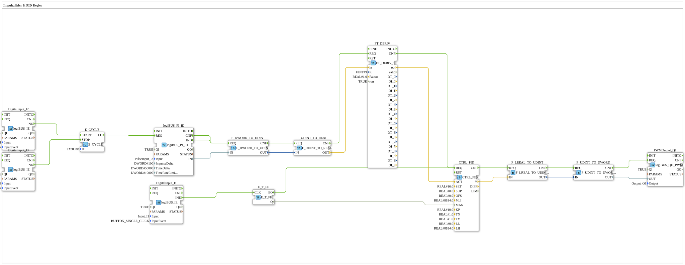

# Exercise_153: Pulse Counter & PID Controller

This article describes the logiBUS® exercise `Uebung_153`.

----

## Objective of the Exercise

More precise control using a PID algorithm.

-----

## Description

[cite_start]Structurally identical to `Uebung_152`, however, the function block `CTRL_PID` is used[cite: 1].

In addition to the proportional (P) and integral (I) components, this block has a derivative (D) component (`TV` parameter) that responds to the rate of change of the control deviation. This enables faster response to sudden disturbances but requires more careful parameterization.

