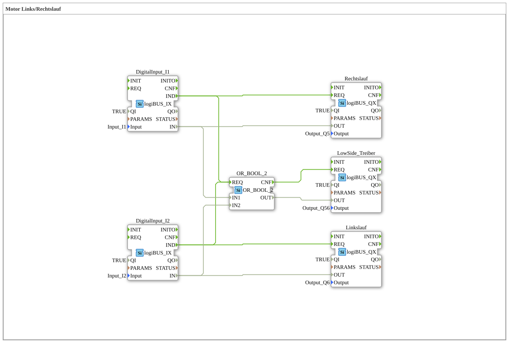

# Exercise_160: Motor Left/Right Rotation

This article describes the logiBUS® exercise `Uebung_160`. It demonstrates the simple logic function for controlling a reversible drive.
----
## Objective of the Exercise

Implementation of a control system for left rotation, right rotation, and a summed signal (motor active).

-----

## Description and Components

[cite_start]In `Uebung_160.SUB`, two pushbuttons are mapped to three outputs[cite: 1].

### Function Blocks (FBs)

* **`I1`**: Pushbutton for left rotation.
* **`I2`**: Button for clockwise rotation.
* **`OR_2_BOOL`**: Logical OR operation.
* **`Q5`**: Output for counterclockwise rotation.
* **`Q6`**: Output for clockwise rotation.
* **`Q56`**: Output indicating "Motor is running" (sum).

-----

## Functionality

* If the user presses **I1**, output `Q5` is activated.
* If the user presses **I2**, output `Q6` is activated.
* * The OR gate activates output `Q56` whenever **either I1 OR I2** (or both) is pressed.

This circuit demonstrates the combination of direct signal forwarding and logic preprocessing for display purposes.

-----

## Application Example

**Tonger rotor or conveyor belt**:

Outputs `Q5` and `Q6` control the respective contactors for the direction of rotation. Output `Q56` controls a central warning light or a relief valve, which must always be open when the motor is moving in any direction.