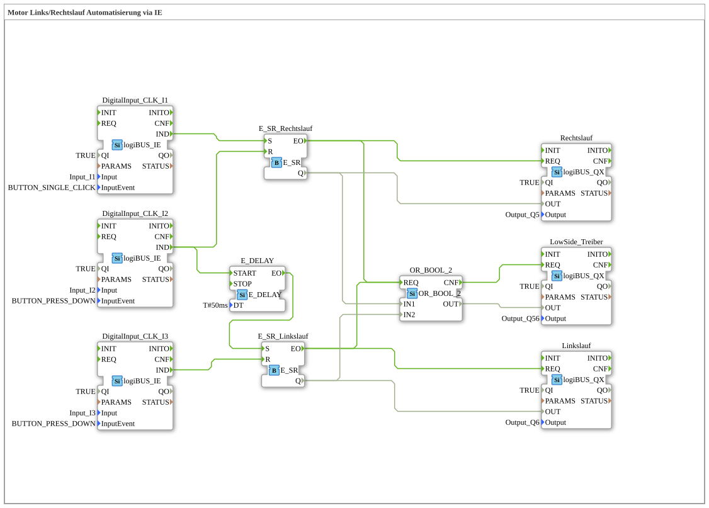

Here is the documentation for Exercise 160b, based on the provided XML data.
# Exercise_160b: Motor Reverse/Forward Rotation Automation via IE

* * * * * * * * * *
## Introduction
This exercise implements a control system for a motor with reverse and forward rotation (reversing operation) using logiBUS blocks for input and output via Industrial Ethernet (IE). The circuit features a direct switching function with a safety delay and a collective indicator for the operating status.

## Function Blocks Used

This sub-application uses various standard library blocks as well as hardware driver blocks to implement the logic.

## Sub-Blocks: Inputs
Here, the pushbuttons for the control system are read.

- **Type**: `logiBUS::io::DI::logiBUS_IE`
- **Internal Function Blocks Used**:
- **DigitalInput_CLK_I1**: `logiBUS_IE`
- Parameters: `Input` = `Input_I1`, `InputEvent` = `BUTTON_SINGLE_CLICK`
- Description: Starts the first output (Q5). Responds to a single click.

``` - **DigitalInput_CLK_I2**: `logiBUS_IE`

- Parameters: `Input` = `Input_I2`, `InputEvent` = `BUTTON_PRESS_DOWN`
- Description: Stops output Q5 and initiates the start of output Q6. Responds to being pressed down.
- **DigitalInput_CLK_I3**: `logiBUS_IE`
- Parameters: `Input` = `Input_I3`, `InputEvent` = `BUTTON_PRESS_DOWN`
- Description: Stops the second output (Q6). Responds to being pressed down.

### Sub-Blocks: Outputs

These blocks control the physical outputs.

- **Type**: `logiBUS::io::DQ::logiBUS_QX`
- **Internal FBs Used**:
- **DigitalOutput_Q5**: `logiBUS_QX`
- Parameters: `Output` = `Output_Q5`
- Description: Controls the motor for direction A (e.g., counterclockwise).
- **DigitalOutput_Q6**: `logiBUS_QX`
- Parameters: `Output` = `Output_Q6`
- Description: Controls the motor for direction B (e.g., clockwise).
- **DigitalOutput_Q56**: `logiBUS_QX`
- Parameters: `Output` = `Output_Q56`
- Description: Signal lamp/status indicator, active when Q5 or Q6 is active.

### Sub-Blocks: Logic (Logic Control)
The core logic of the controller.

- **Type**: `iec61499::events::E_SR` (Set/Reset Flip-Flop)
- **Internal Function Blocks Used**:
- **E_SR_A**: `E_SR`
- Function: Stores the state for output Q5. Set by I1 and reset by I2.
- **E_SR_B**: `E_SR`
- Function: Stores the state for output Q6. Set with a delay by I2 and reset by I3.
- **Type**: `iec61499::events::E_DELAY` (Delay)
- **Internal Function Blocks Used**:
- **E_DELAY**: `E_DELAY`
- Parameters: `DT` = `T#50ms`
- Function: Delays the setting of `E_SR_B` by 50 milliseconds after I2 is pressed. This likely serves as a short dead time during the rotation direction change.
- **Type**: `E_SR_B`
- **Parameters**: `DT` = `T#50ms`
- Function: Delays the setting of `E_SR_B` by 50 milliseconds after I2 is pressed. This presumably serves as a short dead time during the rotation direction change.

**** - **Type**: `iec61131::bitwiseOperators::OR_2_BOOL` (Logical OR)
- **Internal Function Blocks Used**:
- **OR_2_BOOL**: `OR_2_BOOL`
- Function: Combines the states of Q5 and Q6. If either of the two motor outputs is active, output Q56 is activated.

## Program Flow and Connections

The network implements motor control with the following properties:

1. **Start Direction A (Q5):**

* When `Input_I1` (click) is activated, `DigitalInput_CLK_I1` sends an event to the set input (S) of `E_SR_A`.

``` * `E_SR_A` sets its output Q to TRUE, thereby activating `DigitalOutput_Q5`.

2. **Switching / Stop A & Start B (Q6):**

* When `Input_I2` is pressed, two things happen simultaneously:
* An event is sent to the reset input (R) of `E_SR_A`. This immediately switches off `DigitalOutput_Q5`.
* An event starts the timer `E_DELAY`.
* After 50 ms (`DT=T#50ms`), `E_DELAY` sends an event to the set input (S) of `E_SR_B`.
* * `E_SR_B` sets its output Q to TRUE, thereby activating `DigitalOutput_Q6`.
* *Note:* I2 here acts as a switch from A to B with a short dead time.

3. **Stop towards B (Q6):**

* When `Input_I3` is pressed (push), `DigitalInput_CLK_I3` sends an event to the reset input (R) of `E_SR_B`.
* `DigitalOutput_Q6` is switched off.

4. **Operating Indicator (Q56):**

* The data outputs (Q) of `E_SR_A` and `E_SR_B` are connected to the inputs of the `OR_2_BOOL` block.
* As soon as one of the two SR memories is active (motor running left or right), `OR_2_BOOL` activates `DigitalOutput_Q56`.

**Learning Objectives:**

* Use of bistable flip-flops (SR latches) for state storage.
* Implementation of a time-delay switching logic (E_DELAY) to prevent abrupt load changes or short circuits.
* Processing of different push-button events (single click vs. press-down).
* Logical combination of states (OR) to control a summary display.

## Summary
Exercise `Uebung_160b` demonstrates a practical implementation of a reversing contactor circuit logic according to IEC 61499. The combination of SR latches and a delay timer ensures that when switching from clockwise to counterclockwise rotation (triggered by button I2), the first output switches off before the second output switches on after 50 ms. Button I1 serves as the start for the first direction, and button I3 as the stop for the second direction. Output Q56 signals whether the motor is currently running.