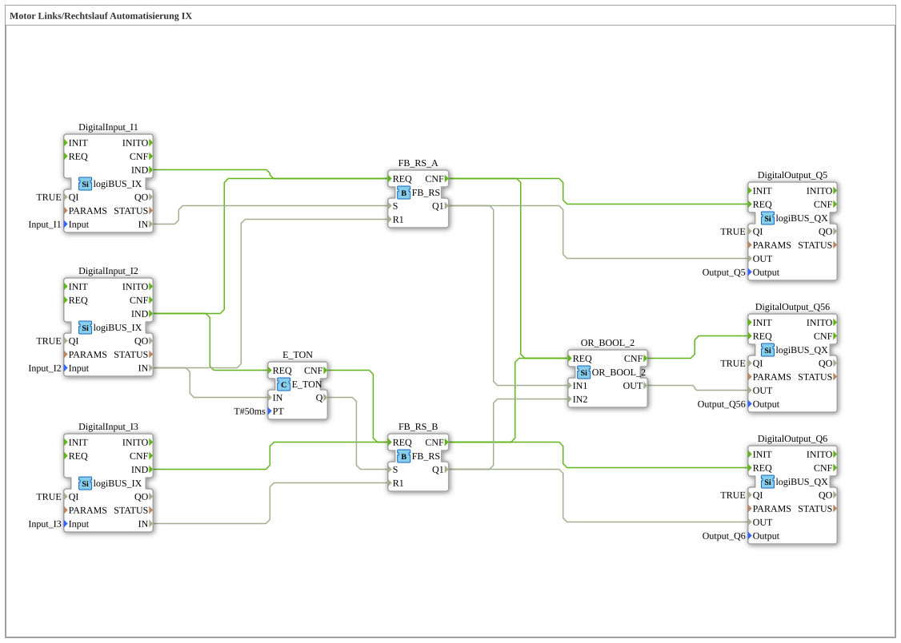

Here is the documentation for exercise `Uebung_160b2` in the requested format.
# Exercise_160b2: Motor Forward/Reverse Rotation Automation IX

*(If a network view image is available, please insert it here)*

* * * * * * * * * *
## Introduction

Exercise **Exercise_160b2** implements a control circuit for a motor's forward/reverse rotation (Automation IX). The focus of this circuit is the switching between two states (outputs Q5 and Q6) with an integrated dead time (delay) when switching from Q5 to Q6, controlled by digital inputs. Additionally, a summary status is output.

## Function Blocks (FBs) Used

This sub-application uses standard library blocks to implement the logical operations.

* **logiBUS_IX (DigitalInput_I1, _I2, _I3)**:
* Provides the hardware's digital inputs (I1, I2, I3) on the network.
* **logiBUS_QX (DigitalOutput_Q5, _Q6, _Q56)**:
* Controls the hardware's digital outputs.
* **iec61131::bistableElements::FB_RS (FB_RS_A, FB_RS_B)**:
* Reset-dominant bistable flip-flops (RS flip-flops). They store the "On" or "Off" state for the motors.
* **iec61131::bitwiseOperators::OR_2_BOOL (OR_2_BOOL)**:
* A two-input logical OR gate.
* **iec61499::events::timers::E_TON (E_TON)**:
* An on-delay timer.

### Sub-Blocks
*This exercise does not use user-defined sub-blocks, but rather direct instances of standard FBs are interconnected.*

## Program Flow and Connections

The circuit implements interlocked control of two outputs (e.g., motor left/right) with the following properties:

1. **Control of Output Q5 (First Path):**

* Output **Q5** is controlled via the block **FB_RS_A**.
* Activating input **I1** sets the block and activates Q5.
* Activating input **I2** resets the block and immediately deactivates Q5.

2. **Switching and Control of Output Q6 (Second Path):**

* Input **I2** has a dual function: It stops Q5 and starts the process for Q6.
* The signal from **I2** starts the timer **E_TON**. This is set to **50ms** (`PT=50ms`).
* After 50ms, the timer output (`Q`) sets the function block **FB_RS_B**.
* This activates output **Q6**.
* This creates a short dead time between Q5 switching off and Q6 switching on, which is important in motor control to prevent short circuits or mechanical stress during direct switching.
* Activating input **I3** resets **FB_RS_B** and deactivates Q6.
* 3. **Collective Indicator Q56:**
* The **OR_2_BOOL** function block monitors the outputs of FB_RS_A (Q5) and FB_RS_B (Q6).
* Output **Q56** is active as soon as either Q5 **OR** Q6 is active. This serves as an "operating indicator."

**Summary Logic:**

* **I1** starts Q5.
* **I2** stops Q5 and starts (with a 50ms delay) Q6.
* **I3** stops Q6.

## Summary

Exercise `Uebung_160b2` demonstrates an advanced motor control circuit. It shows how to store states using RS flip-flops and implement an automatic switching delay using a timer (`E_TON`). This is a typical scenario in drive technology to protect the hardware during direction changes. Outputs Q5 and Q6 represent the two directions of travel, while Q56 signals the general operating status.
