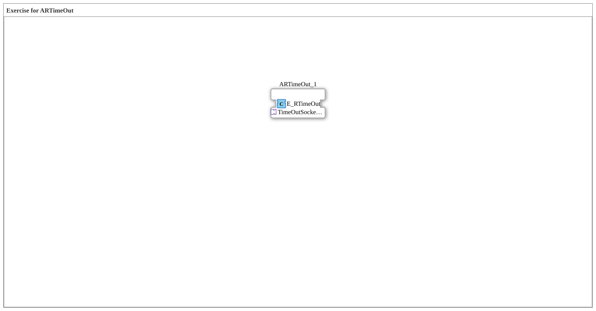

Here is the documentation for exercise `Uebung_170` based on the provided XML data.
# Exercise_170: Exercise for ARTimeOut

* * * * * * * * * *
## Introduction
Uebung_170` is a sub-application that deals with handling timeouts. It serves as a practice environment for the function block `E_RTimeOut` (Event Resettable TimeOut) to test or demonstrate its behavior within an IEC 61499 network.

## Function Blocks Used

This exercise uses an instance of an event block from the standard library.

### Included Blocks:
- **ARTimeOut_1**
- **Type**: `iec61499::events::E_RTimeOut`
- **Description**: This block provides a timeout function for events. It is typically used to monitor whether an event occurs within a specific time period and can be reset.
- **Configuration**:
- Position in the grid: x=-900, y=300.
- No initial parameter values are defined for this instance in the XML.

## Program Flow and Connections

Currently, the network for this exercise consists only of the instance `ARTimeOut_1`.

* **Connections**: No connections (neither data nor events) are defined in the current configuration. The block is isolated in the network.
* **How the Exercise Works**:
* Since no connections are present, this exercise is likely intended to allow you to manually test the `E_RTimeOut` function block in debug mode or to serve as a starting point for a more complex circuit where connections will need to be added.
* The user can manually trigger the function block's input events to observe when and how the timeout event is triggered.

## Summary
The `Uebung_170` provides a minimal configuration containing only the `E_RTimeOut` function block. It serves as a basic template or test environment for learning or verifying the logic of resettable timeouts in the 4diac IDE.

---

### 🌐 Related topic subpages on ms-muc-docs.de
* [🌐 Eclipse 4diac IDE & Color Reference on ms-muc-docs.de](https://www.ms-muc-docs.de/iec-61499/eclipse-4diac/)

]
