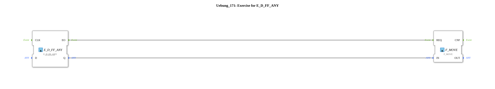

Here is the documentation page for exercise `Uebung_171` based on the provided data.
# Exercise_171: Exercise for E_D_FF_ANY

* * * * * * * * * *
## Introduction
This exercise (`Uebung_171`) is designed as training for using the **E_MOVE** function block. It demonstrates the interaction between IEC 61131 functions for data manipulation and IEC 61499 function blocks for event-driven data transmission.

## Function Blocks Used (FBs)

The following function blocks are used within this sub-app to implement the logic:

### Sub-Blocks: Included Components

In this exercise, the following blocks are specifically instantiated:

* **E_MOVE**
* **Type**: `iec61499::events::E_MOVE`
* **Description**: An event-driven block that moves data from an input to an output as soon as an event is triggered.
* **Use in the Exercise**: Serves as the receiver of the data value.
* **F_MOVE**
* **Type**: `iec61131::selection::F_MOVE`
* **Parameters**: `DataType` = `INT`
* **Description**: A standard IEC 61131 function for assigning values. In this exercise, the data type is explicitly set to `INT` (Integer).
* **Use in the exercise**: Serves as the source or preprocessor of the data value that is passed to `E_MOVE`.

## Program Flow and Connections

The network shows a simple connection between a standard function and an event block, but it is still incomplete (see TODO).

### Existing Data Connections
* **F_MOVE.OUT** $\rightarrow$ **E_MOVE.IN**: The result of the assignment/movement from the block `F_MOVE` is directly routed to the data input of `E_MOVE`.

### Instructions for Execution
The network contains a comment block with the content **"TODO"**. This indicates that the exercise must be completed by the user. Probably missing:

1. Input values for `F_MOVE` to define a value.

2. An event connection to trigger the `E_MOVE` function block (input `EI`) so that it receives and passes on the data value.

**Learning Objectives:**

* Understanding the difference between pure data functions (`F_MOVE`) and event-driven function blocks (`E_MOVE`).
* Correct wiring of data types (here `INT`).

## Summary

Uebung_171` represents a basic exercise for practicing data transfer in 4diac. The focus is on the correct use of the `E_MOVE` block in combination with the preceding IEC 61131 logic (`F_MOVE`). The user must complete the open connections as described in the "TODO" note to enable functionality.

---

### 🌐 Related topic subpages on ms-muc-docs.de
* [🌐 Eclipse 4diac IDE & color reference on ms-muc-docs.de ](https://www.ms-muc-docs.de/iec-61499/eclipse-4diac/)
