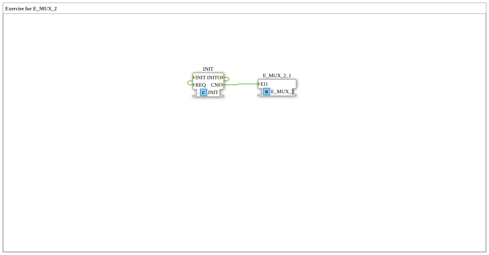

Here is the documentation for exercise `Uebung_172`, based on the provided data.
# Exercise_172: Exercise for E_MUX_2

* * * * * * * * * *
## Introduction
The sub-application **Exercise_172** is an exercise unit that deals with the function block `E_MUX_2`. It serves as a template or starting point for learning and implementing the functionality of the event multiplexer (E_MUX) within the IEC 61499 standard.

## Function Blocks Used

This exercise uses the standard function block from the `iec61499::events` library.

## Sub-Blocks: Exercise_172
This sub-application defines the scope of the exercise.

- **Type**: SubAppType
- **Internal Function Blocks Used**:
- **E_MUX_2_1**: `iec61499::events::E_MUX_2`
- **Description**: This is an instance of the `E_MUX_2` function block (event multiplexer for 2 inputs).
- **Parameters**: No parameters initially set.
- **Coordinates**: x=-3000, y=-1000

## Program Flow and Connections

Currently, this exercise represents a framework that must be completed by the user.

* **Status**: The sub-application contains an instance of `E_MUX_2`, but no connections (event or data flows) yet.
* **Notes**: There is a comment field in the network with the content **"TODO"** (at x=-1900, y=-400). This indicates that the logic, inputs, and outputs still need to be wired.

**Purpose of the exercise**: The goal is presumably to connect two different event sources to the `E_MUX_2` function block and process the resulting output event to understand the principle of event merging (multiplexing).

## Summary
The `Uebung_172` is a prepared working environment for exploring the `E_MUX_2` function block. It contains the necessary instance of the block and a placeholder comment, but leaves the actual implementation of the event logic to the learner.