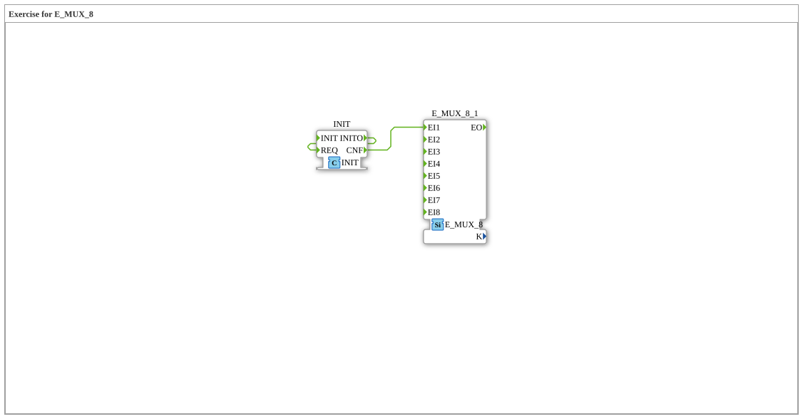

Here is the documentation page for exercise `Uebung_173`, based on the provided data.
# Exercise_173: Exercise for E_MUX_8

* * * * * * * * * *
## Introduction
The sub-application **Exercise_173** serves as a training environment for working with the function block `E_MUX_8`. The goal of this exercise is to understand and apply the concept of event multiplexing (merging multiple event paths) within the IEC 61499 standard.

The provided workspace contains a single function block and a placeholder comment, indicating that the user must complete the logic.

## Function Blocks (FBs) Used

This network primarily uses the following standard function block:

### E_MUX_8_1
- **Type**: `iec61499::events::E_MUX_8`
- **Description**: This is an 8-input event multiplexer.
- **Interfaces**:
- **Event Inputs (EI1 to EI8)**: Trigger inputs for various event sources.
- **Event Output (EO)**: This output fires as soon as one of the inputs `EI1` to `EI8` receives an event.
- **Functionality**: The function block functions like an OR gate for events. It forwards each incoming event to the output, regardless of which input it originates from.

## Program Flow and Connections

The exercise is currently in an initial state ("TODO").

### 🌐 Network Status
- **Existing Instances**: One instance of the multiplexer (`E_MUX_8_1`) is located on the network (coordinates: -3000, -1000).
- **Connections**: **No** connections are defined in the XML. The component is isolated.
- **Comments**: A large comment block containing "TODO" marks the area where the implementation should take place.

### Exercise Procedure

1. **Goal**: The user should presumably connect event sources (e.g., from other components or inputs of the subapp) to the inputs of `E_MUX_8`.

2. **Logic**: The goal is to combine different events onto a single event path (the output of the multiplexer).

### 3. **Prerequisites**: Understanding how events are connected in 4diac and how the execution order works.

## Summary
The `Uebung_173` is a basic template for learning event handling using `E_MUX_8`. It provides the necessary building block but leaves the wiring and integration into a larger logic system to the user as part of the learning process.

---

### 🌐 Related topic subpages on ms-muc-docs.de
* [🌐 Eclipse 4diac IDE & color reference on ms-muc-docs.de](https://www.ms-muc-docs.de/iec-61499/eclipse-4diac/)

]
