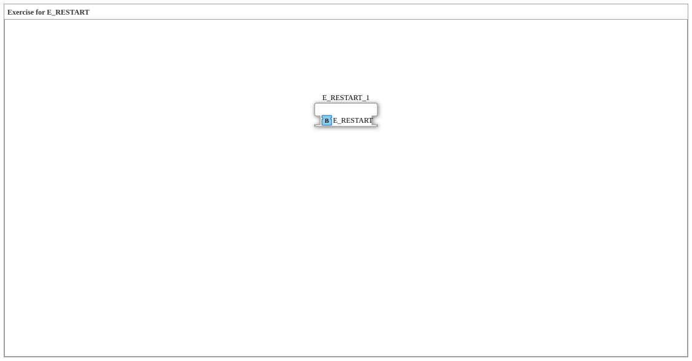

Here is the documentation for exercise `Uebung_174`, based on the provided XML data.
# Exercise_174: Exercise for E_RESTART

* * * * * * * * * *
## Introduction
Exercise_174 is a sub-application that deals with the initialization behavior of controllers in IEC 61499. Specifically, it focuses on working with the `E_RESTART` function block. This exercise provides a basic framework for implementing the logic for cold and warm starts.

## Function Blocks Used

This exercise primarily uses a specific event block from the standard library.

### Included Function Blocks:
* **E_RESTART_1**
* **Type**: `iec61499::events::E_RESTART`
* **Description**: This function block provides events that are triggered when the resource on which the application runs is started.
* **Event Output COLD**: Triggered during a cold start (first-time start or reset).
* **Event Output WARM**: Triggered during a warm start (resumption of operation, if supported).
* **Functionality**: It serves as a trigger for initialization routines within the application.

## Program Flow and Connections

Currently, this exercise represents an empty network with a task.

* **Current State**:
* The function block `E_RESTART_1` is placed in the network.
* No connections to other function blocks exist yet.
* A comment field containing **"TODO"** indicates the area to be edited.
* **Learning Objectives**:
* Understanding the difference between the `COLD` and `WARM` start events.
* Using the `E_RESTART` block to initialize variables or states when the controller starts.
* **Procedure**:

1. Open the exercise as a SubApp.

2. Connect logic chains to the outputs of the `E_RESTART_1` block to define what should happen when the application starts (e.g., setting default values).

## Summary
The `Uebung_174` exercise is a basic exercise for implementing start-up routines. It offers the `E_RESTART` module and prompts the user, via a "TODO" comment, to develop the corresponding initialization logic for the cold and warm start of the controller.
