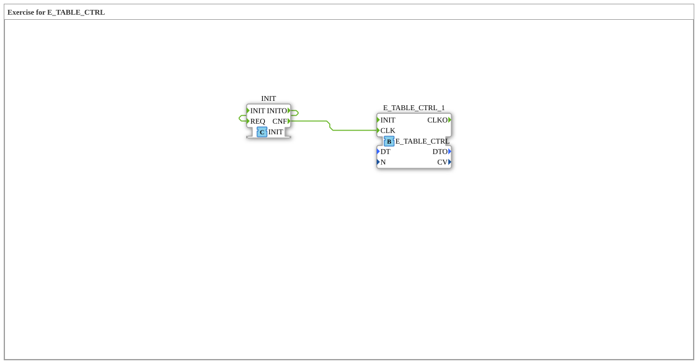

# Exercise_175: Exercise for E_TABLE_CTRL

* * * * * * * * * *
## Introduction

Exercise **Exercise_175** is a template for learning how to use table controls within the IEC 61499 architecture. The focus is specifically on the function block `E_TABLE_CTRL` (Event Table Control). The exercise provides a basic framework that must be completed by the user.
## Function Blocks Used

This sub-application primarily uses an instance of a standard library function block.

### Sub-Blocks: E_TABLE_CTRL_1

- **Type**: `iec61499::events::E_TABLE_CTRL`
- **Internal Function Blocks Used**:
- This block is an instance from the standard library (`iec61499`).
- **Parameters**:
- Currently, no parameters are predefined in the network.
- **Functionality**:
- The `E_TABLE_CTRL` block is typically used to control event-driven processes based on a state table or a defined sequence. It switches outputs based on input states and a stored logic (often similar to a state machine).

## Program Flow and Connections

The network for this exercise is designed as a **task (TODO)**.

- **Network Status**:
- The function block `E_TABLE_CTRL_1` has been placed in the network at coordinates `x=-3000, y=-1000`.
- There are currently **no connections** (neither data nor events) between function blocks or interfaces.
- A large comment block with the content **"TODO"** (at `x=-3100, y=-100`) indicates that the actual implementation of the control logic still needs to be completed.
- **Learning Objectives**:
- Understanding the interfaces of `E_TABLE_CTRL`.
- Interconnecting events and data to implement sequence control.
- **Procedure**:
1. Analyze the required inputs and outputs of `E_TABLE_CTRL`.
- 2. Connect the necessary event and data lines according to the task description (implicitly given here by the "TODO").
3. Configure the function block's parameters, if necessary.

## Summary

The `Uebung_175` is an empty practice environment ("skeleton") that only provides the `E_TABLE_CTRL` function block. The goal of this exercise is to learn the functionality of this function block by independently creating the connections and logic.
