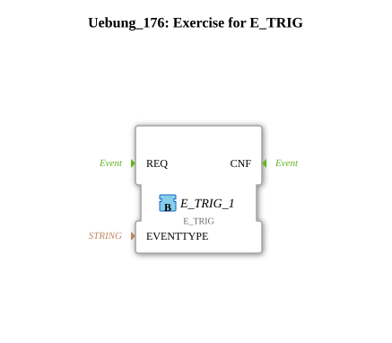

Here is the documentation for the exercise based on the provided XML data:
# Exercise_176: Exercise for E_TRIG

![Image of the exercise, if available]

* * * * * * * * * *
## Introduction

The `Uebung_176` exercise focuses on generating events on rising edges. The emphasis is on understanding and applying the `E_TRIG` (Edge Trigger) function block within an IEC 61499 application. The exercise provides a basic framework that must be completed by the user.

## Function Blocks (FBs) Used

This sub-application uses the following function block to implement the logic:

### Sub-Blocks: E_TRIG_1

- **Type**: `iec61499::events::E_TRIG`
- **Internal FBs Used**:
- **Block Name**: E_TRIG_1
- **Type**: Edge Trigger (Rising Edge)
- **Parameters**: No static parameters defined in the XML.
- **Event Output/Input**:
- `EI` (Event Input): Must be triggered to check the status of `QI`.
- `EO` (Event Output): Fires when a rising edge is detected at `QI`.
- **Data Output/Input**:
- `QI` (Input): The Boolean input that is monitored for a change from FALSE to TRUE.
- **Functionality**:

The `E_TRIG` block is used to forward or generate events only when the Boolean input signal (`QI`) changes from `FALSE` to `TRUE` (rising edge) and an event is simultaneously present at input `EI`.

## Program Flow and Connections

This exercise is designed as a template. Currently, no connections are defined in the network, but the central block `E_TRIG_1` is in place.

### Learning Objectives and Tasks:

* **Understanding Edge Detection**: Learn how signals are monitored for state changes.
* **TODO**: The network contains a comment block with the content "TODO". This indicates that the learner must establish the necessary event and data connections to ensure functionality.

### Starting the Exercise:

1. Open `Uebung_176` in the 4diac IDE.
2. Note the `E_TRIG_1` block placed at coordinates (-3000, -1000).
3. Complete the circuit according to the instructions (connecting input events and Boolean signals).

## Summary

Uebung_176` provides a compact environment for learning the `E_TRIG` block. Manually completing the connections deepens the understanding of event-driven edge detection in control systems.

---

### 🌐 Related topic subpages on ms-muc-docs.de

* [🌐 Eclipse 4diac IDE & color reference on ms-muc-docs.de](https://www.ms-muc-docs.de/iec-61499/eclipse-4diac/)

]
