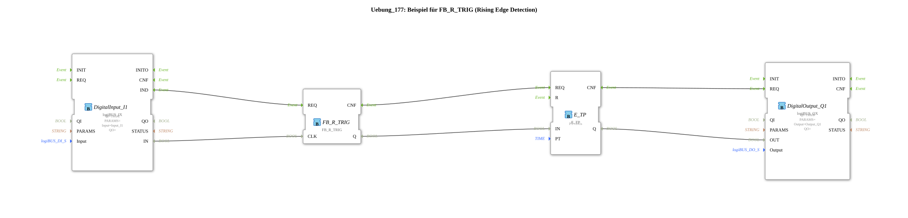

Here is the documentation for Exercise 177, based on the provided data.
# Exercise_177: Example for FB_R_TRIG (Rising Edge Detection)

* * * * * * * * * *
## Introduction

Exercise_177 demonstrates the use of the `FB_R_TRIG` function block for rising edge detection. The goal of the exercise is to process an input signal so that only the moment of activation (change from FALSE to TRUE) triggers an action. This short-duration signal is then used to start a timer that activates an output for a defined period.

## Function Blocks Used (FBs)

The following function blocks are used within the network in this exercise:

- **DigitalInput_I1** (`logiBUS::io::DI::logiBUS_IX`)
- Serves as the interface to the physical input `Input_I1`. It provides the input signal for edge detection.
- **FB_R_TRIG** (`iec61131::edgeDetection::FB_R_TRIG`)
- This is the core function block of the exercise. It monitors the input `CLK`. When `CLK` changes from FALSE to TRUE (rising edge), the output `Q` is set to TRUE for exactly one cycle.
- **E_TP** (`iec61499::events::timers::E_TP`)
- A pulse timer. * **Parameter**: `PT` is set to `T#1s` (1 second).
- Generates a 1-second pulse as soon as the input `IN` is activated.
- **DigitalOutput_Q1** (`logiBUS::io::DQ::logiBUS_QX`)
- Serves as an interface to the physical output `Output_Q1`. It switches the output based on the timer signal.

## Program Flow and Connections

The control process is as follows:

1. **Signal Acquisition**: The function block `DigitalInput_I1` reads the state of the physical input (e.g., a push button). The event `IND` and the data value `IN` are forwarded to the edge detection block.
2. **Edge Detection**:
- The block `FB_R_TRIG` receives the signal at input `CLK`.
- As soon as a change from 0 to 1 (button is pressed) is detected, `FB_R_TRIG` briefly sets its output `Q` to TRUE.
- If the button is held down or released (falling edge), the output `Q` remains FALSE.
- 3. **Time Control**:
- The short-term signal from `FB_R_TRIG.Q` triggers the input `IN` of the timer `E_TP`.
- The timer `E_TP` then starts a pulse. Its output `Q` is set to TRUE for a duration of 1 second (`PT=T#1s`), regardless of whether the input signal is still present at the button or not.
4. **Output**:
- The state of the timer (`E_TP.Q`) is passed to `DigitalOutput_Q1.OUT`.
- This causes the physical output `Output_Q1` (e.g., a lamp) to light up for exactly 1 second each time the input button is pressed again.

**Connection Overview:**

- `DigitalInput_I1.IND` -> `FB_R_TRIG.REQ`
- `DigitalInput_I1.IN` -> `FB_R_TRIG.CLK`
- `FB_R_TRIG.CNF` -> `E_TP.REQ`
- `FB_R_TRIG.Q` -> `E_TP.IN`
- `E_TP.CNF` -> `DigitalOutput_Q1.REQ`
- `E_TP.Q` -> `DigitalOutput_Q1.OUT`

## Summary

This exercise demonstrates a classic application in automation technology: decoupling a static input signal (switch state) from the output logic using edge detection. The combination of `FB_R_TRIG` and `E_TP` ensures that the output `Q1` is active for exactly one second each time the button `I1` is pressed, even if the button is held down for a longer period.
