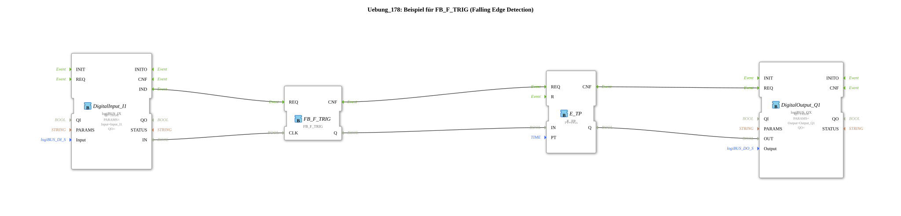

Here is the documentation for Exercise 178, based on the provided XML data.
# Exercise_178: Example for FB_F_TRIG (Falling Edge Detection)

* * * * * * * * * *
## Introduction

Exercise_178 deals with the detection of falling edges in signal processing. The goal is to trigger an event precisely when an input signal changes from `TRUE` (High) to `FALSE` (Low). This event is also used to generate a time-limited pulse.

## Function Blocks Used (FBs)

The following function blocks are used in this sub-application:

- **DigitalInput_I1** (`logiBUS::io::DI::logiBUS_IX`):
- Used to read the digital signal.
- Configured to the hardware input `Input_I1`.
- **FB_F_TRIG** (`iec61131::edgeDetection::FB_F_TRIG`):
- Function block for detecting a falling edge (Falling Edge Trigger).
- **E_TP** (`iec61499::events::timers::E_TP`):
- A pulse timer.
- Configured with a duration (`PT`) of 1 second (`T#1s`).
- **DigitalOutput_Q1** (`logiBUS::io::DQ::logiBUS_QX`):
- Used to output the digital signal.
- Configured to the hardware output `Output_Q1`.

## Program Flow and Connections

The program flow for this exercise is as follows:

1. **Signal Input:**

The function block `DigitalInput_I1` reads the status of the hardware input `Input_I1`. As soon as a signal is present (e.g., a button is pressed) or changes, this is transmitted via the event `IND` and the data connection `IN`.

2. **Edge Detection:**

The input signal (`IN` from `DigitalInput_I1`) is connected to the clock input (`CLK`) of `FB_F_TRIG`.

- `FB_F_TRIG` monitors this signal.
- If the module detects a change from **High to Low** (e.g., releasing a button), the output `Q` briefly switches to `TRUE`.
- 3. **Time Control (Pulse):**

The output signal `Q` of the edge trigger is connected to the input `IN` of the timer `E_TP`.

- As soon as the falling edge is detected, the timer `E_TP` starts.
- The timer generates a pulse with a duration of **1 second** (defined by `PT = T#1s`).
4. **Signal Output:**

The output `Q` of the timer controls the input `OUT` of the timer `DigitalOutput_Q1`.

- This causes the hardware output `Output_Q1` (e.g., a lamp) to be activated for exactly 1 second after the input signal has dropped.

This causes the hardware output `Output_Q1` (e.g., a lamp) to be activated for exactly 1 second after the input signal has dropped. **Summary Data Flow:**

DigitalInput_I1.IN` -> `FB_F_TRIG.CLK` -> `FB_F_TRIG.Q` -> `E_TP.IN` -> `E_TP.Q` -> `DigitalOutput_Q1.OUT`

**Summary Event Flow:**

DigitalInput_I1.IND` -> `FB_F_TRIG.REQ` -> `FB_F_TRIG.CNF` -> `E_TP.REQ` -> `E_TP.CNF` -> `DigitalOutput_Q1.REQ`

## Summary

Exercise_178 demonstrates the classic application of a "run-on control" or shutdown delay based on a negative signal change. The user learns how to combine digital signal acquisition, logical edge detection using `FB_F_TRIG`, and time-controlled output using `E_TP`. A practical example would be a light that illuminates for one second as soon as a button is *released*.
