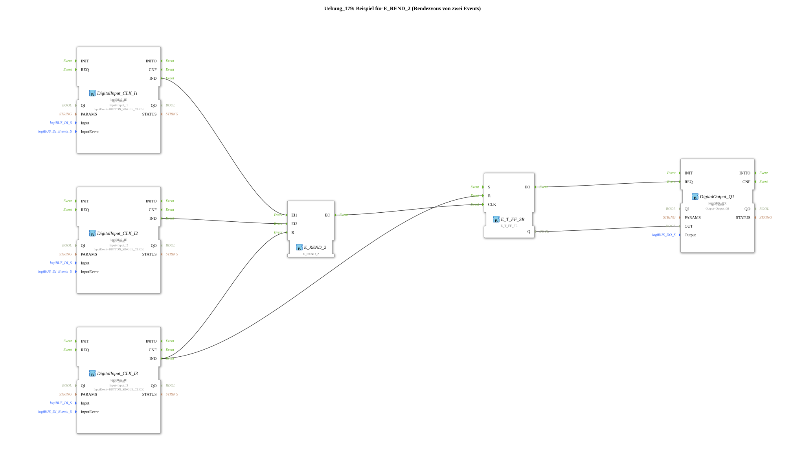

Here is the documentation for Exercise 179, based on the information provided.
# Exercise_179: Example for E_REND_2 (Rendezvous of Two Events)

* * * * * * * * * *
## Introduction
This exercise demonstrates the use of the function block **E_REND_2** (Event Rendezvous). The goal is to understand the concept of event synchronization. A rendezvous block ensures that an outgoing event is only triggered when an event has arrived at both inputs. This is often used to synchronize two parallel processes before a subsequent step is executed.

## Function Blocks Used (FBs)

This sub-application uses the following function blocks from the standard and logiBUS libraries:

* **logiBUS::io::DI::logiBUS_IE (3x)**
* Used as: `DigitalInput_CLK_I1`, `DigitalInput_CLK_I2`, `DigitalInput_CLK_I3`
* Function: Provides the physical inputs (pushbuttons) I1, I2, and I3. Configured for the event `BUTTON_SINGLE_CLICK`.
* **iec61499::events::E_REND_2**
* Used as: `E_REND_2`
* Function: An event synchronization block. It waits for events at inputs `EI1` and `EI2`. Only when both events have occurred (regardless of the order) is the output event `EO` fired. The internal state can be reset via input `R`.
* **iec61499::events::E_T_FF_SR**
* Used as: `E_T_FF_SR`
* Function: A toggle flip-flop (T flip-flop) with set and reset inputs. Each event at input `CLK` toggles the state of output `Q` (from TRUE to FALSE or vice versa).
* * **logiBUS::io::DQ::logiBUS_QX**
* Used as: `DigitalOutput_Q1`
* Function: Controls the physical output Q1 to display the current status.

## Program Flow and Connections

The exercise proceeds as follows:

1. **Inputs (Rendezvous):**

* The button **I1** (`DigitalInput_CLK_I1`) is connected to the first event input `EI1` of the `E_REND_2` block.
* The button **I2** (`DigitalInput_CLK_I2`) is connected to the second event input `EI2` of the `E_REND_2` block.
* Pressing only one of these two buttons initially has no effect on the output. The module "remembers" the event.
* Only when **both** buttons (I1 and I2) have been pressed (the event "rendezvous" is complete) does the `E_REND_2` trigger the output event `EO`.

2. **Processing (Toggle):**

* The output event `EO` of the `E_REND_2` is connected to the clock input `CLK` of the `E_T_FF_SR`.
* Once the rendezvous has occurred, the flip-flop is triggered and toggles the output Q1 (light on or off).

3. **Reset Function:**

* The button **I3** (`DigitalInput_CLK_I3`) acts as the central reset.
* It is connected to the reset input `R` of the flip-flop `E_REND_2`. This clears any previously stored individual events (e.g., if I1 has been pressed, but I2 is still missing).
* Simultaneously, I3 is connected to the reset input `R` of the flip-flop `E_T_FF_SR`, which immediately switches off output Q1 (`FALSE`).
* 4. **Output:**
* The flip-flop's data status `Q` is transferred to `DigitalOutput_Q1` and controls the hardware LED/lamp.

## Summary

Exercise `Uebung_179` clearly demonstrates how to synchronize two independent event streams. Lamp Q1 only changes its state when both button I1 and button I2 have been pressed. The process can be aborted and the output reset at any time using button I3. This is a fundamental pattern for controllers where two conditions (events) must be met to proceed.