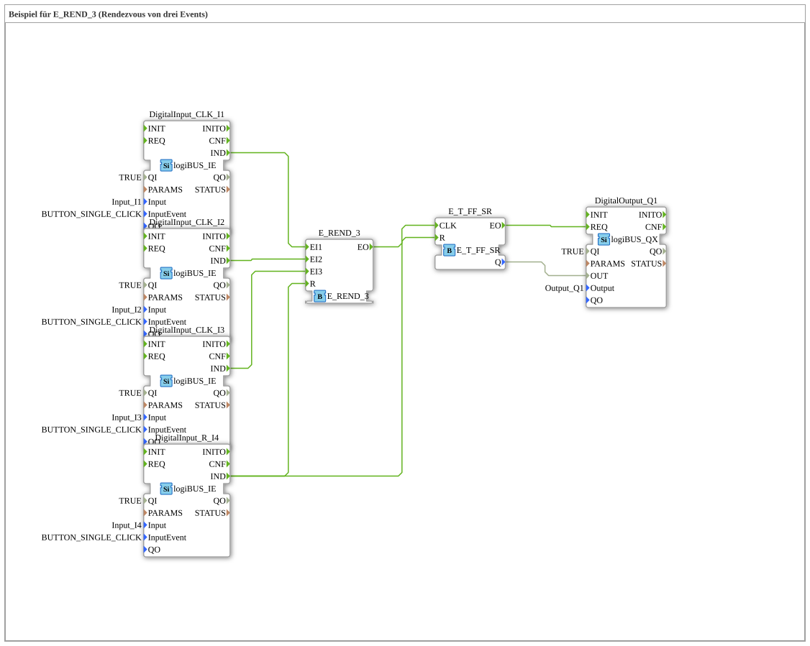

Here is the documentation for exercise **Exercise_180**, based on the provided XML data.

# Exercise_180: Example for E_REND_3 (Rendezvous of three events)

* * * * * * * * * *

## Introduction

This exercise demonstrates the synchronization of events using a rendezvous block. The goal is to execute an action (switching an output) only after three separate input events have occurred. This illustrates the principle of event synchronization in IEC 61499 control systems.

## Function Blocks (FBs) Used

In this subapplication, various function blocks are combined to implement the logic. Since `Uebung_180` is a SubAppType, the internal blocks it contains and their configuration are described here.

### Internal Building Blocks

#### `DigitalInput_CLK_I1`, `DigitalInput_CLK_I2`, `DigitalInput_CLK_I3`
- **Type**: `logiBUS::io::DI::logiBUS_IE`
- **Function**: Provide the three necessary input signals to be synchronized.

- **Configuration**:

- `Input` = `Input_I1` / `Input_I2` / `Input_I3`

- `InputEvent` = `BUTTON_SINGLE_CLICK`

- `QI` = `TRUE`

#### `DigitalInput_R_I4`

- **Type**: `logiBUS::io::DI::logiBUS_IE`

- **Function**: Serves as the central reset input for the circuit.

- **Configuration**:

- `Input` = `Input_I4`

- `InputEvent` = `BUTTON_SINGLE_CLICK`

- `QI` = `TRUE`

#### `E_REND_3`

- **Type**: `iec61499::events::E_REND_3`

- **Function**: A "rendezvous" function block for three events. It waits until an event has occurred at each of the three inputs (`EI1`, `EI2`, `EI3`). Only when all three events have been registered (the order is irrelevant) does the output `EO` fire.

- **Connections**:

- Inputs `EI1`, `EI2`, `EI3` are connected to digital inputs I1, I2, and I3.

- Input `R` is connected to reset input I4.

#### `E_T_FF_SR`

- **Type**: `iec61499::events::E_T_FF_SR`

- **Function**: A toggle flip-flop (T flip-flop) with set and reset inputs. Each event at the `CLK` input changes the status of the output `Q`.

- **Connections**:

- `CLK` connected to the output of the Rendezvous module.

- `R` (Reset) connected to the Reset input I4.

#### `DigitalOutput_Q1`

- **Type**: `logiBUS::io::DQ::logiBUS_QX`

- **Function**: Controls the physical output based on the flip-flop's state.

- **Configuration**:

- `Output` = `Output_Q1`

- `QI` = `TRUE`

## Program Flow and Connections

The circuit implements a logical AND operation at the timing level (synchronization):

1. **Input Acquisition**: The three input blocks `DigitalInput_CLK_I1`, `_I2`, and `_I3` send a `IND` event upon activation (single click).

2. **Rendezvous (Synchronization)**: These three events are routed to the block `E_REND_3`.

* The function block internally stores which inputs have already been activated.

* Only when **all three** inputs (I1, I2, and I3) have sent a signal at least once is the output event `EO` of `E_REND_3` triggered.

3. **Processing (Toggle)**: The `EO` event of the Rendezvous function block triggers the `CLK` input of `E_T_FF_SR`.

* The flip-flop changes its state (from FALSE to TRUE or vice versa).

* The new state `Q` is passed to the output `DigitalOutput_Q1`, which turns the lamp (Q1) on or off.

4. **Reset**: The input `DigitalInput_R_I4` is connected to the reset inputs (`R`) of both `E_REND_3` and `E_T_FF_SR`.

* A signal at I4 clears the internal memory of the Rendezvous module (all three buttons must be pressed again).

* Simultaneously, the flip-flop is reset, causing output Q1 to immediately switch to `FALSE` (Off).

**Learning Objectives:**

* Understanding the `E_REND` pattern (waiting for multiple events).

* Combining event control and state storage (flip-flop).

* Implementing a central reset logic.

## Summary

Exercise 180 demonstrates an effective method to ensure that three conditions must be met (events must have occurred) before a process step (switching the output) is executed. The `E_REND_3` block acts as an event collector, while the `E_T_FF_SR` stores the current output state. A global reset allows the entire logic to be restored to its initial state.