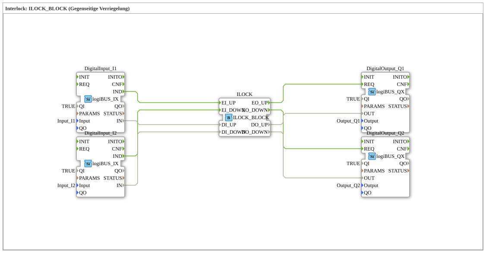

# Exercise_201: Interlock: ILOCK_BLOCK (Mutual Interlock)



* * * * * * * * * *

## Introduction

This exercise demonstrates the implementation of a **mutual interlock** using the function block `ILOCK_BLOCK`. The goal is to link two digital inputs (`I1`, `I2`) in such a way that only one of the two corresponding outputs (`Q1`, `Q2`) can be active at any given time. As soon as an input signal is present, the corresponding output is set and the other output is disabled. This exercise uses the hardware modules `logiBUS_IX` (digital input) and `logiBUS_QX` (digital output), as well as the interlock module from the `logiBUS` library.


``` ## Function Blocks (FBs) Used

### Sub-Blocks: `DigitalInput_I1`
- **Type**: `logiBUS::io::DI::logiBUS_IX`
- **Internal FBs Used**: None (Hardware Driver)

- **Parameters**:

- `QI` = `TRUE`

- `Input` = `Input_I1`

- **Event Output**: `IND` (triggered on signal change)

- **Data Output**: `IN` (current digital value)

### Sub-Blocks: `DigitalInput_I2`

- **Type**: `logiBUS::io::DI::logiBUS_IX`

- **Internal Function Blocks Used**: None

- **Parameters**:

- `QI` = `TRUE`

- `Input` = `Input_I2`

- **Event Output**: `IND`

- **Data Output**: `IN`

### Sub-Blocks: `ILOCK`

- **Type**: `logiBUS::signalprocessing::interlock::ILOCK_BLOCK`

- **Internal Function Blocks Used**: None (predefined interlock block)

- **Parameters**: None

- **Event Inputs**:

- `EI_UP` – Event for Channel 1 (e.g., "Up" button)

- `EI_DOWN` – Event for Channel 2 (e.g., "Down" button)

- **Event Outputs**:

- `EO_UP` – Enable for Channel 1

- `EO_DOWN` – Enable for Channel 2

- **Data Inputs**:

- `DI_UP` – Digital value for Channel 1

- `DI_DOWN` – Digital value for Channel 2

- **Data Outputs**:

- `DO_UP` – Set output value for Channel 1

- `DO_DOWN` – Set output value for Channel 2

- **Functionality**:

The `ILOCK_BLOCK` evaluates both channels. When `DI_UP` is active (`1`) and the event `EI_UP` occurs, `DO_UP` is set to `1` and simultaneously `DO_DOWN` is reset to `0` (locking). Similarly, when channel 2 is activated, channel 1 is locked. It is ensured that both outputs are never active simultaneously (`TRUE`).


`DI_UP` is active (`1`) and the event `EI_UP` occurs.


`DO_UP` is set to `1` and `DO_DOWN` is reset to `0` (locking). ### Sub-Blocks: `DigitalOutput_Q1`
- **Type**: `logiBUS::io::DQ::logiBUS_QX`
- **Internal Function Blocks Used**: None

- **Parameters**:

- `QI` = `TRUE`

- `Output` = `Output_Q1`

- **Event Input**: `REQ` (Trigger for output)

- **Data Input**: `OUT` (Value to be output)

### Sub-Blocks: `DigitalOutput_Q2`

- **Type**: `logiBUS::io::DQ::logiBUS_QX`

- **Internal Function Blocks Used**: None

- **Parameters**:

- `QI` = `TRUE`

- `Output` = `Output_Q2`

- **Event Input**: `REQ`

- **Data Input**: `OUT`

## Program Flow and Connections

The exercise flow is determined by the **event and data connections** in the SubApp network:

1. **Input Signal Acquisition**

The two digital inputs `DigitalInput_I1` and `DigitalInput_I2` monitor the physical inputs `Input_I1` and `Input_I2`, respectively. The event `IND` is triggered on a rising or falling edge.


``` 2. **Event Forwarding to ILOCK**

- `DigitalInput_I1.IND` → `ILOCK.EI_UP`

- `DigitalInput_I2.IND` → `ILOCK.EI_DOWN`

Simultaneously, the current digital values are passed to `ILOCK` via the data connections:

- `DigitalInput_I1.IN` → `ILOCK.DI_UP`

- `DigitalInput_I2.IN` → `ILOCK.DI_DOWN`

3. **Locking Logic**

`ILOCK_BLOCK` processes the incoming events and data. It sets the output `DO_UP` (or `DO_DOWN`) to the value of the corresponding input, provided the other channel is not already active. Internal logic ensures that only one channel can deliver the value `TRUE` at any given time. The output events `EO_UP` and `EO_DOWN` are generated accordingly.


``` 4. **Output to Hardware**

The events and data of `ILOCK` are forwarded to the digital outputs:

- `ILOCK.EO_UP` → `DigitalOutput_Q1.REQ`

- `ILOCK.EO_DOWN` → `DigitalOutput_Q2.REQ`

- `ILOCK.DO_UP` → `DigitalOutput_Q1.OUT`

- `ILOCK.DO_DOWN` → `DigitalOutput_Q2.OUT`

The respective output module receives the value and outputs it to the physical output `Output_Q1` or `Output_Q2`.
...`` **Summary of Functionality**:

When the first input is activated (e.g., a button on `Input_I1`), the corresponding output `Output_Q1` is activated, and the second output is immediately deactivated. If the second input is then activated, the active output changes to `Output_Q2`, and `Output_Q1` is deactivated again. Holding both inputs simultaneously results in a defined prioritization (usually the last pressed channel).

## Summary

- **Objective of the Exercise**: Basic understanding of interlocking and its implementation using the predefined function block `ILOCK_BLOCK`.

- **Difficulty Level**: Beginner (Fundamentals of event and data processing).

- **Prerequisites**: Basic knowledge of the 4diac IDE, function blocks, and logiBUS hardware drivers.

- **Learning Content**:

- Working with digital input/output blocks (`logiBUS_IX`, `logiBUS_QX`).

- Event-driven connections between function blocks.

- Application of a specialized interlock block (`ILOCK_BLOCK`).

- Debugging and testing in the 4diac IDE (e.g., through simulation with test drivers).

After completing this exercise, you will be able to integrate and extend simple interlock logic in control applications.


---

### 🌐 Related topic subpages on ms-muc-docs.de

* [🌐 Eclipse 4diac IDE & Color Reference on ms-muc-docs.de](https://www.ms-muc-docs.de/iec-61499/eclipse-4diac/)

]