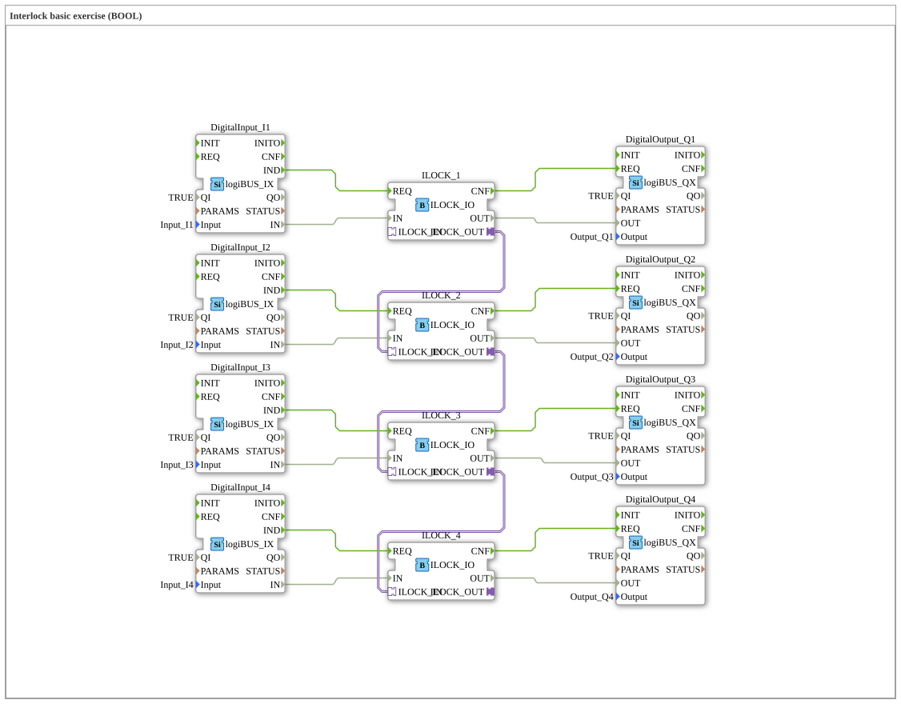

# Exercise_201_Interlock_BOOL: Interlock basic exercise (BOOL)

* * * * * * * * * *

## Introduction

This exercise teaches the basic functionality of an **interlock circuit** (interlock) using Boolean signals. Four digital inputs (`I1` to `I4`) control four digital outputs (`Q1` to `Q4`) via special interlock blocks. The interlock blocks are arranged in a chain, so that a subsequent output can only be enabled once the previous interlock block has been activated. This allows for the implementation of a safe, sequential control system.

## Function Blocks (FBs) Used

- **DigitalInput_I1 … DigitalInput_I4**

Type: `logiBUS::io::DI::logiBUS_IX`

- A digital input of the logiBUS system.
- **DigitalOutput_Q1 … DigitalOutput_Q4**

Type: `logiBUS::io::DQ::logiBUS_QX`

- A digital output of the logiBUS system.
- **ILOCK_1 … ILOCK_4**

Type: `logiBUS::signalprocessing::interlock::ILOCK_IO`

- A special interlock function block that only passes the state of an input signal to the output if the internal interlock condition is met.

There are no nested sub-blocks (sub-applications).

## Program Flow and Connections

### Event and Data Flow

1. **Input Events**

Each digital input (e.g., `DigitalInput_I1`) generates an event (`IND`) as soon as the input value changes. This event is sent directly to the corresponding interlock block (e.g., `ILOCK_1.REQ`).

1. **Data Transfer**

The value of the digital input (`IN` data port) is transferred to the corresponding interlock block (`ILOCK_x.IN`) in parallel with the event.

1. **Interlock Chain**

The interlock blocks are cascaded via adapter connections:

- `ILOCK_1.ILOCK_OUT` → `ILOCK_2.ILOCK_IN`
- `ILOCK_2.ILOCK_OUT` → `ILOCK_3.ILOCK_IN`
- `ILOCK_3.ILOCK_OUT` → `ILOCK_4.ILOCK_IN`

This chaining ensures that an interlock block only provides a valid output if the preceding block has also been activated.

1. **Output Control**

After internal processing, each interlock block outputs an acknowledgment event (`CNF`) that controls the corresponding digital output (e.g., `DigitalOutput_Q1.REQ`). Simultaneously, the data value (`OUT`) is transmitted to the output.

## Learning Objectives and Notes

- **Learning Objective:** Understanding interlock logic and cascaded enable conditions.
- **Difficulty Level:** Basic.
- **Prerequisites:** Basic knowledge of the 4diac IDE and working with logiBUS blocks.
- **Starting the Exercise:** Set the digital inputs (e.g., via simulation test values) to `TRUE` and observe how the outputs become active sequentially.

## Summary

The exercise *Exercise_201_Interlock_BOOL* demonstrates the construction of a simple four-stage interlock chain. Each input triggers its own interlock block, which only enables its output if the entire chain up to it is continuously active. The implementation uses the logiBUS standard modules for digital input/output and the special interlock function module `ILOCK_IO`. This basic principle can be directly applied to safety-related controllers (e.g., shutdown systems).

---

### 🌐 Related topic subpages on ms-muc-docs.de

- [🌐 Eclipse 4diac IDE & color reference on ms-muc-docs.de ](https://www.ms-muc-docs.de/iec-61499/eclipse-4diac/)
