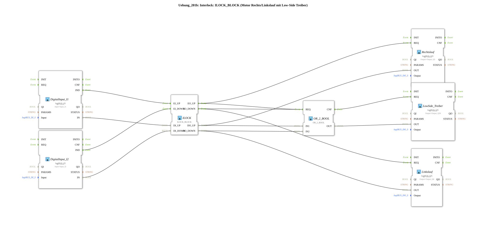

# Exercise_201b: Interlock: ILOCK_BLOCK (Motor with Forward/Reverse Rotation and Low-Side Driver)

* * * * * * * * * *
## Introduction

This exercise implements an **interlock circuit** for a motor with forward and reverse rotation. Additionally, a **low-side driver** is controlled. The interlock prevents both directions from being active simultaneously. The logic is based on the special function block `ILOCK_BLOCK`.
## Function Blocks Used

The sub-app uses the following function blocks:

| Block Name | Type | Description |
|----------------------|------------------------------------------|------------------------------------------------------------------------------|
| DigitalInput_I1 | `logiBUS::io::DI::logiBUS_IX` | Digital input for sensor I1 (e.g., "Up" button). |
| DigitalInput_I2 | `logiBUS::io::DI::logiBUS_IX` | Digital input for sensor I2 (e.g., "Down" button). |
| ILOCK | `logiBUS::signalprocessing::interlock::ILOCK_BLOCK` | Interlock block: locks the two directions against each other. |
| Choking | `logiBUS::io::DQ::logiBUS_QX` | Digital output for clockwise rotation (Q5). |
| Counterclockwise | `logiBUS::io::DQ::logiBUS_QX` | Digital output for counterclockwise rotation (Q6). |
| LowSide_Driver | `logiBUS::io::DQ::logiBUS_QX` | Digital output for the low-side driver (Q56). |
| OR_2_BOOL | `iec61131::bitwiseOperators::OR_2_BOOL` | Logical OR: activates the low-side driver for clockwise or counterclockwise rotation. |

### Instance Parameters

- **DigitalInput_I1**: `QI = TRUE`, `Input = Input_I1`
- **DigitalInput_I2**: `QI = TRUE`, `Input = Input_I2`
- **ILOCK**: no parameters set (default values)
- **Right Rotation**: `QI = TRUE`, `Output = Output_Q5`
- **Left Rotation**: `QI = TRUE`, `Output = Output_Q6`
- **LowSide_Driver**: `QI = TRUE`, `Output = Output_Q56`
- **OR_2_BOOL**: no parameters set

## Program Flow and Connections

1. **Input Signals**

The digital inputs `DigitalInput_I1` and `DigitalInput_I2` read the physical signals from the pushbuttons or sensors.

The event outputs `.IND` trigger the corresponding event inputs of the interlock block:

- `I1.IND` → `ILOCK.EI_UP`
- `I2.IND` → `ILOCK.EI_DOWN`
2. **Interlock Logic**

The block `ILOCK` evaluates the data inputs `DI_UP` and `DI_DOWN`. It ensures that both outputs `DO_UP` and `DO_DOWN` are never **TRUE** simultaneously.

The events `EO_UP` and `EO_DOWN` signal when a direction is activated.

3. **Output Control**
- `ILOCK.EO_UP` and the data signal `DO_UP` control the **clockwise** output (Q5).
- `ILOCK.EO_DOWN` and `DO_DOWN` control the **counterclockwise** output (Q6).
- Both events `EO_UP` and `EO_DOWN` are connected to the OR gate `OR_2_BOOL`. As soon as one direction is active, the OR gate triggers the **LowSide Driver** (Q56).
- Simultaneously, the data signals `DO_UP` and `DO_DOWN` are fed to the inputs `IN1` and `IN2` of the OR gate. The output `OR_2_BOOL.OUT` feeds the data input of the LowSide Driver.
4. **Interrelationship**

The LowSide Driver is only activated when either clockwise or counterclockwise rotation is active. This ensures that the motor's power supply is only enabled in these states.

**Learning Objectives:**

- Understanding an interlock circuit for motors with two directions of rotation.
- Controlling a low-side driver based on an OR gate.
- Working with the special logiBUS function blocks.

**Required Prior Knowledge:**

- Basic knowledge of the 4diac IDE and the IEC 61499 model.
- Knowledge of digital inputs/outputs and Boolean logic.

## Summary

This exercise demonstrates the safe control of a motor with clockwise/counterclockwise rotation using an interlock function block. A low-side driver is automatically activated as soon as one of the two directions is selected. The entire circuit is implemented as a sub-application and can be reused in larger projects.

---

### 🌐 Related topic subpages on ms-muc-docs.de

- [🌐 Eclipse 4diac IDE & Color Reference on ms-muc-docs.de](https://www.ms-muc-docs.de/iec-61499/eclipse-4diac/)

]
