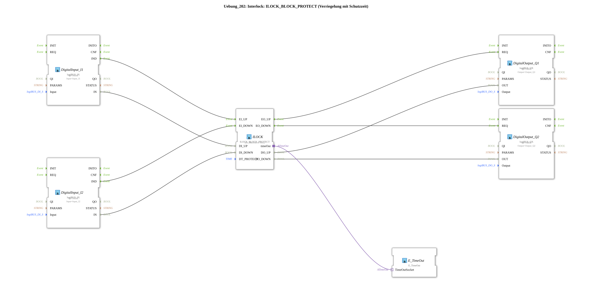

# Exercise_202: Interlock: ILOCK_BLOCK_PROTECT (Interlock with Timeout)

* * * * * * * * * *

## Introduction

This exercise demonstrates the application of an **interlock function block with timeout (ILOCK_BLOCK_PROTECT)**.
The function block implements an interlock between two opposing movements (e.g., up/down of a drive) and prevents an immediate change of direction by means of an adjustable timeout.

The logical input signals are read via digital inputs, and the output signals are output via digital outputs. A timer function block is connected to the interlock as an adapter to control the timing behavior.

## Function Blocks Used

| Function Block Name | Type | Description |
| -------------- | ----- | -------------- |
| DigitalInput\_I1 | `logiBUS::io::DI::logiBUS_IX` | Digital input – reads the signal from **Input_I1** (e.g., "Up" button) |
| DigitalInput\_I2 | `logiBUS::io::DI::logiBUS_IX` | Digital input – reads the signal from **Input_I2** (e.g., "Down" button) |
| ILOCK | `logiBUS::signalprocessing::interlock::ILOCK_BLOCK_PROTECT` | Interlock block with protection time – locks the outputs and enforces a minimum switching delay (parameter `DT_PROTECT = T#1s`) |
| DigitalOutput\_Q1 | `logiBUS::io::DQ::logiBUS_QX` | Digital Output – Controls **Output_Q1** (e.g., Relay "On") |
| DigitalOutput_Q2 | `logiBUS::io::DQ::logiBUS_QX` | Digital Output – Controls **Output_Q2** (e.g., Relay "Off") |
| E\_TimeOut | `iec61499::events::E_TimeOut` | Event-driven timer – provides the time base for the protection time (connected as an adapter) |

### Function Block Parameters

- **DigitalInput\_I1**: `QI = TRUE`, `Input = Input_I1`
- **DigitalInput\_I2**: `QI = TRUE`, `Input = Input_I2`
- **ILOCK**: `DT_PROTECT = T#1s` (Protection time 1 second)
- **DigitalOutput\_Q1**: `QI = TRUE`, `Output = Output_Q1`
- **DigitalOutput\_Q2**: `QI = TRUE`, `Output = Output_Q2`

## Program Flow and Connections

### Event Connections

1. **DigitalInput_I1.IND** → **ILOCK.EI_UP** 1. A rising edge at input I1 triggers the "Up" event at the interlock.
2. **DigitalInput_I2.IND** → **ILOCK.EI_DOWN**

A rising edge at input I2 triggers the "Down" event.

1. **ILOCK.EO_UP** → **DigitalOutput_Q1.REQ**

When the interlock releases the "Up" state, digital output Q1 is set.

1. **ILOCK.EO_DOWN** → **DigitalOutput_Q2.REQ**

When the interlock releases the "Down" state, digital output Q2 is set.

### Data Connections

- **DigitalInput_I1.IN** → **ILOCK.DI_UP**
- **DigitalInput_I2.IN** → **ILOCK.DI_DOWN**
- **ILOCK.DO_UP** → **DigitalOutput_Q1.OUT**
- **ILOCK.DO_DOWN** → **DigitalOutput_Q2.OUT**

### Adapter Connection

- **ILOCK.timeOut** ↔ **E_TimeOut.TimeOutSocket**
- The timer is connected to the interlock as an adapter and provides the necessary time base for the protection time.

### Functionality

- If input **I1** becomes active, the interlock sends the event **EO_UP** after the protection time has expired and sets **DO_UP**.
- If **I2** becomes active immediately afterward, the switching process is blocked until the protection time has expired.
- The parameter `DT_PROTECT` defines the minimum time between two direction changes – here, 1 second.
- The digital inputs are processed with their logical states (IN), while the events (IND) trigger the state change of the interlock.

### Learning Objectives of this Exercise

- Understanding the functionality of an interlock block with a timeout
- Application of the block `ILOCK_BLOCK_PROTECT`
- Integration of a timer as an adapter
- Relationship between event and data flows in the 4diac IDE

## Summary

Exercise **Exercise_202** illustrates a simple interlock with a timeout. Two pushbuttons (Up/Down) control two outputs via an interlock block. The integrated timeout prevents immediate switching and thus protects mechanical components. The implementation uses digital inputs/outputs and an external timer, which is connected to the interlock as an adapter. This basic principle is widely used in automation technology (e.g., in lifting mechanisms or sliding gates).

---

### 🌐 Related topic subpages on ms-muc-docs.de

- [🌐 Eclipse 4diac IDE & color reference on ms-muc-docs.de](https://www.ms-muc-docs.de/iec-61499/eclipse-4diac/)

]
