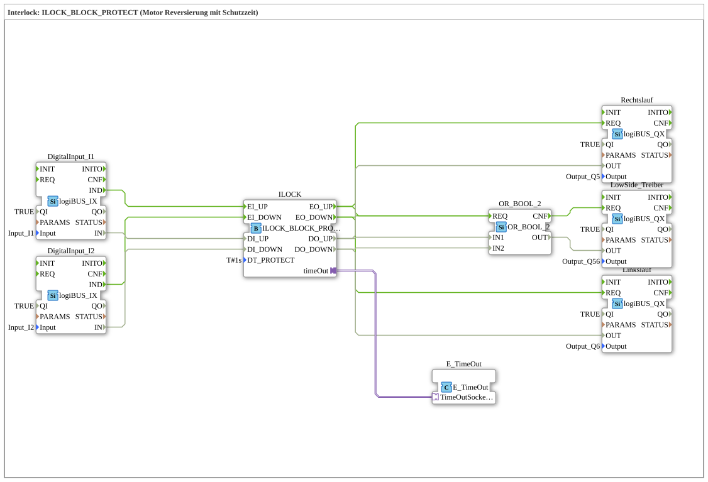

# Exercise_202b: Interlock: ILOCK_BLOCK_PROTECT (Motor Reversing with Protection Time)



* * * * * * * * * *

## Introduction

This exercise implements motor reversing with an interlock and protection time (ILOCK_BLOCK_PROTECT). The direction of rotation (clockwise or counterclockwise) is controlled via two digital inputs, with the interlock block preventing both outputs from being active simultaneously. A low-side driver is switched in both cases via an OR gate. Additionally, a protection time (DT_PROTECT = 1 s) is integrated, which only allows a change of direction after this time has elapsed.

## Function Blocks (FBs) Used

The exercise consists of the following function blocks (FB instances), all of which are contained in the subapp ``Uebung_202b``.


- **DigitalInput_I1**: Type ``logiBUS::io::DI::logiBUS_IX``

Reads the digital input ``Input_I1``.

- Parameters: QI = TRUE, Input = ``Input_I1``

- Event output: IND (Indication)

- Data output: IN (Value of the input)

- **DigitalInput_I2**: Type ``logiBUS::io::DI::logiBUS_IX``

Reads the digital input ``Input_I2``.

- Parameters: QI = TRUE, Input = ``Input_I2``

- Event output: IND

- Data output: IN

- **ILOCK**: Type ``logiBUS::signalprocessing::interlock::ILOCK_BLOCK_PROTECT``

Core component of the interlock function with protection time.

- Parameter: DT_PROTECT = T#1s (protection time 1 second)

- Event inputs: EI_UP, EI_DOWN

- Event outputs: EO_UP, EO_DOWN

- Data inputs: DI_UP, DI_DOWN

- Data outputs: DO_UP, DO_DOWN

- Adapter interface: timeOut (connected to E_TimeOut)

- **Counterclockwise**: Type ``logiBUS::io::DQ::logiBUS_QX``

Controls the digital output ``Output_Q5`` (counterclockwise).


- Parameter: QI = TRUE, Output = ``Output_Q5``

- Event input: REQ

- Data input: OUT

- **Reverse Scrolling**: Type ``logiBUS::io::DQ::logiBUS_QX``

Controls the digital output ``Output_Q6`` (reverse scrolling).

- Parameter: QI = TRUE, Output = ``Output_Q6``

- Event input: REQ

- Data input: OUT

- **Low-Side Driver**: Type ``logiBUS::io::DQ::logiBUS_QX``

Controls the common low-side output ``Output_Q56``.


- Parameter: QI = TRUE, Output = ``Output_Q56``

- Event input: REQ

- Data input: OUT

- **OR_2_BOOL**: Type ``iec61131::bitwiseOperators::OR_2_BOOL``

Logical OR operation of two Boolean values.

- Event input: REQ

- Event output: CNF

- Data inputs: IN1, IN2

- Data output: OUT

- **E_TimeOut**: Type ``iec61499::events::E_TimeOut``

Timer that monitors the ILOCK's protection time.


- Adapter interface: TimeOutSocket (connected to ILOCK.timeOut)

## Program Flow and Connections

The components are connected as follows:

1. **Input Signals**:

- ``DigitalInput_I1`` (Taster/Sensor für Rechtslauf) sendet über seinen Ereignisausgang IND ein Ereignis an den Ereigniseingang ``EI_UP`` des ILOCK. Gleichzeitig wird der Datenwert ``IN`` an den Dateneingang ``DI_UP`` is passed.

- ``DigitalInput_I2`` (Taster/Sensor für Linkslauf) sendet analog an ``EI_DOWN`` und ``DI_DOWN``.


2. **Interlock with Protection Time (ILOCK)**:

The ILOCK block evaluates the input signals. Upon a valid command (e.g., DI_UP = TRUE and an event at EI_UP), the corresponding output (DO_UP) is activated, and an event is connected to the ``EO_UP`` ausgegeben. Gleichzeitig wird der andere Ausgang (DO_DOWN) deaktiviert. Die Schutzzeit ``DT_PROTECT = 1s`` verhindert einen sofortigen Richtungswechsel; erst nach Ablauf der Zeit darf die Gegenrichtung angenommen werden. Der Adapter ``timeOut`` ist mit dem ``E_TimeOut`` block, which implements the time monitoring.


... 3. **Output Control**:

- The event ``EO_UP`` des ILOCK triggert den ``Rechtslauf``-Baustein (Eingang REQ) und übergibt den Datenwert ``DO_UP`` an den Dateneingang OUT. Somit wird der Ausgang ``Output_Q5`` is set.

- Similarly, the event ``EO_DOWN`` der ``Linkslauf``-Baustein aktiviert und ``Output_Q6`` is set.

- Both events (EO_UP and EO_DOWN) are also sent to the REQ event input of the ``OR_2_BOOL``-Bausteins weitergeleitet. Der Datenwertausgang ``DO_UP`` geht auf IN1, ``DO_DOWN`` auf IN2 des ODER-Bausteins. Der Ausgang OUT des ODER-Bausteins wird an den ``LowSide_Treiber`` übergeben, sodass der gemeinsame Ausgang ``Output_Q56`` whenever either clockwise or counterclockwise rotation is active.

4. **Time Monitoring**:

The ``E_TimeOut`` block is connected to the ILOCK via an adapter and provides the necessary timing functionality for the protection time.


``` In summary, the following sequence occurs:

- Activation of input I1 → clockwise rotation is enabled, counterclockwise rotation is disabled, and the low-side driver becomes active.

- When switching to I2: the 1-second protection time must elapse before counterclockwise rotation becomes active. The last state is retained during the protection time.

- The low-side driver follows the currently active rotation command.

## Summary

Exercise ``Uebung_202b`` vermittelt den Einsatz des Interlock-Bausteins ``ILOCK_BLOCK_PROTECT`` on safe motor reversal. The integration of a protection time prevents excessively rapid changes in direction, thus preventing component damage. The use of an OR gate for shared low-side control and the clear separation of event and data flows illustrate the typical structure of a 4diac IDE controller for logiBUS hardware.


``` ---

### 🌐 Related topic subpages on ms-muc-docs.de

* [🌐 Eclipse 4diac IDE & Color Reference on ms-muc-docs.de](https://www.ms-muc-docs.de/iec-61499/eclipse-4diac/)

]