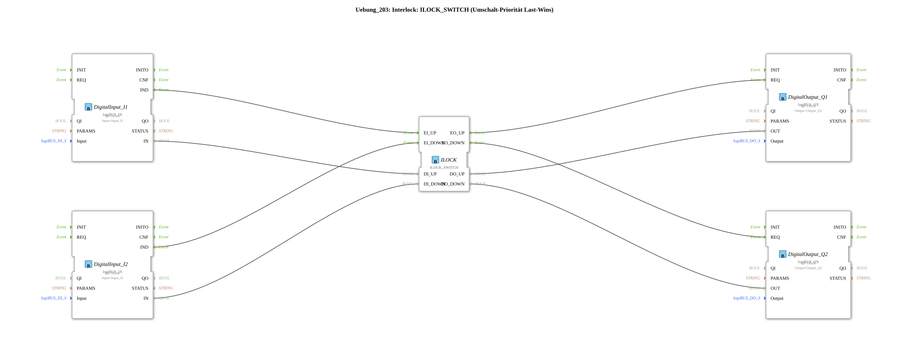

# Exercise_203: Interlock: ILOCK_SWITCH (Last-Wins Switching Priority)

> **Interlock: ILOCK_SWITCH (Last-Wins Switching Priority)**
* * * * * * * * * *
## Introduction

This exercise demonstrates the use of an interlock function block of type `ILOCK_SWITCH` to prioritize two competing requests. The circuit implements a **last-wins switching priority**: The last activated input receives the enable signal (priority). As soon as both inputs are inactive again, the output is reset.

Two digital input signals (I1, I2) control two separate digital outputs (Q1, Q2) via the interlock function block. The logic prevents both outputs from being active simultaneously and ensures that only the last activated channel is enabled.

## Function Blocks Used (FBs)

The subapp contains the following function blocks:

- **DigitalInput_I1** (Type: `logiBUS::io::DI::logiBUS_IX`)

*Parameters*: `QI = TRUE`, `Input = Input_I1`

*Event Output*: `IND` (activated on rising edge of input)

*Data Output*: `IN` (current input value)

- **DigitalInput_I2** (Type: `logiBUS::io::DI::logiBUS_IX`)

*Parameters*: `QI = TRUE`, `Input = Input_I2`

- **ILOCK** (Type: `logiBUS::signalprocessing::interlock::ILOCK_SWITCH`) No parameters.

*Event inputs*: `EI_UP`, `EI_DOWN`

*Data inputs*: `DI_UP`, `DI_DOWN`

*Event outputs*: `EO_UP`, `EO_DOWN`

*Data outputs*: `DO_UP`, `DO_DOWN`

- **DigitalOutput_Q1** (Type: `logiBUS::io::DQ::logiBUS_QX`)

*Parameters*: `QI = TRUE`, `Output = Output_Q1`

*Event input*: `REQ` (activates output)

*Data input*: `OUT` (value to be set)

- **DigitalOutput_Q2** (Type: `logiBUS::io::DQ::logiBUS_QX`)

*Parameters*: `QI = TRUE`, `Output = Output_Q2`

## Program Flow and Connections

The circuit operates **event-driven** and utilizes both event and data connections.

1. **Event-driven**:
- A rising edge at input `I1` generates an event at `IND` on `DigitalInput_I1`, which is connected to the event input `EI_UP` of the interlock module.
- Similarly, an edge at `I2` sends the event to `EI_DOWN`.
- The interlock block determines which channel is enabled based on priority (last wins) and triggers either `EO_UP` or `EO_DOWN`.
- The event `EO_UP` triggers the digital output `Q1` via `REQ`, while `EO_DOWN` triggers the output `Q2`.

... 2. **Data Flow**:

- The current value of `I1` (via `IN` from `DigitalInput_I1`) is passed to the data input `DI_UP` of the interlock.
- The value of `I2` is passed to `DI_DOWN`.
- The interlock block passes the enabled channel via the corresponding data outputs (`DO_UP` → `OUT` from `DigitalOutput_Q1`, `DO_DOWN` → `OUT` from `DigitalOutput_Q2`).
3. **Functionality of `ILOCK_SWITCH`**:
- In case of simultaneous or conflicting requests, the last received pulse wins (last wins).
- Only one of the two outputs can be active.
- As soon as both inputs return to `FALSE`, the outputs are also reset (provided the block is configured accordingly).

**Learning Objectives of this Exercise**:

- Understanding the interlock principle and last-wins priority.
- Working with event-driven function blocks in the 4diac IDE.
- Linking digital inputs/outputs with an interlock function block.
- Troubleshooting and behavioral testing through simulation.

## Summary

The exercise `Uebung_203` uses a `ILOCK_SWITCH` function block to prioritize two competing digital inputs. The last-wins logic ensures that only the last activated channel is ever enabled. The implementation is fully event-driven with corresponding data connections, enabling clean and deterministic control. This basic circuit is a typical building block for safety and interlock logic in automation technology.

---

### 🌐 Related topic subpages on ms-muc-docs.de

- [🌐 Eclipse 4diac IDE & Color Reference on ms-muc-docs.de](https://www.ms-muc-docs.de/iec-61499/eclipse-4diac/)
