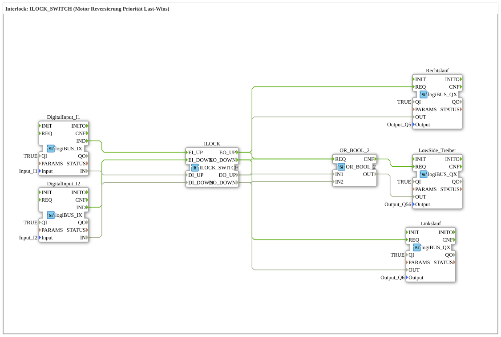

# Exercise_203b: Interlock: ILOCK_SWITCH (Motor Reversing Priority Last-Wins)

* * * * * * * * * *
## Introduction
This exercise demonstrates the use of an **ILOCK_SWITCH** function block for the safe control of a motor with a reversing function.
The **last-wins priority** principle ensures that, when control signals are applied simultaneously, the last active signal takes precedence – preventing a short circuit caused by simultaneous activation of both directions of rotation.

An additional **low-side driver** is activated for each active direction of rotation to supply voltage to the load (e.g., motor).

## Function Blocks (FBs) Used

### Digital Inputs
- **DigitalInput_I1** (Type: `logiBUS::io::DI::logiBUS_IX`)
- Parameters: `QI = TRUE`, `Input = Input_I1`
- Event Output: `IND`
- Data Output: `IN`
- **DigitalInput_I2** (Type: `logiBUS::io::DI::logiBUS_IX`)
- Parameters: `QI = TRUE`, `Input = Input_I2`
- Event Output: `IND`
- Data Output: `IN`

### Interlock Block
- **ILOCK** (Type: `logiBUS::signalprocessing::interlock::ILOCK_SWITCH`)
- Event inputs: `EI_UP`, `EI_DOWN`
- Data inputs: `DI_UP`, `DI_DOWN`
- Event outputs: `EO_UP`, `EO_DOWN`
- Data outputs: `DO_UP`, `DO_DOWN`

### Digital outputs
- **Right-hand rotation** (Type: `logiBUS::io::DQ::logiBUS_QX`)
- Parameters: `QI = TRUE`, `Output = Output_Q5`
- Input: `REQ`, Data: `OUT`
- **Left Rotation** (Type: `logiBUS::io::DQ::logiBUS_QX`)
- Parameters: `QI = TRUE`, `Output = Output_Q6`
- Input: `REQ`, Data: `OUT`
- **Lowside Driver** (Type: `logiBUS::io::DQ::logiBUS_QX`)
- Parameters: `QI = TRUE`, `Output = Output_Q56`
- Input: `REQ`, Data: `OUT`

### Logic Gates
- **OR_2_BOOL** (Type: `iec61131::bitwiseOperators::OR_2_BOOL`)
- Event input: `REQ`
- Data inputs: `IN1`, `IN2`
- Event output: `CNF`
- Data output: `OUT`

## Program Flow and Connections

1. The two digital inputs **Input_I1** and **Input_I2** provide the control signals for the direction of rotation (e.g., pushbuttons for clockwise and counterclockwise rotation) via the function blocks `DigitalInput_I1` and `DigitalInput_I2`, respectively.

2. The events `IND` and the data values `IN` are forwarded to the interlock block **ILOCK**:

- `DigitalInput_I1.IND` → `ILOCK.EI_UP` | `DigitalInput_I1.IN` → `ILOCK.DI_UP`
- `DigitalInput_I2.IND` → `ILOCK.EI_DOWN` | `DigitalInput_I2.IN` → `ILOCK.DI_DOWN`

3. The output of `ILOCK_SWITCH` determines which output is activated according to **last-wins** logic:

- Upon an event at `EI_UP`, `DO_UP = DI_UP` is set and `DO_DOWN` is reset (provided both inputs are active).
- Upon an event at `EI_DOWN`, `DO_DOWN = DI_DOWN` is set and `DO_UP` is reset.
- The corresponding event outputs (`EO_UP`, `EO_DOWN`) trigger the subsequent function blocks.

``` 4. The output `DO_UP` is fed to the data output **Right Rotation** (`OUT`), and its `REQ` event is activated via `EO_UP`. The same applies to `DO_DOWN` and **Left Rotation**.

The output `DO_UP` is fed to the data output **Right Rotation** (`OUT`), and its event `REQ` is activated via `EO_UP`. The same applies to `DO_DOWN` and **Left Rotation**.

``` 5. The signals `DO_UP` and `DO_DOWN` are simultaneously fed to the OR gate **OR_2_BOOL**:

- `ILOCK.DO_UP` → `OR_2_BOOL.IN1`
- `ILOCK.DO_DOWN` → `OR_2_BOOL.IN2`
- The events `EO_UP` and `EO_DOWN` are combined into `OR_2_BOOL.REQ`.

6. As soon as at least one of the two data values is `TRUE`, `OR_2_BOOL.OUT = TRUE` is output. The confirmation event `CNF` then activates the **LowSide_Driver** (`REQ`), which switches on the shared power supply to the load (e.g., motor voltage) via `Output_Q56`.

This circuit ensures:

- Both directions of rotation are never active simultaneously.
- The load is only energized when a direction of rotation is requested.
- The **Last-Wins Priority** prevents blockages when buttons are pressed simultaneously.

## Summary

This exercise teaches the safe control of a reversing motor using an interlock block and last-wins logic.

**Learning Objectives:**

- Understanding of interlock mechanisms to prevent short circuits.
- Working with the ILOCK_SWITCH function block (event/data interface).
- Combining event and data flows in the 4diac IDE.
- Implementing an auxiliary voltage (low-side driver) based on motor requirements.

**Difficulty Level:** Intermediate
**Prerequisites:** Basic knowledge of the 4diac IDE, event and data connections, and simple logic gates.

**Starting the Exercise:** Open the sub-application `Uebung_203b` and simulate the digital inputs `Input_I1` / `Input_I2`. Observe the outputs `Output_Q5` (right), `Output_Q6` (left), and `Output_Q56` (low-side).

---

### 🌐 Related topic subpages on ms-muc-docs.de
* [🌐 Eclipse 4diac IDE & Color Reference on ms-muc-docs.de](https://www.ms-muc-docs.de/iec-61499/eclipse-4diac/)

]
