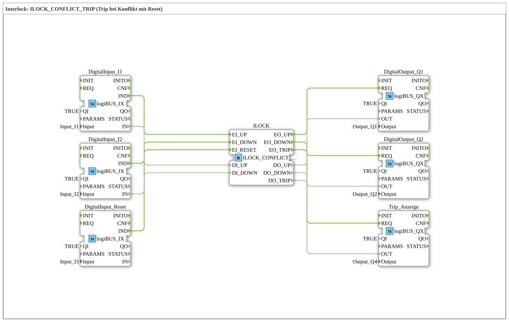

# Exercise_204: Interlock: ILOCK_CONFLICT_TRIP (Trip on conflict with reset)

* * * * * * * * * *
## Introduction
This exercise implements an interlock function with conflict detection and trip triggering, which can be reset. It demonstrates the typical use of an interlock function block to prevent simultaneous, conflicting control signals (e.g., up/down movement). In the event of a conflict, the ILOCK_CONFLICT_TRIP generates a trip (fault output) and blocks the outputs until an explicit reset signal is received.
## Function Blocks Used (FBs)

The exercise consists of the following function blocks, which are connected via event and data lines:

- **DigitalInput_I1** – Type: `logiBUS::io::DI::logiBUS_IX`

Parameters: `QI = TRUE`, `Input = Input_I1`

Digital input for the up signal (UP).

- **DigitalInput_I2** – Type: `logiBUS::io::DI::logiBUS_IX`

Parameters: `QI = TRUE`, `Input = Input_I2`

Digital input for the down signal (DOWN).

- **DigitalInput_Reset** – Type: `logiBUS::io::DI::logiBUS_IX`

Parameters: `QI = TRUE`, `Input = Input_I3`

Digital input for the reset signal.

- **ILOCK** – Type: `logiBUS::signalprocessing::interlock::ILOCK_CONFLICT_TRIP`

The central interlock module. It evaluates the input signals and controls the outputs. If both UP and DOWN signals are present simultaneously (conflict), the trip output is set.

- **DigitalOutput_Q1** – Type: `logiBUS::io::DQ::logiBUS_QX`

Parameters: `QI = TRUE`, `Output = Output_Q1`

Digital output for the UP signal.

- **DigitalOutput_Q2** – Type: `logiBUS::io::DQ::logiBUS_QX`

Parameters: `QI = TRUE`, `Output = Output_Q2`

Digital output for the off signal.

- **Trip_Display** – Type: `logiBUS::io::DQ::logiBUS_QX`

Parameters: `QI = TRUE`, `Output = Output_Q4`

Digital output for displaying the trip status.

## Program Flow and Connections

The exercise is set up as a SubAppType, in which all the logic runs. The connections are as follows:

| Event Connection | Source | Destination | Data Connection | Source | Destination |

|-------------------|--------|------|-----------------|--------|------|

IND → EI_UP | DigitalInput_I1 | ILOCK | IN → DI_UP | DigitalInput_I1 | ILOCK |
| IND → EI_DOWN | DigitalInput_I2 | ILOCK | IN → DI_DOWN | DigitalInput_I2 | ILOCK |
| IND → EI_RESET | DigitalInput_Reset | ILOCK | – | – | – |
| EO_UP → REQ | ILOCK | DigitalOutput_Q1 | DO_UP → OUT | ILOCK | DigitalOutput_Q1 |
| EO_DOWN → REQ | ILOCK | DigitalOutput_Q2 | DO_DOWN → OUT | ILOCK | DigitalOutput_Q2 |
| EO_TRIP → REQ | ILOCK | Trip_Display | DO_TRIP → OUT | ILOCK | Trip_Display |

**Procedure:**

1. A rising edge on one of the inputs (I1 for UP, I2 for DOWN) generates an event that activates the ILOCK block at its corresponding event input.

2. The ILOCK checks for a conflict (both inputs active simultaneously).

- **No conflict:** The desired output (DO_UP or DO_DOWN) is set, and the corresponding output driver (Q1 or Q2) is switched.
- **Conflict:** No output is set; instead, the trip output (DO_TRIP) is activated and output via `Trip_Anzeige`. Outputs Q1 and Q2 remain off.

3. An applied reset signal (I3) can reset the trip and restore normal operation. As long as the conflict persists, a further reset will not release the device.

## Summary

Exercise **Exercise_204** demonstrates the use of the interlock function block `ILOCK_CONFLICT_TRIP`. It shows how a conflict is detected by two opposing control signals (e.g., up/down) and secured with a trip. The function block requires an explicit reset after a conflict. This behavior is typical for safety applications in automation technology. The exercise is suitable for beginners who want to learn basic interlock mechanisms with 4diac and logiBUS function blocks.

---

### 🌐 Related topic subpages on ms-muc-docs.de
* [🌐 Eclipse 4diac IDE & color reference on ms-muc-docs.de](https://www.ms-muc-docs.de/iec-61499/eclipse-4diac/)
