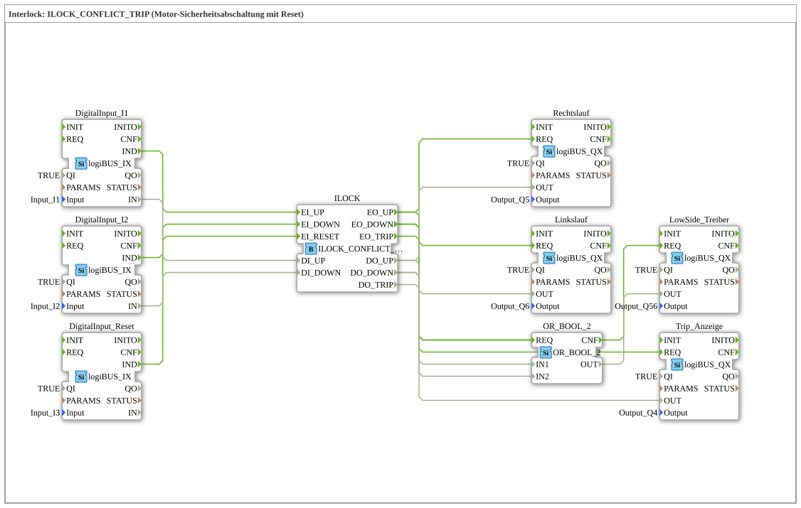

# Exercise_204b: Interlock: ILOCK_CONFLICT_TRIP (Motor Safety Shutdown with Reset)

* * * * * * * * * *
## Introduction
This exercise implements a **motor safety shutdown with reset**. It is based on the function block `ILOCK_CONFLICT_TRIP`, which implements an interlock for two opposing motor directions (clockwise and counterclockwise). If a conflict occurs (both directions active simultaneously), the motor is stopped and an alarm (trip) is triggered. A separate reset input allows the trip state to be reset.

The motor is controlled via three digital inputs:

- I1 – Request clockwise rotation
- I2 – Request counterclockwise rotation
- I3 – Reset

The following outputs are available:

- Q5 – Clockwise rotation
- Q6 – Counterclockwise rotation
- Q4 – Trip indicator
- Q56 – Low-side driver (shared enable for both motor directions)

## Function Blocks (FBs) Used

This exercise uses the following function blocks:

- **`DigitalInput_I1`** (Type: `logiBUS::io::DI::logiBUS_IX`)
- Parameters: `QI` = TRUE, `Input` = `Input_I1`
- Converts the digital input signal I1 into an internal signal.
- **`DigitalInput_I2`** (Type: `logiBUS::io::DI::logiBUS_IX`)
- Parameters: `QI` = TRUE, `Input` = `Input_I2`
- Converts the digital input signal I2 into an internal signal.
- **`DigitalInput_Reset`** (Type: `logiBUS::io::DI::logiBUS_IX`)
- Parameters: `QI` = TRUE, `Input` = `Input_I3`
- Converts the digital input signal I3 (Reset) into an internal signal.
- **`ILOCK`** (Type: `logiBUS::signalprocessing::interlock::ILOCK_CONFLICT_TRIP`)
- No parameters
- Core component of this exercise. It implements the interlock logic with conflict detection and trip function.
- **`Rechtslauf`** (Type: `logiBUS::io::DQ::logiBUS_QX`)
- Parameters: `QI` = TRUE, `Output` = `Output_Q5`
- Controls output Q5 for clockwise rotation of the motor.
- **`Linkslauf`** (Type: `logiBUS::io::DQ::logiBUS_QX`)
- Parameters: `QI` = TRUE, `Output` = `Output_Q6`
- Controls output Q6 for reverse motor rotation.
- **`Trip_Anzeige`** (Type: `logiBUS::io::DQ::logiBUS_QX`)
- Parameters: `QI` = TRUE, `Output` = `Output_Q4`
- Controls output Q4 as a trip indicator.
- **`LowSide_Treiber`** (Type: `logiBUS::io::DQ::logiBUS_QX`)
- Parameters: `QI` = TRUE, `Output` = `Output_Q56`
- Controls output Q56 as a common enable (low-side driver) for both motor directions.
- **`OR_2_BOOL`** (Type: `iec61131::bitwiseOperators::OR_2_BOOL`)
- No parameters
- Logical OR gate; combines the signals for forward and reverse rotation to control the low-side driver.

## Program Flow and Connections

The flow is divided into the following steps:

1. **Input Acquisition**:

The three digital inputs (I1, I2, I3) are read via the corresponding `logiBUS_IX` function blocks.

- `DigitalInput_I1` provides the clockwise rotation request (BOOL) and an event `IND`.
- `DigitalInput_I2` provides the counterclockwise rotation request and an event `IND`.
- `DigitalInput_Reset` provides the reset signal and an event `IND`.

2. **Processing in the ILOCK block**:

- The block `ILOCK` receives the events from the following inputs:
- `EI_UP` is triggered by `DigitalInput_I1.IND`.
- `EI_DOWN` is triggered by `DigitalInput_I2.IND`.
- `EI_RESET` is triggered by `DigitalInput_Reset.IND`.
- The data values (BOOL) are transmitted via the corresponding data ports:
- `DI_UP` from `DigitalInput_I1.IN`
- `DI_DOWN` from `DigitalInput_I2.IN`
- The function block decides, based on its internal state logic, whether the request is valid, a conflict exists, or a reset is performed.

3. **Output of Motor Directions**:

- If a clockwise rotation request is valid, `ILOCK` generates an event `EO_UP` and sets the data output `DO_UP` to TRUE.
- If a reverse scrolling request is valid, `ILOCK` generates an event `EO_DOWN` and sets `DO_DOWN` to TRUE.
- In case of an error (conflict), `ILOCK` generates an event `EO_TRIP` and sets `DO_TRIP` to TRUE.
- The events are forwarded to the corresponding output blocks:
- `EO_UP` → `Rechtslauf.REQ`
- `EO_DOWN` → `Linkslauf.REQ`
- `EO_TRIP` → `Trip_Anzeige.REQ`
- The data values are transferred to the output blocks via the data connections:
- `DO_UP` → `Rechtslauf.OUT`
- `DO_DOWN` → `Linkslauf.OUT`
- `DO_TRIP` → `Trip_Anzeige.OUT`

4. **Low-Side Driver**:

- The low-side driver (output Q56) is activated as soon as either clockwise or counterclockwise rotation is active.
- For this purpose, the events `EO_UP` and `EO_DOWN` (both) are routed to the function block `OR_2_BOOL.REQ`.
- The data values `DO_UP` and `DO_DOWN` are routed to the inputs `IN1` and `IN2`, respectively, of the OR gate.
- The output `OR_2_BOOL.OUT` is TRUE if at least one of the two conditions is met.
- The event `OR_2_BOOL.CNF` triggers the function block `LowSide_Treiber.REQ`, and the data value `OR_2_BOOL.OUT` is passed to `LowSide_Treiber.OUT`.

### Learning Objectives
- Understanding the interlock concept for motor controllers
- Working with the function block `ILOCK_CONFLICT_TRIP` (conflict/trip logic)
- Linking event and data flows in the 4diac IDE
- Using an OR gate for simultaneous enabling
- Error handling via a reset mechanism

### Difficulty Level
Advanced – Basic knowledge of the 4diac IDE and working with function blocks is required.

### Learning Objectives
- Understanding the interlock concept for motor controllers
- Working with the function block `ILOCK_CONFLICT_TRIP` (conflict/trip logic)
- Linking event and data flows in the 4diac IDE
- Using an OR gate for simultaneous enabling
- Error handling via a reset mechanism

### Difficulty Level

Advanced – Basic knowledge of the 4diac IDE and working with function blocks is required.

### Learning Objectives
...`` ### Prerequisites
- Fundamentals of IEC 61499
- Sequence controls and interlocks
- Input/output configuration with logiBUS function blocks

### Starting the Exercise

1. Open the 4diac IDE and load the exercise `Uebung_204b`.

2. Ensure that the required logiBUS libraries are imported (see CompilerInfo).

3. Check the connections between the function blocks.

4. Simulate the behavior by applying the input signals I1, I2, and I3.

## Summary

The exercise `Uebung_204b` demonstrates the use of the function block `ILOCK_CONFLICT_TRIP`.For a motor safety shutdown. By combining three digital inputs (two direction requests and one reset), an interlock is implemented that detects conflicts and triggers a trip in case of a fault. The outputs are controlled via separate channels for clockwise rotation, counterclockwise rotation, and a common low-side enable. This solution demonstrates how safety-related control systems can be implemented with the 4diac IDE.

---

### 🌐 Related topic subpages on ms-muc-docs.de
* [🌐 Eclipse 4diac IDE & color reference on ms-muc-docs.de](https://www.ms-muc-docs.de/iec-61499/eclipse-4diac/)
