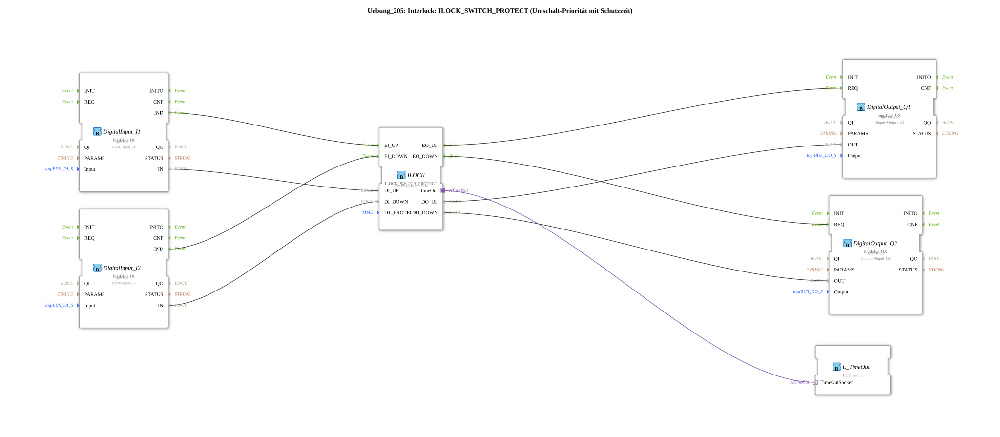

# Exercise_205: Interlock: ILOCK_SWITCH_PROTECT (Switching Priority with Protection Time)

* * * * * * * * * *
## Introduction

This exercise demonstrates the use of the function block `ILOCK_SWITCH_PROTECT` to implement a switching priority with protection time (interlock). Two digital inputs (I1, I2) control two digital outputs (Q1, Q2) via interlocked logic. The `ILOCK_SWITCH_PROTECT` ensures that a configurable protection time (`DT_PROTECT`) is observed after a switching operation before another switching operation is possible. This prevents rapid, unwanted switching back and forth (oscillation). The outputs are controlled via event-driven output blocks. A function block `E_TimeOut` is connected to `ILOCK` via an adapter and enables time monitoring of the protection period.
## Function Blocks (FBs) Used

### Function blocks of the subapplication `Uebung_205`

| Function block name | Type | Parameters | Description |
|--------------|-----|------------|--------------|
| `DigitalInput_I1` | `logiBUS::io::DI::logiBUS_IX` | `QI = TRUE`, `Input = Input_I1` | Reads the first digital input (hardware address `Input_I1`). The event `IND` signals a change in value. |
| `DigitalInput_I2` | `logiBUS::io::DI::logiBUS_IX` | `QI = TRUE`, `Input = Input_I2` | Reads the second digital input. The event `IND` signals a change in value. |
| `ILOCK` | `logiBUS::signalprocessing::interlock::ILOCK_SWITCH_PROTECT` | `DT_PROTECT = T#1s` | Core component: Implements the switching priority with a 1-second protection time. |
| `DigitalOutput_Q1` | `logiBUS::io::DQ::logiBUS_QX` | `QI = TRUE`, `Output = Output_Q1` | Sets the first digital output (hardware address `Output_Q1`) to the value of the data input `OUT` when the event `REQ` occurs. |
| `DigitalOutput_Q2` | `logiBUS::io::DQ::logiBUS_QX` | `QI = TRUE`, `Output = Output_Q2` | Sets the second digital output (hardware address `Output_Q2`) to the value of the data input `OUT` when the event `REQ` occurs. |
| `E_TimeOut` | `iec61499::events::E_TimeOut` | – | Timer module connected to `ILOCK` via adapter `timeOut`. It monitors compliance with the protection time. |
...
## Program Flow and Connections

1. **Event Control:**
- A rising/falling edge at `DigitalInput_I1` triggers the event `DigitalInput_I1.IND` → connected to `ILOCK.EI_UP`.
- An edge at `DigitalInput_I2` triggers `DigitalInput_I2.IND` → connected to `ILOCK.EI_DOWN`.
- Upon successful switching, `ILOCK` generates the event `EO_UP` (for the upper output) or `EO_DOWN` (for the lower output).
- `ILOCK.EO_UP` is connected to `DigitalOutput_Q1.REQ` (output Q1 switches).
- `ILOCK.EO_DOWN` is connected to `DigitalOutput_Q2.REQ` (output Q2 switches).
2. **Data Path:**
- The value of input `DigitalInput_I1.IN` is transferred to `ILOCK.DI_UP`.
- The value of `DigitalInput_I2.IN` is transferred to `ILOCK.DI_DOWN`.
- The ILOCK transmits the state for the upper output (1 = active) to `DigitalOutput_Q1.OUT` via `DO_UP`.
- Accordingly, `DO_DOWN` passes the status to `DigitalOutput_Q2.OUT`.
3. **Protection Time Monitoring:**
- The `ILOCK_SWITCH_PROTECT` has an adapter port, `timeOut`, which is connected to the `E_TimeOut.TimeOutSocket`. This adapter allows the `E_TimeOut` to monitor the protection time (here, 1 second) and, if necessary, generate an event when it expires.
4. **Interlock Functionality:**
- The `ILOCK_SWITCH_PROTECT` operates with priority: Whichever input becomes active first sets the corresponding output. As long as the protection time (`DT_PROTECT = 1s`) is running, the other input is ignored. Switching is only possible again after the protection time has expired.
- This prevents rapid switching between the two outputs (e.g., with mechanical bounce switches or fast pushbuttons).

**Learning Objectives:**

- Using the interlock block `ILOCK_SWITCH_PROTECT` with a guard time.
- Understanding event-driven communication (IND → EI, EO → REQ).
- Integrating a timer adapter to monitor the guard time.
- Configuring hardware inputs/outputs (`logiBUS_IX`, `logiBUS_QX`).

**Difficulty Level:** Medium
**Prerequisites:** Basic knowledge of event control in 4diac, working with input/output blocks.

## Summary

Exercise **Exercise_205** demonstrates the practical application of an interlock with a timeout using the `ILOCK_SWITCH_PROTECT` module. Two digital inputs control two outputs, with switching only possible after a configurable timeout period. The setup illustrates the separation of event and data paths as well as the integration of time monitoring via adapters. This circuit is typically suitable for applications where two actuators must not be active simultaneously and rapid switching must be avoided (e.g., motor direction reversal, valve control).

---

### 🌐 Related topic subpages on ms-muc-docs.de

- [🌐 Eclipse 4diac IDE & color reference on ms-muc-docs.de ](https://www.ms-muc-docs.de/iec-61499/eclipse-4diac/)

]
