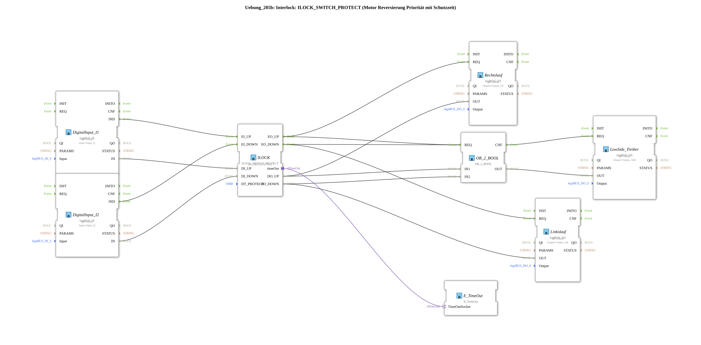

# Exercise_205b: Interlock: ILOCK_SWITCH_PROTECT (Motor Reversing Priority with Protection Time)

* * * * * * * * * *
## Introduction

This exercise demonstrates the implementation of a **motor reversing interlock** with priority protection and a protection time. The function block `ILOCK_SWITCH_PROTECT` ensures that a motor cannot be switched to both directions of rotation (clockwise and counterclockwise) simultaneously. An additional low-side driver switches the common power supply. The protection time `DT_PROTECT` of 1 second prevents excessively rapid switching and protects the power electronics.

## Function Blocks (FBs) Used

### Input Blocks – Digital Inputs

- **DigitalInput_I1** (Type `logiBUS::io::DI::logiBUS_IX`)
- Parameters: `QI = TRUE`, `Input = Input_I1`
- Function: Captures the signal from the first button/sensor (e.g., "Start Right") and forwards it as an event `IND` and a data value `IN`.
- **DigitalInput_I2** (Type `logiBUS::io::DI::logiBUS_IX`)
- Parameters: `QI = TRUE`, `Input = Input_I2`
- Function: Captures the signal from the second button/sensor (e.g., "Start Left") and forwards it as an event `IND` and a data value `IN`.

### Interlock Block

- **ILOCK** (Type `logiBUS::signalprocessing::interlock::ILOCK_SWITCH_PROTECT`)
- Parameter: `DT_PROTECT = T#1s`
- Function: Implements interlocking between two directions.
- Event inputs: `EI_UP` (Request right), `EI_DOWN` (Request left)
- Data outputs: `DO_UP`, `DO_DOWN` (Directions enabled)
- Event outputs: `EO_UP`, `EO_DOWN` (Acknowledge enable)
- Internally, when a direction changes, the protection time `DT_PROTECT` is started before the other direction can be enabled.
- Adapter `timeOut` passes the timer status to the `E_TimeOut` block.

` internally, the protection timer qzms `qzms `qzms `qzms `000023qz
### Output Modules

- **Right-Hand Rotation** (Type `logiBUS::io::DQ::logiBUS_QX`)
- Parameters: `QI = TRUE`, `Output = Output_Q5`
- Function: Switches the output for the right-hand rotation coil (Q5) when the enable signal is received from the ILOCK via `REQ` and `IN`.
- **Reverse Rotation** (Type `logiBUS::io::DQ::logiBUS_QX`)
- Parameters: `QI = TRUE`, `Output = Output_Q6`
- Function: Switches the output for the counter-clockwise rotation coil (Q6) when the enable signal is received from the ILOCK via `REQ` and `IN`.
- **LowSide_Driver** (Type `logiBUS::io::DQ::logiBUS_QX`)
- Parameters: `QI = TRUE`, `Output = Output_Q56`
- Function: Switches the common supply (Q56) for both directions. Activated as soon as one of the two enable signals (`DO_UP` or `DO_DOWN`) is present.

### Logic Block

- **OR_2_BOOL** (Type `iec61131::bitwiseOperators::OR_2_BOOL`)
- Function: Logical OR operation of the two enable signals (`DO_UP` and `DO_DOWN`).
- Inputs: `IN1`, `IN2`
- Output: `OUT` – outputs `TRUE` if at least one direction is enabled.

### Timer Module

- **E_TimeOut** (Type `iec61499::events::E_TimeOut`)
- Function: Visualizes/monitors the protection time. It is connected to the ILOCK via the adapter `timeOut` and displays the status of the running timer (e.g., for diagnostic purposes).

## Program Flow and Connections

1. **Input Processing**
- The digital inputs `Input_I1` (right) and `Input_I2` (left) are acquired via the function blocks `DigitalInput_I1` and `DigitalInput_I2`.
- Upon an edge, an event (`IND`) is sent to the ILOCK.
2. **Locking via ILOCK**
- The ILOCK checks whether a change of direction is permitted.
- If a switching request is made, the 1-second protection time is started.
- Only after the protection time has expired is the new direction enabled and the corresponding event (`EO_UP`/`EO_DOWN`) and the data value (`DO_UP`/`DO_DOWN`) are output.
- The adapter `timeOut` delivers the timer status to `E_TimeOut`, which can be used, for example, in an HMI display.
3. **Controlling the Outputs**
- `EO_UP` triggers the function block `Rechtslauf`, which sets the output `Output_Q5`.
- `EO_DOWN` triggers the function block `Linkslauf`, which sets the output `Output_Q6`.
- In parallel, the data outputs `DO_UP` and `DO_DOWN` are forwarded to the OR gate (`OR_2_BOOL`).
- The OR signal activates `LowSide_Treiber`, which switches on the common power supply `Output_Q56`. This ensures that current only flows when at least one direction is active.
4. **Protection Mechanism**
- The protection time prevents the outputs from switching too quickly during rapid changes in requirements (contact bounce, incorrect operation), thus protecting the motor bridge.

## Summary

Exercise 205b demonstrates an industrial-grade motor reversing circuit with **priority interlock** (`ILOCK_SWITCH_PROTECT`). The integrated **protection time** prevents excessively rapid switching between clockwise and counterclockwise rotation. A low-side driver ensures clean power supply isolation. The use of logiBUS and IEC 61131 function blocks makes the solution hardware-integrated and reusable in PLC projects.

**Learning Objectives:**

- Understand interlock concepts for motor controllers
- Use of the function block `ILOCK_SWITCH_PROTECT`
- Use of OR gates to enable shared outputs
- Interpretation of protection times in control engineering

**Difficulty Level:** Advanced beginners (basic knowledge of IEC 61499 and logiBUS hardware is required).
