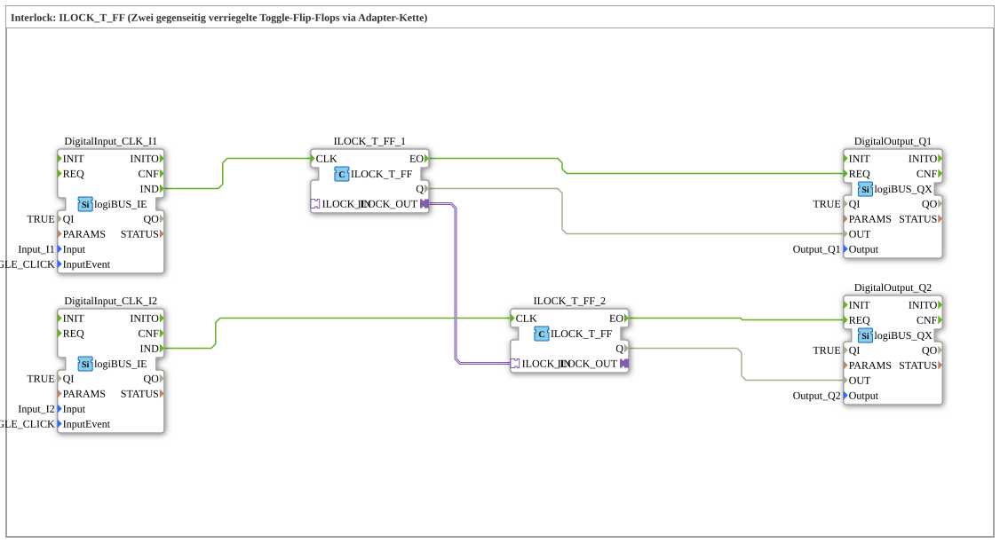

# Exercise_206: Interlock: ILOCK_T_FF (Two mutually interlocked toggle flip-flops via an adapter chain)

* * * * * * * * * *
## Introduction
This exercise demonstrates the mutual interlocking of two toggle flip-flops. Each button (I1 and I2) controls a separate output (Q1 and Q2, respectively). The special feature is that the two flip-flops are connected via an adapter ("ILOCK"), so that only one of the two outputs can be active at any given time. When the other button is pressed, the previously active output is reset and the new output is set. This creates a simple alternating flashing circuit with mutual interlocking.

``` ## Function Blocks (FBs) Used

- **DigitalInput_CLK_I1** and **DigitalInput_CLK_I2**: `logiBUS::io::DI::logiBUS_IE`
- Parameters: `QI = TRUE`, `Input = Input_I1` and `Input_I2`, `InputEvent = BUTTON_SINGLE_CLICK`
- These blocks convert the signal coming from the hardware input (e.g., a push button) into an event (`IND`) that serves as the clock signal for the flip-flops.
- **ILOCK_T_FF_1** and **ILOCK_T_FF_2**: `logiBUS::signalprocessing::interlock::ILOCK_T_FF`
- These blocks are special toggle flip-flops with an interlock interface (adapter). With each clock cycle (event at `CLK`), the output `Q` toggles. Additionally, the output state can be reset externally via the adapter (`ILOCK_IN`).
- **DigitalOutput_Q1** and **DigitalOutput_Q2**: `logiBUS::io::DQ::logiBUS_QX`
- Parameters: `QI = TRUE`, `Output = Output_Q1`, and `Output_Q2`
- These function blocks pass the data value to the hardware output as soon as an event occurs at `REQ`.

``` ## Program Flow and Connections

1. **Input Processing**

Each button (I1, I2) is read via a `logiBUS_IE` function block. With each single click, the function block generates an event at output `IND`.

2. **Toggle Flip-Flops**

The event from `DigitalInput_CLK_I1` is connected to input `CLK` of `ILOCK_T_FF_1`. Similarly, `DigitalInput_CLK_I2` is connected to `ILOCK_T_FF_2`. With each event, the output `Q` of the corresponding flip-flop toggles its state.

3. **Mutual Interlock**

The adapter output `ILOCK_OUT` of `ILOCK_T_FF_1` is connected to the adapter input `ILOCK_IN` of `ILOCK_T_FF_2` (bidirectional chain). This means that as soon as `ILOCK_T_FF_1` is set, the other module is reset. Simultaneously, the reverse is also achieved via this connection: If `ILOCK_T_FF_2` is set, `ILOCK_T_FF_1` is reset. Therefore, only one of the two outputs can have the value `TRUE` (i.e., be "active") at any given time.

This means that as soon as `ILOCK_T_FF_1` is set, the other module is reset. 4. **Output Control**

The output events `EO` of the flip-flops trigger the `REQ` inputs of the output devices. Simultaneously, the data values `Q` are forwarded to the `OUT` inputs of the output devices. This sets the hardware outputs Q1 and Q2 according to the state of the flip-flops.

**Learning Objectives of this Exercise:**

- Understanding the operation of a toggle flip-flop (toggles on every clock cycle).
- Using an adapter connection to implement mutual interlocking.
- Reading pushbuttons with single-click events and outputting to digital outputs.
- Constructing a simple state control circuit with two mutually exclusive states.

**Difficulty Level:** Medium
**Prerequisites:** Basic knowledge of IEC 61499, event and data connections, and working with adapters.

## Summary

Exercise 206 demonstrates an elegant solution for a mutually interlocked circuit using two toggle flip-flops. By using the pre-built interlock block `ILOCK_T_FF` and the adapter connection between the two instances, it is ensured that only one output is active at any given time. This principle is frequently found in control systems where multiple actuators must not be active simultaneously (e.g., changing the direction of a motor, barrier control).