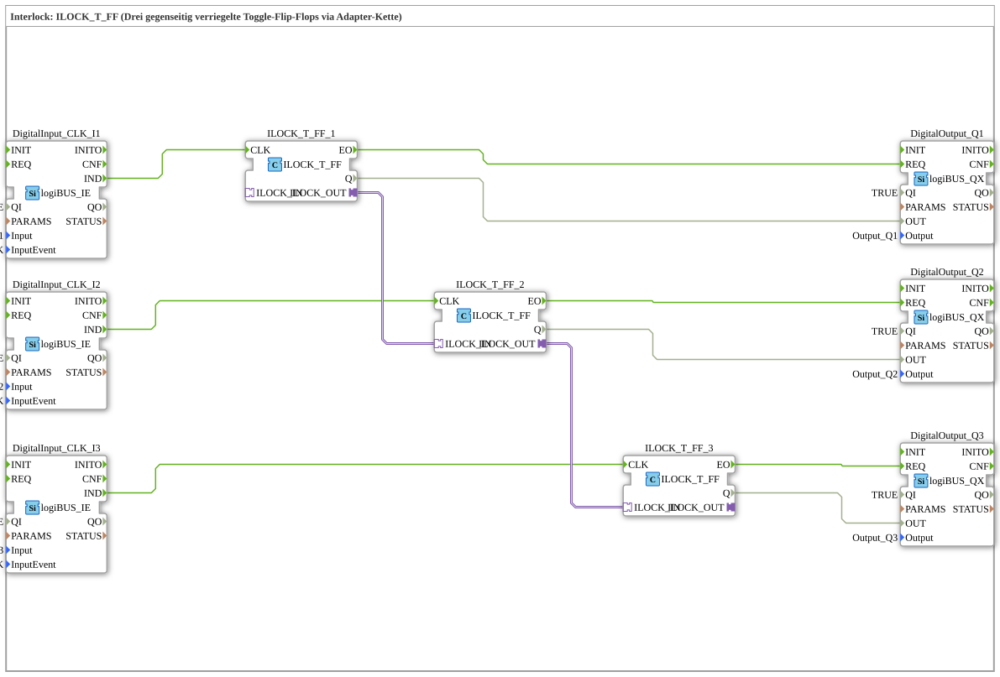

# Exercise_206b: Interlock: ILOCK_T_FF (Three mutually interlocked toggle flip-flops via an adapter chain)

* * * * * * * * * *
## Introduction

This exercise implements an application using three mutually interlocked toggle flip-flops. Three pushbuttons (digital inputs) each control an ILOCK_T_FF, which toggles its output with each button press. The three flip-flops are bidirectionally connected via an adapter chain, ensuring that only one output can be active at a time (interlock). The outputs are routed to three digital outputs (e.g., LEDs).
## Function Blocks (FBs) Used

### Digital Input: logiBUS_IE

- **Type**: logiBUS::io::DI::logiBUS_IE
- **Instances Used**: DigitalInput_CLK_I1, DigitalInput_CLK_I2, DigitalInput_CLK_I3
- **Parameters**:
- QI = TRUE
- Input = Input_I1 / Input_I2 / Input_I3
- InputEvent = BUTTON_SINGLE_CLICK
- **Functionality**:

Each block detects a button and generates an event (IND) at its event output upon a single click.

### Interlock Toggle Flip-Flop: ILOCK_T_FF

- **Type**: logiBUS::signalprocessing::interlock::ILOCK_T_FF
- **Instances Used**: ILOCK_T_FF_1, ILOCK_T_FF_2, ILOCK_T_FF_3
- **Parameters**: No specific parameters in the XML
- **Functionality**:

A toggle flip-flop that switches its output **Q** on every event at the input **CLK**. It has two adapter interfaces: **ILOCK_IN** and **ILOCK_OUT**. These adapters allow multiple ILOCK_T_FF flip-flops to be chained together, ensuring that only one flip-flop in the chain can set its output to TRUE at any given time (mutual interlocking). When another flip-flop is activated, the previously active one is automatically reset.

A toggle flip-flop that switches its output **Q** on every event at its input **CLK**.
### Digital Output: logiBUS_QX

- **Type**: logiBUS::io::DQ::logiBUS_QX
- **Instances Used**: DigitalOutput_Q1, DigitalOutput_Q2, DigitalOutput_Q3
- **Parameters**:
- QI = TRUE
- Output = Output_Q1 / Output_Q2 / Output_Q3
- **Functionality**:

This function block sets a digital output (e.g., an LED) to the value present at the **OUT** data input. The output occurs upon an event at the **REQ** input.

## Program Flow and Connections

1. **Input Signals**:

Three pushbuttons are connected to the logiBUS inputs *Input_I1*, *Input_I2*, and *Input_I3*. Each key press (single click) generates an event on the associated logiBUS_IE, which is forwarded via the event output **IND** to the **CLK** input of the corresponding ILOCK_T_FF.

2. **Interlock**:

The three ILOCK_T_FFs are connected via their adapter interfaces:

- ILOCK_T_FF_1.ILOCK_OUT → ILOCK_T_FF_2.ILOCK_IN
- ILOCK_T_FF_2.ILOCK_OUT → ILOCK_T_FF_3.ILOCK_IN

This chain ensures that only one of the three flip-flops can set its output **Q** to TRUE. As soon as another flip-flop changes its state, the previously active one is reset.

3. **Output Signals**:

The outputs **Q** of the flip-flops are connected to the data inputs **OUT** of the digital output modules. The **EO** event of each ILOCK_T_FF (triggered upon a state change) triggers the **REQ** input of the associated logiBUS_QX, thus updating the output.

**Connections at a Glance (Events & Data):**

| Source | Destination | Type |
|--------|------|------|
| DigitalInput_CLK_I1.IND | ILOCK_T_FF_1.CLK | Event |
| DigitalInput_CLK_I2.IND | ILOCK_T_FF_2.CLK | Event |
| DigitalInput_CLK_I3.IND | ILOCK_T_FF_3.CLK | Event |
| ILOCK_T_FF_1.EO | DigitalOutput_Q1.REQ | Event |
| ILOCK_T_FF_2.EO | DigitalOutput_Q2.REQ | Event |
| ILOCK_T_FF_3.EO | DigitalOutput_Q3.REQ | Event |
ILOCK_T_FF_1.Q | DigitalOutput_Q1.OUT | Data |
ILOCK_T_FF_2.Q | DigitalOutput_Q2.OUT | Data |
ILOCK_T_FF_3.Q | DigitalOutput_Q3.OUT | Data |

**Adapter Connections (Bidirectional):**

| Source | Destination |
|--------|------|
ILOCK_T_FF_1.ILOCK_OUT | ILOCK_T_FF_2.ILOCK_IN |
ILOCK_T_FF_2.ILOCK_OUT | ILOCK_T_FF_3.ILOCK_IN |

## Summary

This exercise demonstrates the use of the ILOCK_T_FF block to implement an interlock between three toggle flip-flops. The adapter chain ensures that only one output is active at any given time, which is typically required for applications with changing operating modes or exclusive states. Input/output is handled via the logiBUS hardware. **Learning Objectives**: Understanding interlock mechanisms, working with adapter interfaces, and event-driven logic in 4diac. **Prerequisites**: Basic knowledge of the 4diac IDE and the logiBUS library.

---

### 🌐 Related topic subpages on ms-muc-docs.de

* [🌐 Eclipse 4diac IDE & color reference on ms-muc-docs.de](https://www.ms-muc-docs.de/iec-61499/eclipse-4diac/)

]
