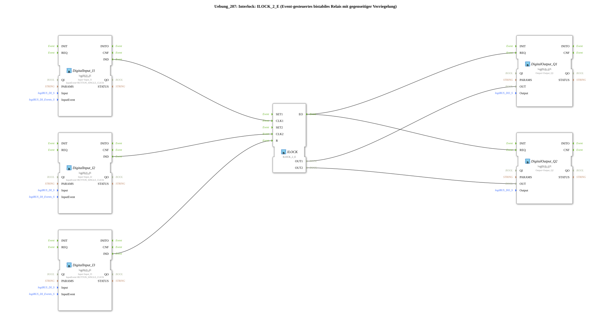

# Exercise_207: Interlock: ILOCK_2_E (Event-driven bistable relay with mutual interlocking)

* * * * * * * * * *
## Introduction
Exercise 207 implements an **event-driven bistable relay with mutual interlocking** (interlock). Two pushbuttons (inputs I1 and I2) can alternately set two outputs (Q1 and Q2), with the outputs being mutually exclusive. A third pushbutton (input I3) serves as a reset button to reset both outputs.
This circuit is typical for safety applications where both outputs must never be active simultaneously (e.g., interlocking drives or switches).

## Function Blocks (FBs) Used

| Block | Type | Short Description |

|----------|-----|------------------|

| `DigitalInput_I1`, `DigitalInput_I2`, `DigitalInput_I3` | `logiBUS_IE` (logiBUS Digital Input Event) | Converts a key press (single click) into an event `IND`. The parameter `Input` specifies the physical input (e.g., `Input_I1`). |

| `ILOCK` | `ILOCK_2_E` (logiBUS Interlock, event-driven) | Bistable relay with two outputs `OUT1`/`OUT2`. Events `CLK1` and `CLK2` set the respective output (with mutual interlocking), and `R` resets both. |

| `DigitalOutput_Q1`, `DigitalOutput_Q2` | `logiBUS_QX` (logiBUS Digital Output) | Receives a data value (`OUT`) via event `REQ` and outputs it at the physical output. |

## Program Flow and Connections

The interconnection takes place within a subapplication (`SubAppType`). The following diagram shows the logical connection of the function blocks:

[I1] → DigitalInput_I1.IND → ILOCK.CLK1
[I2] → DigitalInput_I2.IND → ILOCK.CLK2
[I3] → DigitalInput_I3.IND → ILOCK.R

ILOCK.EO → DigitalOutput_Q1.REQ
→ DigitalOutput_Q2.REQ

ILOCK.OUT1 → DigitalOutput_Q1.OUT
ILOCK.OUT2 → DigitalOutput_Q2.OUT
**Procedure:**

1. **Setting Q1**: Pressing a key at input I1 generates an event at output `IND` of function block `DigitalInput_I1`. This event is forwarded to event input `CLK1` of the interlock function block `ILOCK`. Subsequently, `ILOCK` sets data output `OUT1` to `TRUE` and `OUT2` to `FALSE` (mutual interlocking). The output block `EO` is then triggered via the event output `DigitalOutput_Q1`, which passes the value of `OUT1` to the physical output Q1. `DigitalOutput_Q2` also receives the same event and takes over the value of `OUT2` (which is now `FALSE`).

2. **Setting Q2**: Similarly, pressing a button at input I2, via `DigitalInput_I2` and the event input `CLK2`, sets `OUT2` (and resets `OUT1`).

2. **Setting Q2**: Similarly, pressing a button at input I2, via `DigitalInput_I2` and the event input `CLK2`, sets `OUT2` (and resets `OUT1`).

``` 3. **Reset**: Pressing a button at input I3 sends a signal to the event input `R` of the interlock function block. This resets both outputs `OUT1` and `OUT2` to `FALSE`. Both output blocks are then updated again via `EO`.

**Special Feature:** The output blocks are triggered together by every event (whether setting or resetting), so that both outputs always reflect the interlock state synchronously.

## Summary

This exercise demonstrates the use of the standardized interlock function block `ILOCK_2_E` from the logiBUS library. By using event-driven digital inputs and outputs, a simple yet reliable interlocking system is implemented. The mutual interlocking ensures that both outputs are never active simultaneously – a typical requirement in automation technology.
