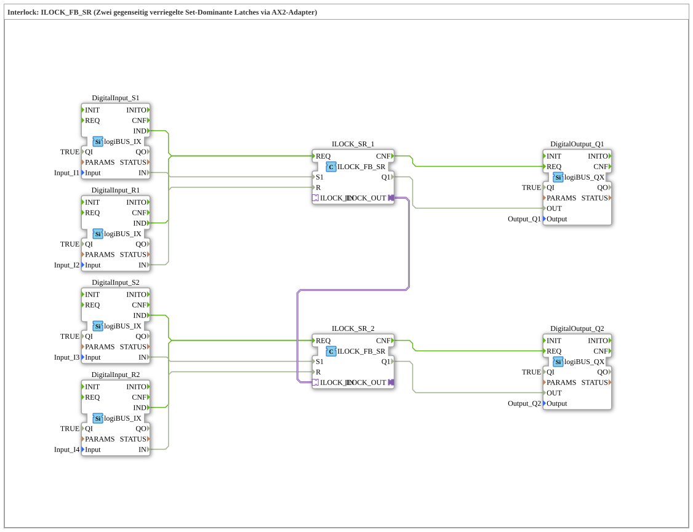

# Exercise_208: Interlock: ILOCK_FB_SR (Two mutually interlocked set-dominant latches via AX2 adapter)

* * * * * * * * * *
## Introduction

This exercise demonstrates the implementation of a mutual interlock between two outputs using the function block `ILOCK_FB_SR`. Each set-dominant latch controls one output, with an adapter connection ensuring that only one of the two outputs can be active at any given time. The inputs (set and reset) are read via digital input modules (logiBUS_IX), and the outputs are output via digital output modules (logiBUS_QX). The interlock prevents both outputs from being set simultaneously – even if both set signals are present at the same time.

## Function Blocks (FBs) Used

- **DigitalInput_S1, DigitalInput_R1, DigitalInput_S2, DigitalInput_R2**
- **Type**: `logiBUS::io::DI::logiBUS_IX`
- **Parameters**:
- `QI` = `TRUE` (Internally enabled)
- `Input` = `Input_I1` (or `I2`, `I3`, `I4`) – Assignment to the actual input channel
- **Function**: Converts the binary signal of the connected sensor into a digital data signal (`IN`) and generates An event (`IND`) is triggered on an edge.
- **ILOCK_SR_1, ILOCK_SR_2**
- **Type**: `logiBUS::signalprocessing::interlock::ILOCK_FB_SR`
- **Parameters**: No user-defined parameters (configured via connections).
- **Function**: Set-dominant latch with interlock logic. Mutual blocking is implemented via the adapter (`ILOCK_IN`/`ILOCK_OUT`). The function blocks operate internally as follows:
- `S1` (Set) has priority over `R` (Reset) – when Set is active, output `Q1` is set as long as the interlocking input (`ILOCK_IN`) is not active.
- `R` (Reset) resets `Q1` if `S1` is inactive.
- `Q1` only becomes active if the interlocking partner output (`ILOCK_IN` from the other instance) is not set.
- **Adapter connection**:
- `ILOCK_OUT` (from `ILOCK_SR_1`) → `ILOCK_IN` (from `ILOCK_SR_2`)
- This prevents both function blocks from simultaneously setting `Q1` = TRUE.

*Adapter connection**:

*`ILOCK_OUT` (from `ILOCK_SR_1`) → `ILOCK_IN` (from `ILOCK_SR_2`)

*This prevents both function blocks from simultaneously setting `Q1` = TRUE.

* ... - **DigitalOutput_Q1, DigitalOutput_Q2**
- **Type**: `logiBUS::io::DQ::logiBUS_QX`
- **Parameters**:
- `QI` = `TRUE` (Internally enabled)
- `Output` = `Output_Q1` (or `Q2`) – Assignment to the actual output channel
- **Function**: Sets the physical output to the value received via `OUT` as soon as an event (`REQ`) occurs.

## Program Flow and Connections

1. **Input Processing**

Each DigitalInput FB (logiBUS_IX) waits for a signal change at its associated hardware input (`Input_I1` … `Input_I4`). Upon a rising edge, it generates the event `IND` and provides the current state at the data output `IN`.

2. **Interlock Logic**
- The event `IND` of the respective input is directly forwarded to the `REQ` input of the associated `ILOCK_FB_SR`.
- Simultaneously, the data value `IN` is applied to the corresponding set or reset input of the ILOCK:
* `DigitalInput_S1.IN` → `ILOCK_SR_1.S1`
* `DigitalInput_R1.IN` → `ILOCK_SR_1.R`
* `DigitalInput_S2.IN` → `ILOCK_SR_2.S1`
* `DigitalInput_R2.IN` → `ILOCK_SR_2.R`
- The two ILOCK modules are interlocked via their adapter connections:

ILOCK_SR_1.ILOCK_OUT` → `ILOCK_SR_2.ILOCK_IN`

This means that `ILOCK_SR_2` can only set its output `Q1` to TRUE if `ILOCK_SR_1.Q1` is FALSE (and vice versa).

3. **Output**
- After processing, the ILOCK block generates the event `CNF`. This triggers the associated DigitalOutput FB (logiBUS_QX) via its `REQ` input.
- Simultaneously, the result `Q1` of the ILOCK is passed to the data output `OUT` of the DigitalOutput:
* `ILOCK_SR_1.Q1` → `DigitalOutput_Q1.OUT`
* `ILOCK_SR_2.Q1` → `DigitalOutput_Q2.OUT`

**Learning Objectives:**

- Understanding the operation of a set-dominant latch with interlock functionality.
- Implementing mutual interlocking (e.g., for protection functions or direction control) using an adapter connection.
- Integrating digital input/output modules into a logic control network.

**Difficulty Level:** Medium – requires basic knowledge of signal processing and working with function blocks in 4diac.

**Procedure for Commissioning:**

- Load the exercise into the 4diac IDE.
- Ensure that the hardware connections `Input_I1`…`Input_I4` correspond to the buttons/sensors for S1, R1, S2, R2, and that `Output_Q1`/`Q2` control the actuators to be controlled.
- Start the execution and test the setting and resetting of the outputs by pressing the buttons. `Q1` and `Q2` should never be TRUE simultaneously.

## Summary

In this exercise, a mutual interlock of two outputs was implemented using the function block `ILOCK_FB_SR`. The two ILOCK modules are connected via an adapter so that only one of the outputs can be active at a time – a typical application example for interlocks in automation technology. This exercise teaches you how to work with digital input/output modules and demonstrates how complex logic such as set dominance and interlocking can be implemented in a 4diac network.

---

### 🌐 Related topic subpages on ms-muc-docs.de

* [🌐 Eclipse 4diac IDE & color reference on ms-muc-docs.de](https://www.ms-muc-docs.de/iec-61499/eclipse-4diac/)

]
