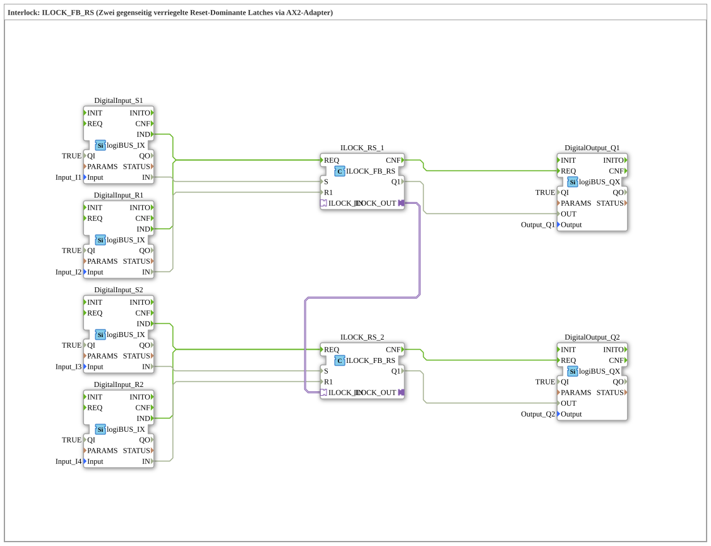

# Exercise_209: Interlock: ILOCK_FB_RS (Two mutually interlocked reset-dominant latches via AX2 adapter)

* * * * * * * * * *

## Introduction

This exercise implements a **mutual interlock** between two reset-dominant RS latches. The function blocks `ILOCK_FB_RS` are connected via an AX2 adapter, ensuring that only one of the two outputs can be active at any given time. As soon as one latch is set, the other is forcibly reset. The inputs and outputs are connected to digital logiBUS hardware (inputs I1–I4, outputs Q1 and Q2).
This exercise teaches the use of special interlock blocks, which are used in control engineering for mutual protection (e.g., in motors or valves).

## Function Blocks Used (FBs)

| Block Name | Type | Parameters / Connections |
| -------------- | ----- | ------------------------ |
| `DigitalInput_S1` | `logiBUS::io::DI::logiBUS_IX` | `QI` = TRUE, `Input` = `Input_I1` (Power-On Signal 1) |
| `DigitalInput_R1` | `logiBUS::io::DI::logiBUS_IX` | `QI` = TRUE, `Input` = `Input_I2` (Reset Signal 1) |
| `DigitalInput_S2` | `logiBUS::io::DI::logiBUS_IX` | `QI` = TRUE, `Input` = `Input_I3` (Power-on signal 2) |
| `DigitalInput_R2` | `logiBUS::io::DI::logiBUS_IX` | `QI` = TRUE, `Input` = `Input_I4` (Reset signal 2) |
| `ILOCK_RS_1` | `logiBUS::signalprocessing::interlock::ILOCK_FB_RS` | – |
| `ILOCK_RS_2` | `logiBUS::signalprocessing::interlock::ILOCK_FB_RS` | – |
| `DigitalOutput_Q1` | `logiBUS::io::DQ::logiBUS_QX` | `QI` = TRUE, `Output` = `Output_Q1` (Lamp/Signal 1) |
| `DigitalOutput_Q2` | `logiBUS::io::DQ::logiBUS_QX` | `QI` = TRUE, `Output` = `Output_Q2` (Lamp/Signal 2) |

**Explanation of the Interlock Blocks**

ILOCK_FB_RS` is a reset-dominant RS latch with an additional adapter interface (`ILOCK_IN`, `ILOCK_OUT`). Multiple such blocks can be coupled via this adapter connection: When one latch is set, it sends a signal on the `ILOCK_OUT` adapter, which forces the other block, via `ILOCK_IN`, into the reset state. Thus, at any given time, at most one of the two outputs, `Q1`, is active.

## Program Flow and Connections

The system is **event-driven**:

1. **Input Signal**

A signal on a digital input (e.g., `Input_I1` for setting Latch 1) generates an event `IND` at the corresponding `DigitalInput` function block.

1. **Process in the Latch**

This event is forwarded to the `REQ` input of the associated `ILOCK_RS` function block. Simultaneously, the data values (`S` and `R1`) from the digital input are transferred to the latch.

The block processes the signals (reset dominant) and outputs a `CNF` event upon completion.

1. **Output**

The `CNF` event activates the `DigitalOutput` block, which sets the current state of the latch to the physical output (e.g., `Output_Q1`).

1. **Locking**

The adapter output `ILOCK_RS_1.ILOCK_OUT` is connected to the adapter input `ILOCK_RS_2.ILOCK_IN`. When Latch 1 is set, Latch 2 receives an active signal via the adapter line, which resets it (and vice versa). This prevents both `Q1` and `Q2` from being HIGH simultaneously.

**Connection Overview:**

| Source | Destination | Type |
| -------- | ------ | ----- |
| `DigitalInput_S1.IND` | `ILOCK_RS_1.REQ` | Event |
| `DigitalInput_R1.IND` | `ILOCK_RS_1.REQ` | Event |
| `DigitalInput_S2.IND` | `ILOCK_RS_2.REQ` | Event |
| `DigitalInput_R2.IND` | `ILOCK_RS_2.REQ` | Event |
| `ILOCK_RS_1.CNF` | `DigitalOutput_Q1.REQ` | Event |
| `ILOCK_RS_2.CNF` | `DigitalOutput_Q2.REQ` | Event |
| `DigitalInput_S1.IN` | `ILOCK_RS_1.S` | Data |
| `DigitalInput_R1.IN` | `ILOCK_RS_1.R1` | Data |
| `DigitalInput_S2.IN` | `ILOCK_RS_2.S` | Data |
| `DigitalInput_R2.IN` | `ILOCK_RS_2.R1` | Data |
| `ILOCK_RS_1.Q1` | `DigitalOutput_Q1.OUT` | Data |
| `ILOCK_RS_2.Q1` | `DigitalOutput_Q2.OUT` | Data |
| `ILOCK_RS_1.ILOCK_OUT` | `ILOCK_RS_2.ILOCK_IN` | **Adapter** (Interlock) |

## Summary

This exercise demonstrates a **mutual interlock** between two reset-dominant RS latches using the special `ILOCK_FB_RS` function blocks and their adapter coupling. Key learning objectives:

- Understanding the interlock principle (mutual exclusivity).
- Using adapter connections for cross-communication between function blocks.
- Integrating digital input/output hardware (logiBUS).
- Event-driven execution in 4diac FBS.

After successful completion, the user can implement such interlocks in their own control projects, e.g., for safeguarding competing actuators.

---

### 🌐 Related topic subpages on ms-muc-docs.de

- [🌐 Eclipse 4diac IDE & Color Reference on ms-muc-docs.de](https://www.ms-muc-docs.de/iec-61499/eclipse-4diac/)

]
