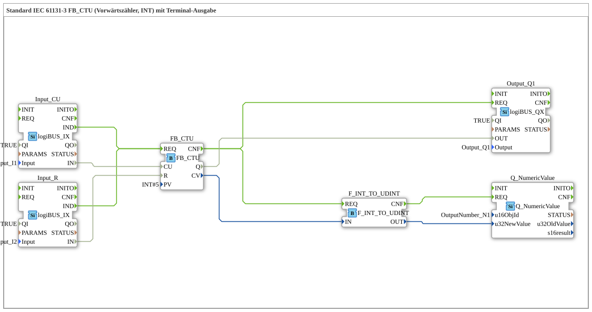

# Exercise_210: Standard IEC 61131-3 FB_CTU (Upward Counter, INT) with Terminal Output

* * * * * * * * * *
## Introduction
This exercise implements an upward counter (count-up) based on the standard function block **FB_CTU** according to IEC 61131-3. The counter uses a data type `INT` (16-bit integer) and has a terminal output that numerically displays the current count. Digital inputs and a digital output of the logiBUS system serve as the hardware interface.
## Function Blocks (FBs) Used

| Block Name | Type | Parameters | Event Inputs/Outputs | Data Inputs/Outputs |

|---|---|---|---|---|

| **FB_CTU** | `iec61131::counters::FB_CTU` | PV = INT#5 | REQ (Input), CNF (Output) | CU (Input), R (Input), Q (Output), CV (Output) |

**Input_CU** | `logiBUS::io::DI::logiBUS_IX` | QI = TRUE, Input = Input_I1 | IND (Output) | IN (Output) |

**Input_R** | `logiBUS::io::DI::logiBUS_IX` | QI = TRUE, Input = Input_I2 | IND (Output) | IN (Output) |

**Output_Q1** | `logiBUS::io::DQ::logiBUS_QX` | QI = TRUE, Output = Output_Q1 | REQ (Input) | OUT (Input) |

**F_INT_TO_UDINT** | `iec61131::conversion::F_INT_TO_UDINT` | – | REQ (Input), CNF (Output) | IN (Input), OUT (Output) |

| **Q_NumericValue** | `isobus::UT::Q::Q_NumericValue` | u16ObjId = OutputNumber_N1 | REQ (Input) | u32NewValue (Input) |

### Functionality of the Individual Function Blocks
- **FB_CTU**: The up counter increments the internal counter value *CV* by 1 on each rising edge at the *CU* input. When *CV* reaches the preset value *PV* (here: 5), the output *Q* is set. A signal at the *R* input resets *CV* to 0 and *Q* to FALSE. The function block is activated via the *REQ* event input.

### Functionality of the Individual Function Blocks
- **FB_CTU**: The up counter increments the internal counter value *CV* by 1 on each rising edge at the *CU* input. - **Input_CU** and **Input_R**: Each reads a digital hardware input (logiBUS terminal) and outputs an event (*IND*) and the current state (*IN*) upon a signal change.
- **Output_Q1**: Receives an event and sets the connected digital output to the value of the data input *OUT*.
- **F_INT_TO_UDINT**: Converts the current counter value *CV* (data type `INT`) into an unsigned 32-bit value (`UDINT`), as the subsequent terminal output can only process positive values.
- **Q_NumericValue**: Displays a numeric value on the terminal (HMI). The value is passed via *u32NewValue* and the display is addressed via the object ID *OutputNumber_N1*.

## Program Flow and Connections

The flow is controlled by event connections:

1. **Counting Pulses**: When a change occurs at the digital input *Input_I1*, `Input_CU.IND` sends an event to `FB_CTU.REQ`. Simultaneously, the signal state is forwarded via `Input_CU.IN` → `FB_CTU.CU`.

2. **Reset**: Similarly, a change at *Input_I2* triggers an event from `Input_R.IND`, which is also sent to `FB_CTU.REQ`. The value of `Input_R.IN` is then passed to the reset input `FB_CTU.R`.

2. **Reset**: Similarly, a change at *Input_I2* triggers an event from `Input_R.IND`, which is also sent to `FB_CTU.REQ`. The value of `Input_R.IN` is passed to the reset input `FB_CTU.R`.

3. **Set Output**: After each processing step of the counter (event output `FB_CTU.CNF`), two actions are triggered in parallel:

- The output value *Q* is passed via `FB_CTU.Q` → `Output_Q1.OUT` to the digital output *Output_Q1* and output via `Output_Q1.REQ`.
- The current counter value *CV* is converted via `FB_CTU.CV` → `F_INT_TO_UDINT.IN`. The converted `UDINT` value (`F_INT_TO_UDINT.OUT`) is passed to `Q_NumericValue.u32NewValue`. Another event (`F_INT_TO_UDINT.CNF`) activates `Q_NumericValue.REQ` to update the terminal display.

**Notes from the design:**

- The conversion of `INT` to `UDINT` is not optimal, as negative counter values cannot be represented. An alternative could be the use of a signed data type or a different output block.
- Since both inputs (`Input_CU` and `Input_R`) send the same event to `FB_CTU.REQ`, a high event frequency can occur. In practice, an **E_D_FF** (Event D Flip-Flop) or a similar debouncing mechanism should be used to avoid unnecessary processing.

**Notes from the design:**

- The conversion of `INT` to `UDINT` is not optimal, as negative counter values cannot be represented.
## Summary

This exercise provides practical experience with the IEC 61131-3 counter function block **FB_CTU** in the 4diac IDE. Learning objectives include:

- Creating a simple up-counter with an adjustable threshold.
- Connecting digital inputs and outputs via the logiBUS.
- Data conversion and display of numerical values on a terminal.
- Understanding event-driven execution and the necessity of event reduction (e.g., using flip-flops).

**Difficulty Level**: Medium

**Prerequisites**: Basic operation of the 4diac IDE, understanding of events and data connections, basic knowledge of IEC 61131-3 function blocks.

**Start of the exercise**: Import the file `Uebung_210.fbt` (or the corresponding 4diac project) and assign the logiBUS hardware channels according to the pool designations (`Input_I1`, `Input_I2`, `Output_Q1`, `OutputNumber_N1`).

---

### 🌐 Related topic subpages on ms-muc-docs.de
* [🌐 Eclipse 4diac IDE & color reference on ms-muc-docs.de ](https://www.ms-muc-docs.de/iec-61499/eclipse-4diac/)
