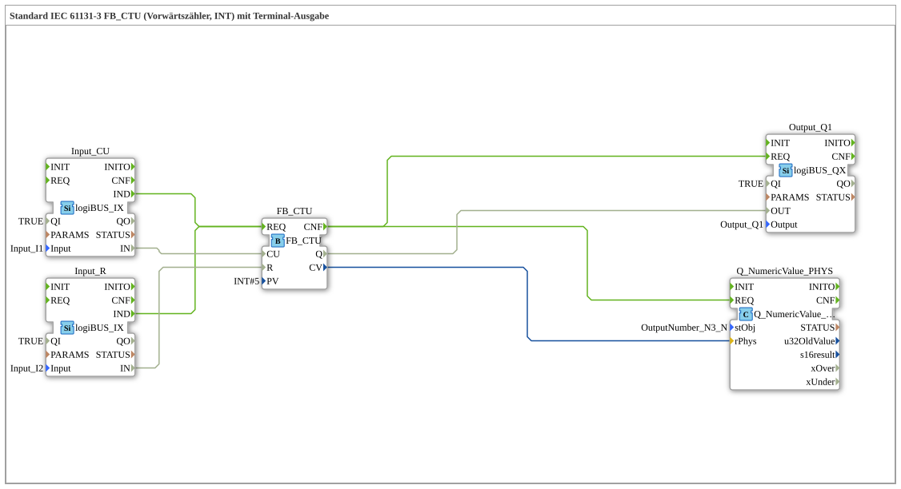

# Exercise_210b: Standard IEC 61131-3 FB_CTU (Counter Up, INT) with Terminal Output

* * * * * * * * * *
## Introduction
This exercise implements a **Counter Up** according to IEC 61131-3 (FB_CTU) with the data type `INT`. The counter is controlled via two digital inputs: a count pulse input (`CU`) and a reset input (`R`). The current counter value is output both to a digital output (limit reached) and via a terminal object for numerical display.

This exercise demonstrates the basic functionality of an industrial counter, the integration of hardware inputs/outputs (logiBUS), and the output of values to a numeric display (terminal).

## Function Blocks (FBs) Used

The following function blocks are used in this exercise:

| FB Name | Type | Parameters | Short Description |

|---------|-----|-----------|------------------|

| `FB_CTU` | `iec61131::counters::FB_CTU` | `PV = INT#5` | IEC 61131-3 Upward Counter, Counting Range INT, Preset Value 5. |

| `Input_CU` | `logiBUS::io::DI::logiBUS_IX` | `QI = TRUE`, `Input = Input_I1` | Digital input, provides the counting pulse (`CU`). |

| `Input_R` | `logiBUS::io::DI::logiBUS_IX` | `QI = TRUE`, `Input = Input_I2` | Digital input, provides the reset signal (`R`). |

| `Output_Q1` | `logiBUS::io::DQ::logiBUS_QX` | `QI = TRUE`, `Output = Output_Q1` | Digital output, activated when the counter reaches its final value (`Q`). |

| `Q_NumericValue_PHYS` | `isobus::UT::Q::Q_NumericValue_PHYS` | `stObj = OutputNumber_N3` | Terminal output: Displays the current counter value (CV) numerically. |

**Notes on the hardware FBs**:

The inputs `Input_I1` and `Input_I2`, as well as the output `Output_Q1`, are physical logiBUS channels. The terminal object `OutputNumber_N3` is a predefined numeric display element that represents the counter value.

**Notes on the hardware FBs**:

The inputs `Input_I1` and `Input_I2`, as well as the output `Output_Q1`, are physical logiBUS channels. The terminal object `OutputNumber_N3` is a predefined numeric display element that represents the counter value.

** ## Program Flow and Connections

### Event and Data Connections

The following graphic shows the logical connections between the building blocks (based on the XML network):

[Input_Cu]  ─── IND ──→ REQ [FB_CTU]
[Input_R ]  ─── IND ──→ REQ [FB_CTU]
[FB_CTU ]  ─── CNF ──→ REQ [Output_Q1]
[FB_CTU ]  ─── CNF ──→ REQ [Q_NumericValue_PHYS]

Daten:
[Input_Cu.IN]  ──→ FB_CTU.CU
[Input_R.IN]   ──→ FB_CTU.R
[FB_CTU.Q]     ──→ Output_Q1.OUT
[FB_CTU.CV]    ──→ Q_NumericValue_PHYS.rPhys
**Explanation**:

- **Counter Inputs**:

The two digital inputs `Input_CU` and `Input_R` are connected to the `REQ` input of the counter `FB_CTU` via their `IND` events. This means the counter is updated on every rising edge of the inputs. The data value of the respective input (`IN`) is then assigned to the corresponding counter input (`CU` or `R`).

- **Counter Behavior**:

The `FB_CTU` increments on every rising edge at `CU`. The current counter value is available at the data output `CV`. If the counter value is greater than or equal to the preset value `PV` (here `INT#5`), the output `Q` is set to `TRUE`. A `TRUE` signal at `R` resets the counter (CV = 0, Q = FALSE).

``` - **Output**:

After each counting operation, the counter's `CNF` event is forwarded to the digital output `Output_Q1` and to the terminal output `Q_NumericValue_PHYS`.

- The `Q` value is written to the output `Output_Q1`.
- The `CV` value is passed to the terminal as a physical quantity (`rPhys`) and displayed numerically there.
... ### Notes from the Source Code

- The comment "**INT can be closed to REAL without conversion**" refers to the fact that the counter value of type `INT` can be directly connected to the `rPhys` input (type `REAL`) – automatic type conversion takes place.
- The note "**if necessary, add an E_D_FF here to reduce the number of events**" recommends using an edge detector for fast pulses to prevent false triggers.
- The comment "**F_INT_TO_REAL can be omitted**" confirms the direct conversion without an explicit function block.

### Learning Objectives and Prior Knowledge
- **Learning Objectives**:
- Integration of an IEC 61131-3 counter into a 4diac application.
- Linking digital inputs and outputs with logiBUS hardware.
- Outputting numerical values to a terminal.
- **Difficulty Level**: Easy
- **Prerequisites**: Basic knowledge of the 4diac IDE, understanding of event and data connections.
- **Starting the Exercise**: The exercise can be performed directly in a running 4diac environment with connected logiBUS hardware. The inputs `Input_I1` (pushbutton) and `Input_I2` (pushbutton) control the counter; `Output_Q1` can, for example, control a lamp.

## Summary

Exercise **Exercise_210b** implements a complete IEC 61131-3 forward counter (`FB_CTU`) with two digital control inputs and output of the counter reading to a terminal. The preset value is set to 5. The application demonstrates the connection of hardware I/O with a standard function block and the straightforward data output via a terminal object. It is suitable as an introductory exercise in industrial counter programming with 4diac.

---

### 🌐 Related topic subpages on ms-muc-docs.de
* [🌐 Eclipse 4diac IDE & color reference on ms-muc-docs.de ](https://www.ms-muc-docs.de/iec-61499/eclipse-4diac/)

]