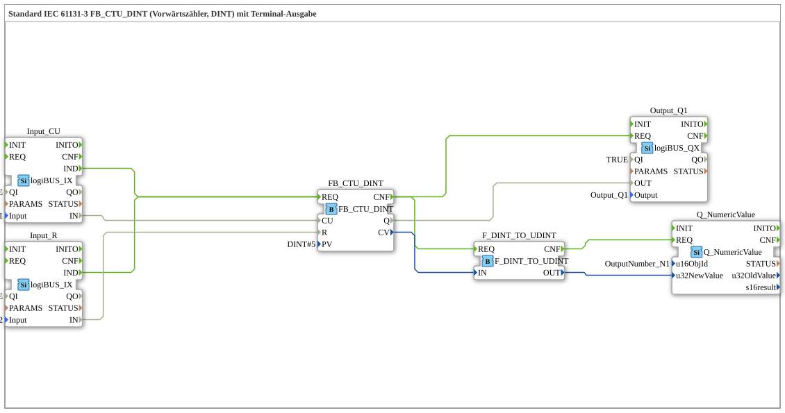

# Exercise_211: Standard IEC 61131-3 FB_CTU_DINT (Up Counter, DINT) with Terminal Output

* * * * * * * * * *

## Introduction

This exercise implements an up counter according to IEC 61131-3 using the function block `FB_CTU_DINT`. The counter uses the data type `DINT` (double exact integer). The counting pulses are provided via a digital input (I1), and a second digital input (I2) is used to reset the counter. The counter's output (Q) controls a digital output (Q1), and simultaneously, the current counter value (CV) is displayed on a screen via a terminal output.

This exercise demonstrates the basic interconnection of industrial input/output modules (logiBUS) with a counter module and a numeric display. A comment in the circuit diagram indicates that the data type conversion used, `DINT_TO_UDINT`, is problematic because negative counter values cannot be displayed correctly.

This exercise demonstrates the basic interconnection of industrial input/output modules (logiBUS) with a counter module and a numeric display.

## Function Blocks (FBs) Used

- **FB_CTU_DINT**

*Type:* `iec61131::counters::FB_CTU_DINT`

*Parameter:* `PV` = `DINT#5` (Default value – the counter outputs Q if CV >= PV)

*Event input:* `REQ` – activates the counter logic

*Data connections:*

- `CU` (Count Up) from block `Input_CU.IN`
- `R` (Reset) from block `Input_R.IN`
- `Q` (Output) goes to `Output_Q1.OUT`
- `CV` (current counter value) goes to `F_DINT_TO_UDINT.IN`
- **Input_CU**

*Type:* `logiBUS::io::DI::logiBUS_IX`

*Parameters:* `QI` = `TRUE`, `Input` = `Input_I1` (first digital input)

*Event output:* `IND` – triggers on edge

*Data output:* `IN` – provides the current input state

- **Input_R**

*Type:* `logiBUS::io::DI::logiBUS_IX`

*Parameters:* `QI` = `TRUE`, `Input` = `Input_I2` (second digital input)

*Event output:* `IND` – triggers on edge change

*Data output:* `IN` – provides the current input state

- **Output_Q1**

*Type:* `logiBUS::io::DQ::logiBUS_QX`

*Parameters:* `QI` = `TRUE`, `Output` = `Output_Q1`

*Event input:* `REQ` – activates output

*Data input:* `OUT` – receives the state from the counter output `Q`

- **Q_NumericValue**

*Type:* `isobus::UT::Q::Q_NumericValue`

*Parameter:* `u16ObjId` = `OutputNumber_N1` (identifier of the terminal output field)

*Event input:* `REQ` – updates the display

*Data input:* `u32NewValue` – new value to display (expects `UDINT`)

- **F_DINT_TO_UDINT**

*Type:* `iec61131::conversion::F_DINT_TO_UDINT`

*Event Input:* `REQ` – performs the conversion

*Data Input:* `IN` (`DINT`)

*Data Output:* `OUT` (`UDINT`)

*Note:* The conversion is not suitable for negative `DINT` values, as `UDINT` can only represent positive numbers. A comment on the network calls this "complete nonsense".

## Program Flow and Connections

The interaction of the components is as follows:

1. **Input Detection:**

The two digital inputs `Input_CU` and `Input_R` detect edges at the physical terminals I1 and I2. They send an event (`IND`) with each change in state.

1. **Counter Logic:**

The events from `Input_CU` and `Input_R` are routed to the **same** event input `FB_CTU_DINT.REQ`. The counter internally distinguishes, based on the data lines, whether a counting pulse (`CU`) or a reset (`R`) is requested.

**Important:** Since both event sources are directly wired to `REQ`, conflicts can occur if both inputs switch simultaneously. A comment suggests including an "E_D_FF" (Event D Flip-Flop) to reduce or prioritize the events.

1. **Output Control:**

After the counter is processed, the event `CNF` is triggered. This triggers two actions in parallel:

- `Output_Q1.REQ` – the digital output Q1 is set by the value of `FB_CTU_DINT.Q`.
- `F_DINT_TO_UDINT.REQ` – the current counter value (CV) is converted from `DINT` to `UDINT`.
1. **Terminal Output:**

The converted number (`UDINT`) is passed to the function block `Q_NumericValue`, which is triggered after the conversion event `CNF`. This updates the value on the terminal (e.g., control panel) with the object ID `OutputNumber_N1`.

**Data Type Issue:**

The counter uses `DINT` (signed). In case of overflow or reset, the current value can become negative. The conversion ``DINT_TO_UDINT`` interprets negative bit patterns as very large positive numbers (e.g., -1 becomes 4294967295). This results in a meaningless display. In practice, either a different data type should be used or a limit should be implemented.

## Summary

This exercise involves building an IEC 61131-3 up-counter with two digital inputs (count pulse and reset) and one digital output. The current counter value is also displayed on a terminal. The circuit diagram demonstrates the use of logiBUS input/output modules, a conversion module, and a numeric display component. At the same time, typical pitfalls in data type conversion are highlighted – an important aspect for industrial control engineering. This exercise is suitable for beginners who want to gain initial experience with counting functions and the interconnection of event and data connections.
