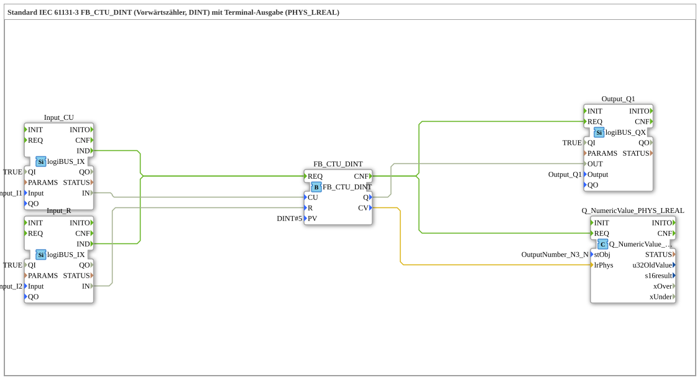

# Exercise_211b: Standard IEC 61131-3 FB_CTU_DINT (Up Counter, DINT) with Terminal Output (PHYS_LREAL)



* * * * * * * * * *
## Introduction

This exercise uses the IEC 61131-3 standard function block **FB_CTU_DINT** (up counter with `DINT` data type). The counter is incremented by pressing a button connected to a digital input and reset by pressing a second button. The current counter value is also output as a physical `LREAL` value via a terminal output block.

The goal is to understand the interaction between a counter, digital inputs/outputs, and a numeric terminal output in the 4diac IDE.


## Function Blocks (FBs) Used

The SubApp network uses five instances of predefined block types. No further sub-blocks are defined.

| Name | Type | Description |

|------|-----|---------------|

| `Input_CU` | `logiBUS_IX` | Digital input (logiBUS) that provides the counting pulse (CU). |

| `Input_R` | `logiBUS_IX` | Digital input that provides the reset signal (R). |

| `FB_CTU_DINT` | `FB_CTU_DINT` | Up counter with `DINT` data type. |

| `Output_Q1` | `logiBUS_QX` | Digital output (logiBUS) that displays the counter output Q. |

| `Q_NumericValue_PHYS_LREAL` | `Q_NumericValue_PHYS_LREAL` | Terminal output block for displaying a physical `LREAL` value. |


### Detailed Parameters and Connections

- **Input_CU**

- Parameters: `QI` = `TRUE`, `Input` = `Input_I1`

- Event output: `IND` (Signals a rising edge at the input)

- Data output: `IN` (Logical state of the input)

- **Input_R**

- Parameters: `QI` = `TRUE`, `Input` = `Input_I2`

- Event output: `IND`

- Data output: `IN`

- **FB_CTU_DINT**

- Parameter: `PV` = `DINT#5` (Preset Value = 5)

- Event input: `REQ` (triggering event for counting)

- Data inputs: `CU` (Count Up), `R` (Reset)

- Event output: `CNF` (acknowledgment after execution)

- Data outputs: `Q` (output signal – becomes TRUE if CV ≥ PV), `CV` (current counter value, type `DINT`)

- **Output_Q1**

- Parameters: `QI` = `TRUE`, `Output` = `Output_Q1`

- Event input: `REQ`

- Data input: `OUT` (value written to the physical output)

- **Q_NumericValue_PHYS_LREAL**

- Parameters: `stObj` = `OutputNumber_N3` (reference to the terminal output object)

- Event input: `REQ`

- Data input: `lrPhys` (physical value `LREAL` for display)

## Program Flow and Connections

### Event Connections

1. **Input Signals**

- When the button at `Input_I1` is pressed (rising edge), `Input_CU.IND` sends an event to `FB_CTU_DINT.REQ`.

- When the button at `Input_I2` is pressed, `Input_R.IND` also sends an event to the same `REQ` input of the counter.


*Note: Both events are routed to the same `REQ` input, therefore the function block must internally distinguish which input (CU or R) is active.*

2. **Counter Execution**

After the counter has processed the event (executed the function), it sends two simultaneous events via `CNF`:

- to `Output_Q1.REQ` (digital output update)

- to `Q_NumericValue_PHYS_LREAL.REQ` (terminal display update)

### Data Connections

- `Input_CU.IN` → `FB_CTU_DINT.CU` – Logical state of button I1 as a counting pulse.

- `Input_R.IN` → `FB_CTU_DINT.R` – Logical state of button I2 as a reset signal.

- `FB_CTU_DINT.Q` → `Output_Q1.OUT` – Passes the status of the counter output (TRUE if counter reading ≥ PV) to digital output Q1.

- `FB_CTU_DINT.CV` → `Q_NumericValue_PHYS_LREAL.lrPhys` – The current counter reading (`DINT`) is converted into a physical value (`LREAL`) and displayed on the terminal.

### Detailed Process

- **Initial State:** Counter reading = 0, output Q = FALSE, terminal displays 0.0.


- **Counting Operation:** Each rising edge at `Input_I1` increments the counter by 1.

- **Reset:** A rising edge at `Input_I2` resets the counter to 0.

- **Output:** When the counter reaches or exceeds the value 5 (PV), `Q` becomes TRUE and the digital output Q1 is activated.

- **Terminal:** After each change in the counter, the new value is displayed as `LREAL` on the configured terminal object `OutputNumber_N3`.

### Learning Objectives

- Use of an IEC 61131-3 standard counter (FB_CTU_DINT).

- Working with digital inputs and outputs (logiBUS).

- Output of numerical values via a terminal block.

- Understanding of event and data flow modeling in 4diac.

#### Required Prior Knowledge

- Basic knowledge of the 4diac IDE (creating SubApp types, connecting blocks).

- Basic understanding of counters and binary signals.

## Summary

Exercise 211b demonstrates the practical application of a forward counter (CTU) according to IEC 61131-3 in the 4diac environment. Two pushbuttons control the counter (counting and resetting), which drives both a digital output and a numeric terminal display. The setup shows typical connection patterns for event-driven automation software and allows for a deeper understanding of block parameters, event chaining, and data conversions.

---

### 🌐 Related topic subpages on ms-muc-docs.de

* [🌐 Eclipse 4diac IDE & Color Reference on ms-muc-docs.de](https://www.ms-muc-docs.de/iec-61499/eclipse-4diac/)


```