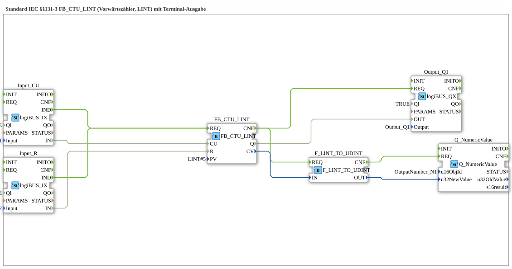

# Exercise_212: Standard IEC 61131-3 FB_CTU_LINT (Upward Counter, LINT) with Terminal Output

* * * * * * * * * *
## Introduction

This exercise demonstrates the use of the IEC 61131-3 function block **FB_CTU_LINT** (Upward Counter for Large Integer Values) in a 4diac IDE subapplication. The counter value is converted and output to a terminal. Additionally, a digital output is set as soon as the counter reaches the predefined maximum value.
---
## Function Blocks Used

Only predefined library blocks are used; no other sub-blocks are included.

- **FB_CTU_LINT**
- **Type**: `iec61131::counters::FB_CTU_LINT`
- **Parameter**: `PV = LINT#5` (Preset value = 5)
- **Task**: Up counter with LINT data type; increments on each rising edge at the CU input and sets the output Q when the counter value reaches or exceeds the preset value.
- **Input_CU**
- **Type**: `logiBUS::io::DI::logiBUS_IX`
- **Parameter**: `QI = TRUE`, `Input = Input_I1`
- **Task**: Digital input that provides the clock-up pulse for the counter.
- **Input_R**
- **Type**: `logiBUS::io::DI::logiBUS_IX`
- **Parameters**: `QI = TRUE`, `Input = Input_I2`
- **Task**: Digital input for resetting the counter.
- **Output_Q1**
- **Type**: `logiBUS::io::DQ::logiBUS_QX`
- **Parameters**: `QI = TRUE`, `Output = Output_Q1`
- **Task**: Digital output that becomes active as soon as the counter reaches the preset value (counter Q signal).
- **F_LINT_TO_UDINT**
- **Type**: `iec61131::conversion::F_LINT_TO_UDINT`
- **Parameter**: None (default conversion)
- **Task**: Converts the current counter reading (LINT) into an unsigned double integer (UDINT), as the terminal block can only display positive values.
- **Note**: A comment on the network indicates that this conversion is problematic because negative numbers cannot be displayed. An E_D_FF could be implemented here instead to reduce unwanted events.
- **Q_NumericValue**
- **Type**: `isobus::UT::Q::Q_NumericValue`
- **Parameter**: `u16ObjId = OutputNumber_N1`
- **Task**: Outputs the passed numeric value to a connected terminal (e.g., an ISOBUS display). The value is updated via the data input `u32NewValue`.

---

## Program Flow and Connections

1. **Event Control**
- Each rising edge at `Input_I1` (connected to `Input_CU`) generates an event `IND`, which activates the counter block via the event input `REQ`.
- Each rising edge at `Input_I2` (connected to `Input_R`) also generates an event `IND` and activates the counter block via the same `REQ` input.
- After the counter operation is complete, the counter signals this via `CNF`. This event is forwarded to three function blocks:
- **Output_Q1.REQ** (sets the digital output according to the counter Q signal)
- **F_LINT_TO_UDINT.REQ** (starts the conversion of the counter reading)
- **Q_NumericValue.REQ** (is triggered after successful conversion via the chain `F_LINT_TO_UDINT.CNF → Q_NumericValue.REQ`).
2. **Data Connections**
- `Input_CU.IN` → `FB_CTU_LINT.CU` (Count pulse)
- `Input_R.IN` → `FB_CTU_LINT.R` (Reset)
- `FB_CTU_LINT.Q` → `Output_Q1.OUT` (Output signal when preset value is reached)
- `FB_CTU_LINT.CV` (Current counter reading) → `F_LINT_TO_UDINT.IN`
- `F_LINT_TO_UDINT.OUT` (Converted value) → `Q_NumericValue.u32NewValue` (Display on terminal)
3. **Operating the Counter**
- The counter increments on each rising edge of the CU input, as long as no reset occurs.
- If the reset input is set to TRUE, the counter reading is reset to zero.
- As soon as the counter reading reaches the value **PV = 5**, the output `Q` is set to TRUE (active high).
- The current counter reading is continuously sent to the terminal as soon as the value changes.
4. **Learning Objectives / Difficulty**
- Introduction to the IEC 61131-3 counter family
- Combining digital inputs/outputs with a counter
- Data conversion and terminal output
- Difficulty level: **Medium**
- Prerequisites: Basic understanding of event and data flows in 4diac and simple IEC 61131-3 data types.

---

## Summary

Exercise **Exercise_212** implements a forward counter (`FB_CTU_LINT`) with a preset value of 5. Counting and resetting are performed via two digital inputs. The counter value is output to a terminal using a data type conversion (`F_LINT_TO_UDINT`), while the output `Output_Q1` is activated as soon as the counter reaches its limit. The circuit shown demonstrates the interaction between industrial counter components, input/output, and user display – a typical task for automation solutions. The accompanying commentary on the conversion suggests possible improvements (reducing the number of events, avoiding negative values).

### 🌐 Related topic subpages on ms-muc-docs.de

* [🌐 Eclipse 4diac IDE & Color Reference on ms-muc-docs.de](https://www.ms-muc-docs.de/iec-61499/eclipse-4diac/)

]
