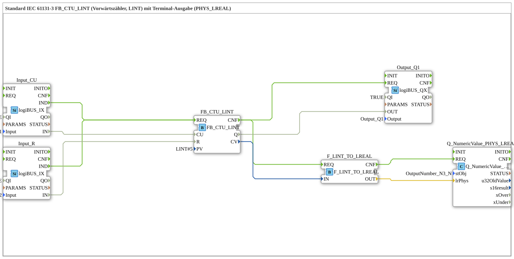

# Exercise_212b: Standard IEC 61131-3 FB_CTU_LINT (Upward Counter, LINT) with Terminal Output (PHYS_LREAL)

*No image available.*

* * * * * * * * *
## Introduction

This exercise implements an upward counter according to IEC 61131-3 (FB_CTU_LINT) with terminal output of the current counter value. The counter is incremented via a digital input (CU) and reset via another digital input (R). After each increment, the counter value is output to a terminal block (LogiBUS Utility) via a type conversion (LINT → LREAL). Simultaneously, a digital output is set as soon as the counter reaches the preset value (PV = 5).

## Function Blocks (FBs) Used

- **FB_CTU_LINT**: Type `iec61131::counters::FB_CTU_LINT`

- Parameter: PV = LINT#5 (default value)

- Event input: REQ (start of counter operation)

- Data inputs: CU (Count Up), R (Reset)

- Data outputs: Q (counter reading ≥ PV), CV (current counter value)

- **Input_CU**: Type `logiBUS::io::DI::logiBUS_IX`

- Parameter: QI = TRUE, Input = Input_I1 (physical digital input)

- Output: IN (Boolean value of the input)

- Event output: IND (signal change detected)

- **Input_R**: Type `logiBUS::io::DI::logiBUS_IX`

- Parameter: QI = TRUE, Input = Input_I2 (physical digital input)

- Output: IN (Boolean value of the Input)

- Event output: IND (signal change detected)

- **Output_Q1**: Type `logiBUS::io::DQ::logiBUS_QX`

- Parameters: QI = TRUE, Output = Output_Q1 (physical digital output)

- Data input: OUT (value passed to the output)

- **F_LINT_TO_LREAL**: Type `iec61131::conversion::F_LINT_TO_LREAL`

- Data input: IN (LINT value)

- Data output: OUT (LREAL value converted)

- **Q_NumericValue_PHYS_LREAL**: Type `isobus::UT::Q::Q_NumericValue_PHYS_LREAL`

- Parameters: stObj = OutputNumber_N3 (reference to a terminal output object)

- Data input: lrPhys (physical LREAL value)

- Event input: REQ (trigger terminal output)

## Program Flow and Connections

Control is achieved via event and data connections:

### Event Connections

- `Input_CU.IND` → `FB_CTU_LINT.REQ`

On a rising edge of digital input I1, the counter is incremented.

- `Input_R.IND` → `FB_CTU_LINT.REQ`

On a rising edge of digital input I2, the counter is reset.

- `FB_CTU_LINT.CNF` → `Output_Q1.REQ`

After a counter operation (whether incrementing or resetting) is completed, the output is updated.

- `FB_CTU_LINT.CNF` → `F_LINT_TO_LREAL.REQ`

Simultaneously, the type conversion of the current counter value is initiated.

- `F_LINT_TO_LREAL.CNF` → `Q_NumericValue_PHYS_LREAL.REQ`

After conversion, the value is sent to the terminal.

### Data Connections

- `Input_CU.IN` → `FB_CTU_LINT.CU`

The state of input I1 controls the counting pulse (rising edge).

- `Input_R.IN` → `FB_CTU_LINT.R`

The state of input I2 controls the reset (rising edge).

- `FB_CTU_LINT.Q` → `Output_Q1.OUT`

The counter output Q (TRUE if CV >= PV) is passed to digital output Q1.

- `FB_CTU_LINT.CV` → `F_LINT_TO_LREAL.IN`
The current counter value (LINT) is passed to the converter.

- `F_LINT_TO_LREAL.OUT` → `Q_NumericValue_PHYS_LREAL.lrPhys`
The converted LREAL value is passed to the terminal block.

### Functionality
1. As long as the input CU (I1) shows a rising edge, the counter CV increments by 1.

2. A rising edge at the reset input R (I2) sets CV to 0.

3. If the counter value reaches the preset value PV (here 5) or higher, the output Q is set to TRUE. Further counting is then no longer possible until a reset occurs.

### Functionality 4. After each counting or reset operation, the current CV value is output to the terminal (LogiBUS Utility) in physical LREAL representation.

**Learning Objectives:**

- Using an IEC 61131-3 counter (FB_CTU_LINT)

- Parameterizing preset values

- Event and data flow between function blocks

- Type conversion (LINT → LREAL) and terminal output

**Difficulty Level:** Advanced Fundamentals
**Prerequisites:** Basic understanding of the 4diac IDE, working with digital inputs/outputs, event chaining.

## Summary

Exercise 212b demonstrates the combination of an IEC 61131-3 up counter (FB_CTU_LINT) with a terminal output. The counter is controlled via two digital inputs; the output Q switches when the preset value is reached. The current counter value is output to a LogiBUS terminal block after each action via type conversion. This demonstrates the chaining of events, data flow logic, and the use of utility blocks in 4diac.

---

### 🌐 Related topic subpages on ms-muc-docs.de

* [🌐 Eclipse 4diac IDE & Color Reference on ms-muc-docs.de](https://www.ms-muc-docs.de/iec-61499/eclipse-4diac/)

]