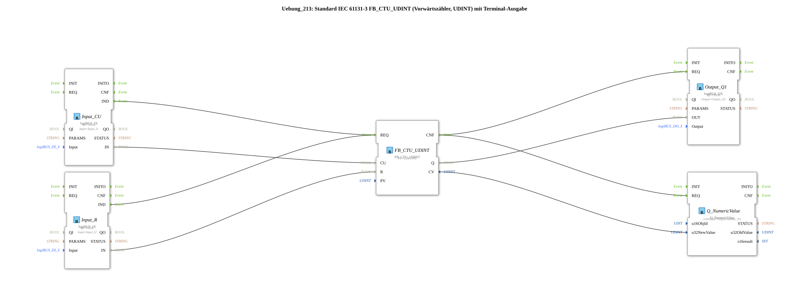

# Exercise_213: Standard IEC 61131-3 FB_CTU_UDINT (Upward Counter, UDINT) with Terminal Output

* * * * * * * * * *
## Introduction

This exercise implements an upward counter according to IEC 61131-3 (type FB_CTU_UDINT) as a sub-application. The counter has two digital inputs (count-up and reset), one digital output (Q), and a terminal output for the current counter value. The inputs are provided via logiBUS I/O blocks, while the output and the numeric value are output to configured logiBUS channels.
## Function Blocks (FBs) Used

- **FB_CTU_UDINT** (Type: `iec61131::counters::FB_CTU_UDINT`)
- Parameter: `PV` = UDINT#5 (Default value for the count threshold)
- Events: REQ (Input), CNF (Output)
- Data: CU (Count-Up), R (Reset), Q (Output), CV (Current Count Value)
- **Input_CU** (Type: `logiBUS::io::DI::logiBUS_IX`)
- Parameters: `QI` = TRUE, `Input` = Input_I1
- Event: IND (Output)
- Data: IN (Output)
- **Input_R** (Type: `logiBUS::io::DI::logiBUS_IX`)
- Parameters: `QI` = TRUE, `Input` = Input_I2
- Event: IND (Output)
- Data: IN (Output)
- **Output_Q1** (Type: `logiBUS::io::DQ::logiBUS_QX`)
- Parameters: `QI` = TRUE, `Output` = Output_Q1
- Event: REQ (Input)
- Data: OUT (Input)
- **Q_NumericValue** (Type: `isobus::UT::Q::Q_NumericValue`)
- Parameters: `u16ObjId` = OutputNumber_N1
- Event: REQ (Input)
- Data: u32NewValue (Input)

## Program Flow and Connections

The Subapplication This consists of a direct connection of the aforementioned function blocks without additional sub-blocks. The process is as follows:

1. **Input Signals**: A rising edge at the digital input Input_I1 is detected by the function block `Input_CU` and triggers the event `IND`. Simultaneously, the value of the input (bit) is passed to the data output `IN`. The same applies to the reset input Input_I2 and the function block `Input_R`.
2. **Counter Control**: The event `IND` from `Input_CU` is connected to the event input `REQ` of the counter `FB_CTU_UDINT`. The data connection sends `Input_CU.IN` to the counter input `CU` (Count-Up). This increments the counter on every rising edge at this input. The event from `Input_R` is also sent to the counter's `REQ` input, and the data value is applied to the `R` input (Reset). A reset sets the counter to zero.
3. **Counter Behavior**: The counter counts upwards from the value 0. When the internal counter value reaches the parameter `PV` (here 5), the output `Q` is set to TRUE. The current counter value is available at output `CV` (data type UDINT).
4. **Output**: After each counter processing, the counter outputs a confirmation event `CNF`. This event is routed to two output blocks:
- **Output_Q1**: The event `REQ` of this block triggers the transfer of the data value from `FB_CTU_UDINT.Q` to the physical output `Output_Q1`.
- **Q_NumericValue**: The event `REQ` of this function block takes the current counter value `CV` (as a 32-bit value) and outputs it to a terminal or display using the configured object ID `OutputNumber_N1`.

A comment on the network indicates that additional event reduction (e.g., using an E_D_FF) could be implemented to update the output only on specific events.

**Learning Objectives**:

- Understanding the IEC 61131-3 counter function blocks.
- Interaction of event and data flows in 4diac.
- Integration of digital inputs/outputs via logiBUS IO blocks.
- Outputting numeric values to a terminal using Q_NumericValue.

**Required prior knowledge**: Basic operation of the 4diac IDE, understanding of event/data connections, and knowledge of logiBUS I/O configuration.

**Starting the exercise**: The subapplication must be imported into a 4diac project. Then, the hardware channels (Input_I1, Input_I2, Output_Q1, OutputNumber_N1) must be assigned to the actual inputs/outputs of the PLC (e.g., logiBUS). After loading and starting the application, the inputs can be tested using pushbuttons or simulation signals; the counter value and output status are displayed on the terminal or at the configured output.

## Summary

This exercise demonstrates the implementation of a standardized IEC 61131-3 up-counter (FB_CTU_UDINT) in 4diac. By linking logiBUS I/O modules with a counter and a numerical output, a practical example of event-driven automation logic is demonstrated. The circuit illustrates how both digital and numerical outputs can occur in parallel with a counter action. This setup is well-suited for learning and deepening your understanding of the interplay between event and data connections in the 4diac IDE.

---

### 🌐 Related topic subpages on ms-muc-docs.de

- [🌐 Eclipse 4diac IDE & Color Reference on ms-muc-docs.de](https://www.ms-muc-docs.de/iec-61499/eclipse-4diac/)

]
