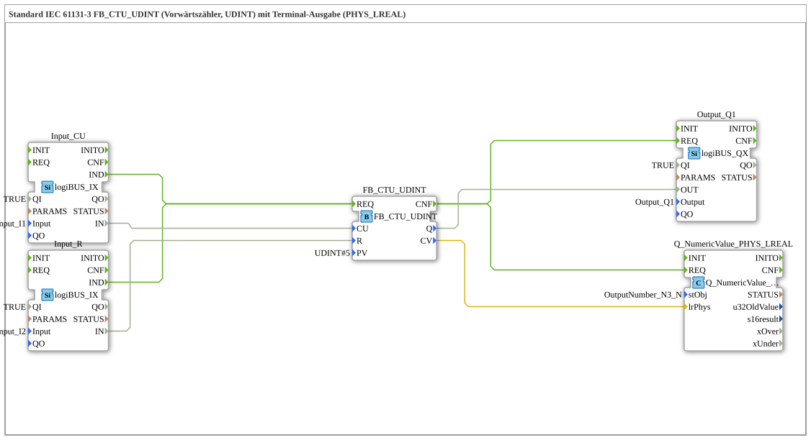

# Exercise_213b: Standard IEC 61131-3 FB_CTU_UDINT (Up Counter, UDINT) with Terminal Output (PHYS_LREAL)

* * * * * * * * * *
## Introduction

This exercise implements an up counter according to IEC 61131-3 (FB_CTU_UDINT) with a preset value of 5. The counting pulses are provided via two digital inputs:

- **I1** serves as the count input (CU – Count Up)

- **I2** serves as the reset input (R – Reset)

The counter value (CV) is output as a physical quantity of type LREAL to a terminal. A digital output (Q1) is activated as soon as the counter value reaches or exceeds the preset value.

This exercise demonstrates the direct connection of a UDINT value to an LREAL output – no type conversion is required, as UDINT can be implicitly converted to LREAL.

## Function Blocks (FBs) Used

This exercise contains five function blocks, all located at the top network level. No sub-blocks are used.

### FB_CTU_UDINT
- **Type**: `iec61131::counters::FB_CTU_UDINT`
- **Parameters**: `PV` = `UDINT#5` (Preset value)
- **Functionality**: Up counter (IEC 61131-3) for integer values of type UDINT. Each increasing signal at input CU increments the counter value CV by 1. Setting input R resets CV to 0. Output Q becomes TRUE as soon as CV ≥ PV.

### Input_CU

- **Type**: `logiBUS::io::DI::logiBUS_IX`

- **Parameters**: `QI` = `TRUE`, `Input` = `Input_I1`

- **Functionality**: Digital input module that reads the physical input I1 (e.g., a push button). The event output IND signals a change in state.

### Input_R
- **Type**: `logiBUS::io::DI::logiBUS_IX`

- **Parameters**: `QI` = `TRUE`, `Input` = `Input_I2`
- **Function**: Digital input block for the physical input I2 (reset button). Its structure is identical to the Input_CU block.

### Output_Q1
- **Type**: `logiBUS::io::DQ::logiBUS_QX`
- **Parameters**: `QI` = `TRUE`, `Output` = `Output_Q1`
- **Function**: Digital output module that switches the physical output Q1 (e.g., a lamp). The value of the OUT data port is passed directly to the hardware.

### Q_NumericValue_PHYS_LREAL
- **Type**: `isobus::UT::Q::Q_NumericValue_PHYS_LREAL`
- **Parameters**: `stObj` = `OutputNumber_N3`
- **Function**: Terminal output for a physical LREAL value. The passed value (lrPhys) is displayed on the configured output channel (here `OutputNumber_N3`).

## Program Flow and Connections

The flow is controlled by **event connections**:

1. A change to **Input_CU** (button I1) generates the **IND** event, which triggers the counter module via its **REQ** input.

2. Similarly, a change to **Input_R** (button I2) generates an **IND** event, which also reaches the **REQ** input of the counter – thus, the same counter is addressed by both inputs.

3. After processing, the counter outputs a **CNF** event. This is forwarded in parallel to two function blocks:

- to **Output_Q1** (Output Q1)

- to **Q_NumericValue_PHYS_LREAL** (Terminal Output)

The **data connections** transmit the following values:

- `Input_CU.IN` → `FB_CTU_UDINT.CU` (Count pulse)
- `Input_R.IN` → `FB_CTU_UDINT.R` (Reset signal)
- `FB_CTU_UDINT.Q` → `Output_Q1.OUT` (Output state)
- `FB_CTU_UDINT.CV` → `Q_NumericValue_PHYS_LREAL.lrPhys` (Counter reading as LREAL)

**Note:** The counter reading CV is of type UDINT. The data port lrPhys expects LREAL. Since IEC 61131-3 allows UDINT to be interpreted as LREAL without explicit conversion, this direct connection is permissible.

## Summary

This exercise demonstrates the use of a standardized up counter (FB_CTU_UDINT) in the 4diac IDE. It shows:

- Connecting two digital inputs as counting and reset signals
- Using a digital output to indicate when the preset value has been reached
- Outputting the counter value to a terminal using a physical LREAL output block
- Implicit type conversion from UDINT to LREAL

This provides a basic understanding of IEC 61131-3 counter functions and input/output logic in 4diac.

---

### 🌐 Related topic subpages on ms-muc-docs.de

* [🌐 Eclipse 4diac IDE & Color Reference on ms-muc-docs.de](https://www.ms-muc-docs.de/iec-61499/eclipse-4diac/)

]