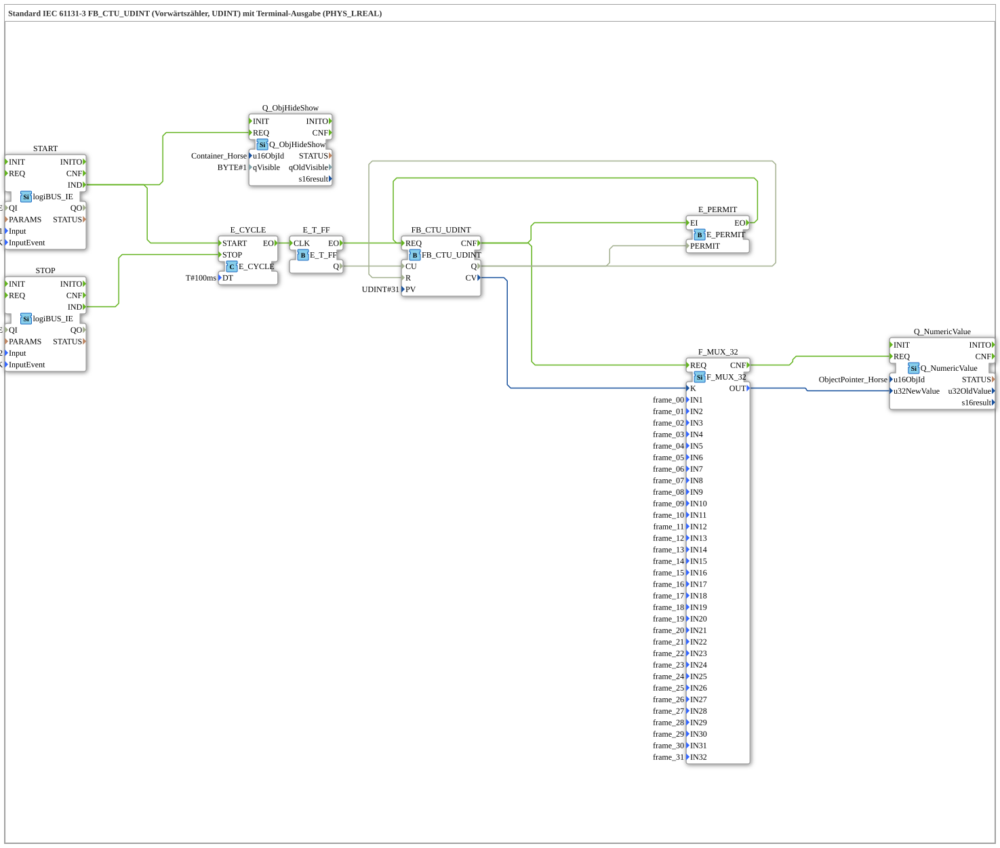

# Exercise_213c: Standard IEC 61131-3 FB_CTU_UDINT (Upward Counter, UDINT) with Terminal Output (PHYS_LREAL)

* * * * * * * * * *
## Introduction
This exercise implements an upward counter according to IEC 61131-3 (FB_CTU_UDINT) with a count limit of 31. The counter value is updated cyclically and transmitted to a numeric terminal output (PHYS_LREAL) via a multiplexer. Additionally, an animated object ("horse") is controlled by showing/hiding it. The exercise illustrates the combination of IEC 61131-3 function blocks with event-driven 4diac logic and terminal output.

## Function Blocks (FBs) Used

### Sub-Blocks: `FB_CTU_UDINT`
- **Type**: `iec61131::counters::FB_CTU_UDINT`
- **Internal FBs Used**: (Standard IEC 61131-3, no further sub-blocks)
- **Parameters**:
- `PV` = `UDINT#31` (count limit)
- **Functionality**:

The block increments the current counter value `CV` (UDINT) on each rising edge at the input `CU`. When `CV` reaches the value `PV`, the output `Q` is set. The counter can be reset via input `R`.

### Sub-modules: `START`
- **Type**: `logiBUS::io::DI::logiBUS_IE`
- **Parameters**:
- `QI` = `TRUE`
- `Input` = `Input_I1` (physical input I1)
- `InputEvent` = `BUTTON_SINGLE_CLICK`
- **Functionality**:

When button I1 is pressed (single click), an event `IND` is generated, which triggers the cycle start and the display of the object.

### Sub-modules: `STOP`
- **Type**: `logiBUS::io::DI::logiBUS_IE`
- **Parameters**:
- `QI` = `TRUE`
- `Input` = `Input_I2`
- `InputEvent` = `BUTTON_SINGLE_CLICK`
- **Functionality**:

When button I2 is pressed, this generates an event `IND`, which stops the cyclic timer.

### Sub-modules: `E_CYCLE`
- **Type**: `iec61499::events::E_CYCLE`
- **Parameters**:
- `DT` = `T#100ms` (Cycle time 100 ms)
- **Functionality**:

A cyclic event generator. The cycle is started with `START` and stopped with `STOP`. The output event `EO` occurs every 100 ms.

### Sub-Blocks: `E_T_FF`
- **Type**: `iec61499::events::E_T_FF`
- **Function**:

A T flip-flop (toggle flip-flop). Each event at the clock input `CLK` changes the state of the output `Q`. Here, a 200 ms clock (when Q=1) is generated from the 100 ms clock to create the count pulse `CU`.

### Sub-Blocks: `E_PERMIT`
- **Type**: `iec61499::events::E_PERMIT`
- **Function**:

An enable block. It forwards an event from `EI` to `EO` only if the input is `PERMIT` or `TRUE`. Data output is only enabled when the counter reaches its end value (`Q=1`).

```
### Sub-modules: `F_MUX_32`
- **Type**: `iec61131::selection::F_MUX_32`
- **Parameters**:
- `IN1` … `IN32` = `frame_00` … `frame_31` (32 predefined constants)
- **Functionality**:

A 32-channel multiplexer. The output `OUT` corresponds to the input `IN(K)`, where `K` is the selection value (UDINT). Here, the current counter value `CV` is used as the selection to choose the corresponding frame for the animation.

### Sub-modules: `Q_NumericValue`
- **Type**: `isobus::UT::Q::Q_NumericValue`
- **Parameters**:
- `u16ObjId` = `ObjectPointer_Horse`
- **Functionality**:

Writes the value at input `u32NewValue` to a terminal display object. The value is displayed as a physical LREAL value.

### Sub-modules: `Q_ObjHideShow`
- **Type**: `isobus::UT::Q::Q_ObjHideShow`
- **Parameters**:
- `u16ObjId` = `Container_Horse`
- `qVisible` = `BYTE#1` (visible)
- **Functionality**:

Displays a graphics container object (it becomes visible with `REQ`). This object likely contains the animated horse graphic.

## Program Flow and Connections

1. **Start**: Pressing button **I1** generates the event `START.IND`. This starts the cyclic timer `E_CYCLE` and simultaneously displays the object `Container_Horse` over `Q_ObjHideShow`.

2. **Cyclic Clock**: `E_CYCLE` generates an event `EO` every 100 ms. This clocks the T flip-flop `E_T_FF`, whose output `Q` changes its state with every second event. This results in a 200 ms clock at the flip-flop's output.

2. **Cyclic Clock**: `E_CYCLE` generates an event `EO` every 100 ms. This clocks the T flip-flop `E_T_FF`, whose output `Q` changes its state with every second event. 3. **Counting**: The output `E_T_FF.Q` is connected to the counter input `CU` of `FB_CTU_UDINT`. On each rising edge (change from 0 to 1), the counter `CV` increments by 1.

4. **Reset**: Once the counter reaches its final value of 31, `Q` is set. This state is fed back to the reset input `R` and then to the enable input `E_PERMIT.PERMIT`. This automatically resets the counter and simultaneously enables further processing.

5. **Data Selection**: The current counter value `CV` (before reset) is sent as selection `K` to the multiplexer `F_MUX_32`. The multiplexer selects the corresponding `frame_xx` (0…31).

6. **Terminal Output**: The `frame_xx` provided by the multiplexer is passed to the numeric value output module `Q_NumericValue` and displayed on the connected terminal (e.g., as characters or graphics).

7. **Stop**: Pressing button **I2** generates `STOP.IND`, which stops the timer `E_CYCLE`. Counting and output are stopped.

**Learning Objectives**:

- Application of the IEC 61131-3 counter `FB_CTU_UDINT` in a 4diac environment.
- Combination of event-driven function blocks (E_CYCLE, E_T_FF, E_PERMIT) with data-flow-oriented function blocks (F_MUX_32, Q_NumericValue).
- Control of an animated object using pushbuttons, a cyclic timer, and a counter.

**Difficulty Level**: Medium

**Prerequisites**: Fundamentals of IEC 61499 event control, IEC 61131-3 counter functions.

## Summary

The exercise `Uebung_213c` executes a forward counter with automatic reset upon reaching the limit of 31. A cyclic timer (100 ms) generates a 200 ms clock pulse for the counting pulses via a T flip-flop. The counter value is converted into a numeric terminal format via a multiplexer and displayed. Two pushbuttons control the start/stop of the entire animation. This exercise clearly demonstrates the integration of IEC 61131-3 counter logic into an event-driven 4diac system with graphical output.

---

### 🌐 Related topic subpages on ms-muc-docs.de
* [🌐 Eclipse 4diac IDE & Color Reference on ms-muc-docs.de
* [🌐 IEC 61499 Events – The Pulse of Automation on ms-muc-docs.de](https://www.ms-muc-docs.de/iec-61499/events/event/)
