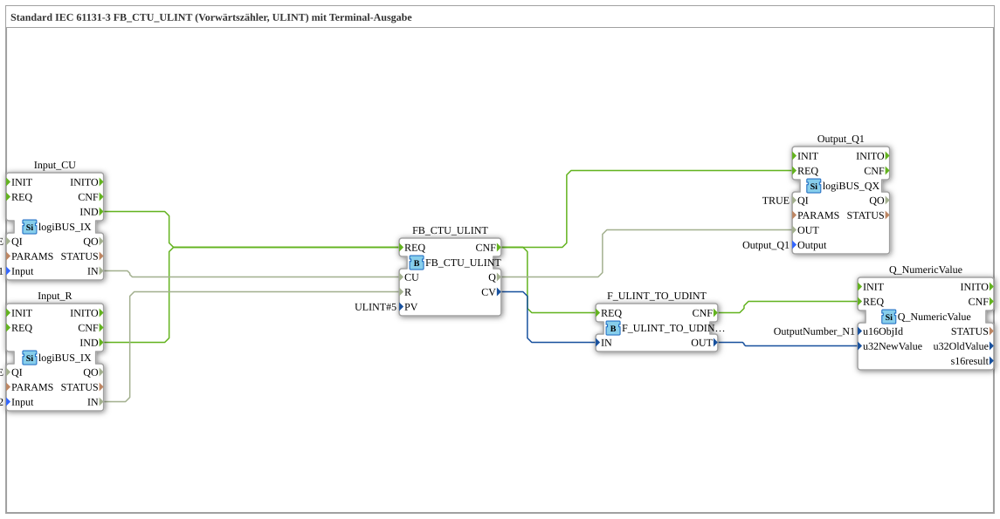

# Exercise_214: Standard IEC 61131-3 FB_CTU_ULINT (Upward Counter, ULINT) with Terminal Output

* * * * * * * * * *
## Introduction

This exercise demonstrates the use of the IEC 61131-3 standard forward counter **FB_CTU_ULINT** for the **ULINT** (unsigned long integer) data type. The counter is controlled via two digital inputs: The **CU** input increments by one on each rising edge, while the **R** input resets the counter value. The current counter value is output to a terminal, and the **Q** output becomes active when the counter value reaches or exceeds the preset value **PV**. The goal is to understand the integration of a standard function block (FB) with hardware inputs/outputs and textual output.

## Function Blocks Used (FBs)

The exercise consists of a network of six internal function blocks linked via event and data connections.

### Sub-Blocks: FB_CTU_ULINT

- **Type**: `iec61131::counters::FB_CTU_ULINT`
- **Internal FBs Used**: None (the block itself is primitive)
- **Parameters**:
- `PV = ULINT#5` – The counter becomes active as soon as the count reaches 5.
- **Event Inputs/Outputs**:
- **REQ** (Input) – Triggers the counter logic.
- **CNF** (Output) – Signals processing and passes the result.
- **Data Inputs/Outputs**:
- **CU** (Input, BOOL) – Counting pulse (rising edge counts).
- **R** (Input, BOOL) – Resets the counter reading.
- **PV** (Input, ULINT) – Default value, here 5.
- **Q** (Output, BOOL) – TRUE if CV >= PV.
- **CV** (Output, ULINT) – Current counter reading.
- **Functionality**: The counter logic is executed with each REQ event: A rising edge on **CU** increments **CV** by 1, a TRUE on **R** sets **CV** to 0. **Q** is updated in the same process.

### Sub-Blocks: Input_CU and Input_R (logiBUS_IX)

- **Type**: `logiBUS::io::DI::logiBUS_IX`
- **Internal Function Blocks Used**: None
- **Parameters**:
- `QI = TRUE` – Qualifier activates the channel.
- `Input = Input_I1` (for Input_CU) or `Input = Input_I2` (for Input_R) – Hardware pin assignment.
- **Events**:
- **IND** (Output) – Triggered when the input signal changes.
- **Data**:
- **IN** (Output, BOOL) – Current state of the digital input.
- **Functionality**: These function blocks read the actual digital inputs (logiBUS hardware) and output an event whenever the input changes. The state is provided via **IN**.

### Sub-function blocks: Output_Q1 (logiBUS_QX)

- **Type**: `logiBUS::io::DQ::logiBUS_QX`
- **Internal Function Blocks Used**: None
- **Parameters**:
- `QI = TRUE` – Qualifier activates the output.
- `Output = Output_Q1` – Hardware pin assignment.
- **Events**:
- **REQ** (Input) – triggers the output of the applied value.
- **Data**:
- **OUT** (Input, BOOL) – the value to be output.
- **Functionality**: The function block sets the digital output to the value of **OUT** as soon as a **REQ** event arrives.

### Sub-function blocks: F_ULINT_TO_UDINT

- **Type**: `iec61131::conversion::F_ULINT_TO_UDINT`
- **Internal Function Blocks Used**: None
- **Parameters**: None
- **Events**:
- **REQ** (Input) – starts the conversion.
- **CNF** (Output) – signals that the result is ready.
- **Data**:
- **IN** (Input, ULINT) – the value to be converted.
- **OUT** (Output, UDINT) – the converted result.
- **Functionality**: This function block converts a 64-bit unsigned integer (ULINT) to a 32-bit unsigned integer (UDINT). An overflow can occur if the ULINT value is greater than 2³²‒1 (network warning).

### Sub-function blocks: Q_NumericValue

- **Type**: `isobus::UT::Q::Q_NumericValue`
- **Internal FBs Used**: None
- **Parameters**:
- `u16ObjId = OutputNumber_N1` – Identification of the terminal object to which the value is sent.
- **Events**:
- **REQ** (Input) – triggers the display update.
- **Data**:
- **u32NewValue** (Input, UDINT) – the numerical value to be displayed.
- **Functionality**: This function block sends the passed 32-bit value to a terminal (e.g., HMI or console) so that the current counter reading is displayed visually.

## Program Flow and Connections

1. **Input Events**: The digital inputs **Input_CU** and **Input_R** generate an **IND** event when their state changes. Both events are connected to the **REQ** input of the counter **FB_CTU_ULINT**. This causes the counter to be recalculated every time one of the inputs changes its state.
2. **Counter Logic**: The counter evaluates the incoming data:
- **CU** receives the current state from **Input_CU.IN**.
- **R** receives the state of **Input_R.IN**.
- A rising edge on **CU** increments the internal counter **CV** by 1.
- A TRUE on **R** sets **CV** to 0.
- If **CV** exceeds the value of **PV** (here 5), **Q** is set to TRUE.
3. **Output**: After the calculation, the counter sends the **CNF** event. This event is handled in parallel by two function blocks:
- **Output_Q1** sets the digital output to the value of **FB_CTU_ULINT.Q**.
- **F_ULINT_TO_UDINT** converts the current counter value **CV** from ULINT to UDINT.
4. **Terminal Output**: After the conversion is complete, **F_ULINT_TO_UDINT.CNF** triggers the **REQ** event of **Q_NumericValue**. The converted value is passed to **u32NewValue** via the **OUT** data line and displayed on the terminal.
5. **Notes from the exercise**:
- One comment suggests possibly including an **E_D_FF** (turn-on delay) to reduce the number of events (e.g., with fast input signals).
- Another comment warns of a possible **overflow** when converting from ULINT to UDINT, as ULINT can cover a larger value range (up to 2⁶⁴‑1) than UDINT (up to 2³²‑1).

## Summary

Exercise 214 demonstrates the practical application of the IEC 61131-3 standard counter **FB_CTU_ULINT** in a 4diac IDE environment. By linking the system to hardware inputs (logiBUS) and a terminal output module, it becomes clear how an industrial counter can be configured and visualized. Students learn to understand event and data flows, as well as the importance of data type conversion and the risk of overflows with incompatible data types. This exercise is suitable for advanced users who already have a basic understanding of IEC 61131-3 and the 4diac IDE.

---

### 🌐 Related topic subpages on ms-muc-docs.de

* [🌐 Eclipse 4diac IDE & color reference on ms-muc-docs.de](https://www.ms-muc-docs.de/iec-61499/eclipse-4diac/)

]
