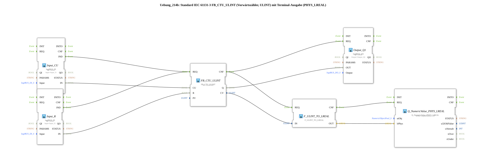

# Exercise_214b: Standard IEC 61131-3 FB_CTU_ULINT (Up Counter, ULINT) with Terminal Output (PHYS_LREAL)

* * * * * * * * * *

## Introduction

This exercise implements an up counter according to IEC 61131-3 (FB_CTU_ULINT). The counter increments by one on each rising edge at the CU (Count Up) input, provided the reset input R is not active. When the preset value (PV) is reached or exceeded, the output Q is set to TRUE. The current counter value is output as a ULINT (unsigned 64-bit integer), converted to LREAL via a conversion block, and passed to a terminal output block, which displays the value on a connected terminal.

The physical inputs and outputs are connected to the logiBUS terminals Input_I1, Input_I2, and Output_Q1.

## Function Blocks (FBs) Used

### FB_CTU_ULINT

- **Type**: `iec61131::counters::FB_CTU_ULINT`
- **Parameters**:
- `PV` = `ULINT#5` (Preset value)
- **Event Input/Output**:
- `REQ` (Input) – Trigger for counting or reset operation
- `CNF` (Output) – Processing confirmation
- **Data Input/Output**:
- `CU` (Input) – Count pulse (rising edge)
- `R` (Input) – Counter reset
- `Q` (Output) – TRUE if meter reading >= PV
- `CV` (Output) – current meter reading (ULINT)

### Input_CU (logiBUS_IX)

- **Type**: `logiBUS::io::DI::logiBUS_IX`
- **Parameters**:
- `QI` = `TRUE` (Activation)
- `Input` = `Input_I1` (Physical Digital Input)
- **Event Output**: `IND` – reports an event when the input changes
- **Data Output**: `IN` – current state of the input

### Input_R (logiBUS_IX)

- **Type**: `logiBUS::io::DI::logiBUS_IX`
- **Parameters**:
- `QI` = `TRUE`
- `Input` = `Input_I2`
- **Event Output**: `IND`
- **Data Output**: `IN`

### Output_Q1 (logiBUS_QX)

- **Type**: `logiBUS::io::DQ::logiBUS_QX`
- **Parameters**:
- `QI` = `TRUE`
- `Output` = `Output_Q1` (physical Digital output)
- **Event input**: `REQ` – triggers setting the output
- **Data input**: `OUT` – value written to the output

### F_ULINT_TO_LREAL

- **Type**: `iec61131::conversion::F_ULINT_TO_LREAL`
- **Event input/output**:
- `REQ` (input) – starts conversion
- `CNF` (output) – conversion confirmation
- **Data input/output**:
- `IN` (input) – ULINT value
- `OUT` (output) – converted LREAL value

### Q_NumericValue_PHYS_LREAL

- **Type**: `isobus::UT::Q::Q_NumericValue_PHYS_LREAL`
- **Parameters**:
- `stObj` = `OutputNumber_N3` (reference to the terminal output object)
- **Event Input**: `REQ` – triggers output
- **Data Input**: `lrPhys` – physical value as LREAL

## Program Flow and Connections

1. **Count Pulse (CU)**: A rising edge at the digital input Input_I1 is detected by the function block `Input_CU` and sent via the event output `IND` to the `REQ` input of the counter. `FB_CTU_ULINT` is forwarded. Simultaneously, the signal state is transmitted via the data connection to the `CU` input.
2. **Reset (R)**: A signal at the digital input Input_I2 is routed analogously via `Input_R` to the `R` input of the counter. With an active signal, the counter is reset to 0.
3. **Counter Processing**: The counter increments its internal value on each rising edge at `CU`, as long as `R` = FALSE. When the preset value (PV = 5) is reached, the output `Q` is set to TRUE.
4. **Counter Reading Output (CV)**: After each counting or reset operation, `FB_CTU_ULINT` signals completion via `CNF`. This event simultaneously triggers two branches:

- **Digital Output**: The event `CNF` starts the function block `Output_Q1`. The value of `Q` (TRUE/FALSE) is written to the physical output Output_Q1.
- **Terminal Output**: The conversion function block `F_ULINT_TO_LREAL` is also triggered via `CNF`. This converts the current counter reading (`CV`, ULINT) into LREAL. After the conversion is complete, the terminal output module `Q_NumericValue_PHYS_LREAL` is activated and the converted value is displayed.

All data connections are wired so that the values are passed on synchronously with the events.

**Learning Objectives**:

- Understanding the IEC 61131-3 counter FB_CTU_ULINT (upward counter)
- Working with data type conversion (ULINT → LREAL)
- Integrating physical inputs/outputs and terminal output in a 4diac sub-application

**Difficulty Level**: Easy

**Required Prior Knowledge**: Basic knowledge of the 4diac IDE, working with logiBUS terminals

**Procedure**: Open the sub-application `Uebung_214b` in the 4diac IDE and test it in simulation mode. The inputs `Input_I1` and `Input_I2` can be controlled via hardware simulation or real terminals.

## Summary

Exercise 214b demonstrates the implementation of an industrial up-counter with terminal output. The counter is controlled via two digital inputs, its output switches a digital output, and the current counter value is output to a terminal after conversion. The interaction of event and data connections, as well as the use of standard IEC and logiBUS components, forms the basis for more complex automation applications.

---

### 🌐 Related topic subpages on ms-muc-docs.de

- [🌐 Eclipse 4diac IDE & color reference on ms-muc-docs.de](https://www.ms-muc-docs.de/iec-61499/eclipse-4diac/)

]
