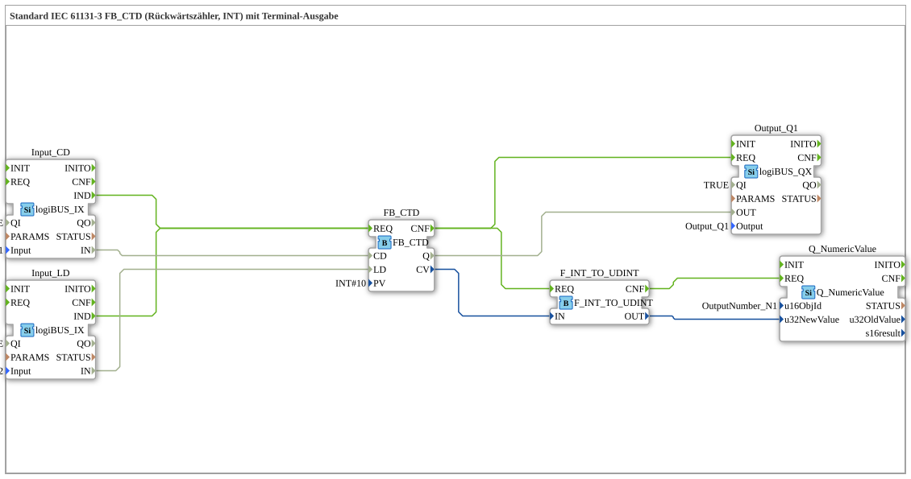

# Exercise_215: Standard IEC 61131-3 FB_CTD (Countdown Counter, INT) with Terminal Output

* * * * * * * * * *
## Introduction

This exercise implements a **countdown counter (FB_CTD)** according to IEC 61131-3. The counter counts down from a predefined **PV** value (Preset Value) at its **CD** (Count Down) input with each event. The **LD** (Load) input allows the counter to be reset to the preset value at any time. The current counter value is displayed on a numeric output field (Terminal), and a binary output (Q1) is set as soon as the counter value reaches **0**.
This exercise represents a typical use case for an IEC counter module and demonstrates its connection to hardware inputs as well as the output of the counter value via an ISOBUS terminal module.

---

## Function Blocks Used

The entire circuit consists of a SubApp type named "Exercise_215". The following function blocks are included in the FBNetwork:

### Sub-function blocks:

#### `FB_CTD` (Type: `iec61131::counters::FB_CTD`)

- **Type**: IEC 61131-3 Function Block – Down Counter
- **Parameters**:
- `PV = INT#10` → Preset value = 10 (as an integer constant)
- **Event inputs**:
- `REQ` → is triggered on the rising edge of `CD` or `LD`
- **Event outputs**:
- `CNF` → is triggered as soon as the function block has completed a new calculation
- **Data Inputs**:
- `CD` (BOOL) → Countdown pulse
- `LD` (BOOL) → Load preset value
- `PV` (INT) → Default value (here fixed at 10)
- **Data Outputs**:
- `Q` (BOOL) → becomes `TRUE` when the counter reaches 0
- `CV` (INT) → Current counter value

**Functionality**:

The function block decrements the internal counter by 1 on each rising edge at `CD`. A rising edge at `LD` resets the counter to the value of `PV`. The output `Q` is `TRUE` as long as the counter value is 0. The current counter value is output via `CV`.

#### `Input_CD` (Type: `logiBUS::io::DI::logiBUS_IX`)

- **Type**: Digital input – physical input `Input_I1`
- **Parameters**:
- `QI = TRUE` → Input enabled
- `Input = Input_I1` → Real input (e.g., push button or sensor)
- **Outputs**:
- `IND` (Event) → Triggered when the input signal changes
- `IN` (BOOL) → Current state of the input

#### `Input_LD` (Type: `logiBUS::io::DI::logiBUS_IX`)

- **Type**: Digital input – physical input `Input_I2`
- **Parameters**:
- `QI = TRUE`
- `Input = Input_I2`
- **Outputs**: same as `Input_CD`

#### `Output_Q1` (Type: `logiBUS::io::DQ::logiBUS_QX`)

- **Type**: Digital output – physical output `Output_Q1`
- **Parameters**:
- `QI = TRUE`
- `Output = Output_Q1` → real output (e.g., lamp or relay)
- **Inputs**:
- `REQ` (Event) → triggered by a new counter result
- `OUT` (BOOL) → Value for the output

#### `F_INT_TO_UDINT` (Type: `iec61131::conversion::F_INT_TO_UDINT`)

- **Type**: IEC conversion function from `INT` to `UDINT`
- **Data inputs**:
- `IN` (INT) → Input value (here the current counter reading)
- **Data outputs**:
- `OUT` (UDINT) → Converted value (unsigned 32-bit integer)

> **Note**: The use of this function block is not optimal from a technical point of view, as the counter reading `CV` of a **down counter** The value cannot be negative (it stops at 0). Direct coupling without type conversion would be possible, but this function block serves here as a didactic example for converting data types.

#### `Q_NumericValue` (Type: `isobus::UT::Q::Q_NumericValue`)

- **Type**: Terminal output function block for displaying a numeric value
- **Parameters**:
- `u16ObjId = OutputNumber_N1` → Object ID of the numeric display field on the terminal
- **Inputs**:
- `REQ` (Event) → Triggers the display update
- `u32NewValue` (UDINT) → New value to be displayed
- **Functionality**: The function block sends the passed value to the configured terminal field, allowing the user to read the current counter value on a display.

---

## Program Flow and Connections

The exercise flow is determined by the event and data connections in the FBNetwork:

1. **Event Triggering**
- The two digital inputs `Input_CD` and `Input_LD` generate the event `IND` upon a signal change.
- Both events are routed to the **same** event input `REQ` of the counter `FB_CTD`. This means: Every key press (regardless of whether it's a CD or LD) triggers a recalculation of the counter.
2. **Data Coupling**
- The **count pulse** (`CD`) is routed directly from the output `IN` of the input block `Input_CD` to the data input `FB_CTD.CD`.
- The **charge pulse** (`LD`) is connected from the output `IN` of the input block `Input_LD` to `FB_CTD.LD`.
- The **counter output Q** is passed on to the output block `Output_Q1.OUT`.
- The **current counter reading `CV`** is sent to the terminal `Q_NumericValue.u32NewValue` via the conversion block `F_INT_TO_UDINT`.
3. **Terminal Update**
- Once the counter calculation is complete, the event `CNF` is triggered by `FB_CTD`.
- This event triggers both the output block `Output_Q1` and the conversion block `F_INT_TO_UDINT`.
- After the conversion, `F_INT_TO_UDINT.CNF` fires and updates the numerical display on the terminal.

**Learning Objectives of this Exercise**:

- Use of the IEC down counter `FB_CTD` (down counter) in 4diac.
- Coupling of hardware inputs and outputs via logiBUS function blocks.
- Output of a counter value to a terminal using an isobus function block.
- Understanding of event and data flow control in a sub-application.

**Difficulty Level**: Easy

**Required Prior Knowledge**: Basic operation of the 4diac IDE, understanding of IEC 61131-3 function blocks.

**Starting the Exercise**:

Load the exercise `Uebung_215` from the package `Uebungen` into an empty project. Connect the hardware inputs `Input_I1` (CD) and `Input_I2` (LD) to pushbuttons and the output `Output_Q1` to an indicator (e.g., a lamp). The terminal object `OutputNumber_N1` must be configured in the pool.

---

## Summary

In this exercise, a complete down counter according to IEC 61131-3 was built. The counter counts down from 10 when a button on `I1` is pressed, resets when a button on `I2` is pressed, and activates the output `Q1`.The counter resets as soon as the value reaches 0. The current counter reading is displayed on a terminal. This exercise demonstrates the integration of IEC components with logiBUS hardware and isobus visualization and provides a basic understanding of event-driven automation systems.

---

### 🌐 Related topic subpages on ms-muc-docs.de

* [🌐 Eclipse 4diac IDE & color reference on ms-muc-docs.de](https://www.ms-muc-docs.de/iec-61499/eclipse-4diac/)
