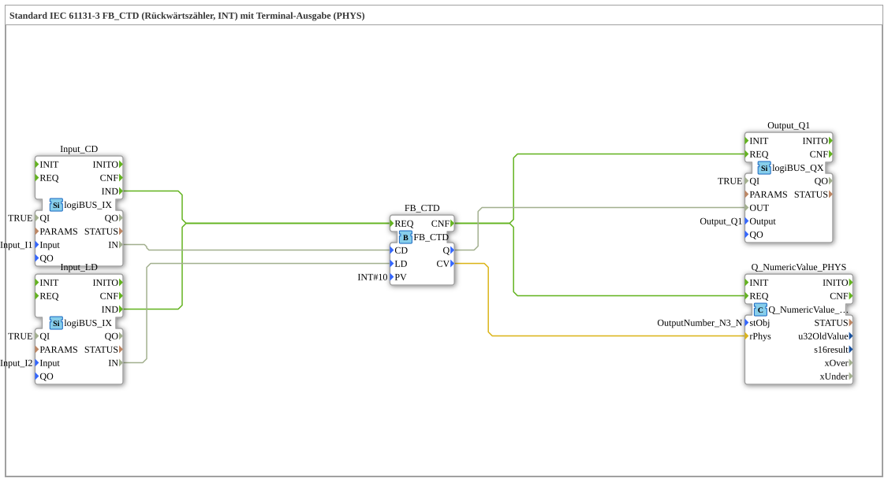

# Exercise_215b: Standard IEC 61131-3 FB_CTD (Down Counter, INT) with Terminal Output (PHYS)

* * * * * * * * * *
## Introduction

This exercise implements a **down counter** according to IEC 61131-3 (function block `FB_CTD`) with a preset value of **10**. The counter is controlled via two digital inputs (CD – Count Down, LD – Load). The current counter value is output to a terminal (PHYS), and the output Q indicates whether the counter value has reached zero.
## Function Blocks (FBs) Used

- **FB_CTD** (Type: `iec61131::counters::FB_CTD`)
- Parameters: `PV` = `INT#10` (Preset value)
- Event input: `REQ` (Execution request)
- Event output: `CNF` (Processing confirmation)
- Data inputs: `CD` (Count Down – Count pulse), `LD` (Load – Load preset value)
- Data outputs: `Q` (Output, TRUE if CV = 0), `CV` (Current counter reading)
- **Input_CD** (Type: `logiBUS::io::DI::logiBUS_IX`)
- Parameters: `QI` = `TRUE`, `Input` = `Input_I1` (Physical input I1)
- Function: Digital input that triggers an event `IND` upon receiving an edge signal.
- **Input_LD** (Type: `logiBUS::io::DI::logiBUS_IX`)
- Parameters: `QI` = `TRUE`, `Input` = `Input_I2` (physical input I2)
- Function: Digital input for the load command.

`` - **Output_Q1** (Type: `logiBUS::io::DQ::logiBUS_QX`)

- Parameters: `QI` = `TRUE`, `Output` = `Output_Q1` (physical output Q1)
- Function: Digital output that outputs the `Q` value of the counter to a physical line.
- **Q_NumericValue_PHYS** (Type: `isobus::UT::Q::Q_NumericValue_PHYS`)
- Parameter: `stObj` = `OutputNumber_N3` (Terminal output)
- Function: Outputs the passed numeric value (`rPhys`) to the terminal.

## Program Flow and Connections

The following event and data connections define the flow:

### Event Connections

- `Input_CD.IND` → `FB_CTD.REQ`: A signal from input I1 triggers the counter block (Count Down or Load, depending on the LD signal).
- `Input_LD.IND` → `FB_CTD.REQ`: A signal from input I2 also triggers the counter module (sets CV to PV).
- `FB_CTD.CNF` → `Output_Q1.REQ`: After processing, output Q is updated.
- `FB_CTD.CNF` → `Q_NumericValue_PHYS.REQ`: Simultaneously, the counter reading CV is sent to the terminal.

### Data Connections

- `Input_CD.IN` → `FB_CTD.CD`: The input value (TRUE/FALSE) is passed as a countdown signal.
- `Input_LD.IN` → `FB_CTD.LD`: The input value serves as the load signal.
- `FB_CTD.Q` → `Output_Q1.OUT`: The output value Q (TRUE when CV=0) is applied to the physical output Q1.
- `FB_CTD.CV` → `Q_NumericValue_PHYS.rPhys`: The current counter value (INT) is passed directly to the terminal block. A comment in the network indicates that **INT can be closed without conversion to REAL**.

### Flow Description

- **Load**: When input I2 becomes active, the counter sets its internal value `CV` to the preset value (10). The output `Q` is reset (FALSE).
- **Count Down**: On each rising edge at input I1, `CV` is decremented by 1. Once `CV = 0` is reached, `Q` is set to TRUE and remains TRUE until the next load.
- The output `Q` controls the physical output Q1, which can then, for example, switch a lamp or a signal.
- The current counter value is always displayed on the terminal (PHYS) after each processing operation.

## Summary

Exercise 215b demonstrates the use of the IEC 61131-3 down counter `FB_CTD` in a 4diac IDE environment. By combining digital inputs (I1, I2), a digital output (Q1), and a terminal output, you will learn about the typical use of a counter in automation technology. The direct connection of the integer counter reading to a terminal output demonstrates the system's flexible data conversion capabilities.

---

### 🌐 Related topic subpages on ms-muc-docs.de

* [🌐 Eclipse 4diac IDE & color reference on ms-muc-docs.de](https://www.ms-muc-docs.de/iec-61499/eclipse-4diac/)

]
