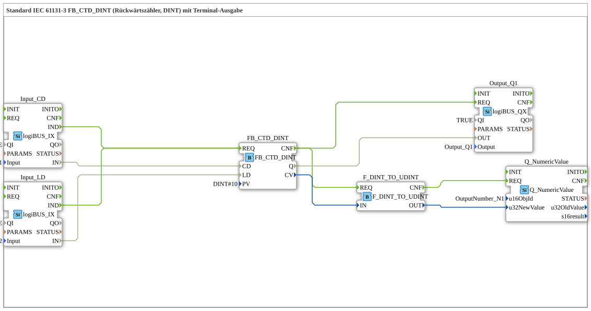

# Exercise_216: Standard IEC 61131-3 FB_CTD_DINT (Down Counter, DINT) with Terminal Output

* * * * * * * * * *
## Introduction
This exercise demonstrates the implementation of a **down counter (CTD)** according to IEC 61131-3 with the integer data type `DINT` (double integer) and a **terminal output** of the current counter reading.
The counter is controlled by two digital inputs:

- **Input I1** – decrements the counter on a rising edge.
- **Input I2** – loads the predefined starting value (PV = 10) into the counter.

A digital output **Q1** is activated as soon as the counter reading reaches 0. Simultaneously, the current meter reading is displayed via a terminal module.
... ## Function Blocks (FBs) Used

- **FB_CTD_DINT** – `iec61131::counters::FB_CTD_DINT`
- Parameter: `PV` = `DINT#10` (Start value)
- Event input: `REQ` (Count pulse from CD or LD)
- Event output: `CNF` (Confirmation after counting)
- Data inputs: `CD` (Decrement input), `LD` (Load input)
- Data outputs: `Q` (Signal when reaching 0), `CV` (Current counter value)
- **Input_CD** – `logiBUS::io::DI::logiBUS_IX`
- Parameters: `QI` = `TRUE`, `Input` = `Input_I1`
- Returns the state of digital input I1.
- **Input_LD** – `logiBUS::io::DI::logiBUS_IX`
- Parameters: `QI` = `TRUE`, `Input` = `Input_I2`
- Returns the state of digital input I2.
- **Output_Q1** – `logiBUS::io::DQ::logiBUS_QX`
- Parameters: `QI` = `TRUE`, `Output` = `Output_Q1`
- Sets the digital output Q1 when the counter Q output is active.
- **F_DINT_TO_UDINT** – `iec61131::conversion::F_DINT_TO_UDINT`
- Converts the counter value from `DINT` (signed) to `UDINT` (unsigned).
- **Note:** Negative counter values can no longer be displayed after this conversion – this exercise intentionally demonstrates this limitation.
- **Q_NumericValue** – `isobus::UT::Q::Q_NumericValue`
- Parameter: `u16ObjId` = `OutputNumber_N1`
- Outputs a numeric value to the terminal.

## Program Flow and Connections

1. **Event Chaining**

- Input I1 or I2 triggers the `REQ` input of the counter via the `IND` event output.
- After successful processing (CNF), the output block `Output_Q1` and the conversion `F_DINT_TO_UDINT` are triggered simultaneously.
- After the conversion, the value is passed to the terminal block `Q_NumericValue`.

2. **Data Concatenation**

- `Input_CD.IN` → `FB_CTD_DINT.CD` (Decrement)
- `Input_LD.IN` → `FB_CTD_DINT.LD` (Load)
- `FB_CTD_DINT.Q` → `Output_Q1.OUT` (Set Output at Counter Value 0)
- `FB_CTD_DINT.CV` → `F_DINT_TO_UDINT.IN` (Current Counter Value)
- `F_DINT_TO_UDINT.OUT` → `Q_NumericValue.u32NewValue` (Terminal Output)

3. **Functionality**

- On each rising edge at I1, the counter value is decremented by 1.
- On a rising edge at I2, the counter is loaded with the value 10 (PV).
- As soon as the counter reading reaches 0, output Q1 is set.
- The current counter reading is continuously displayed on the terminal.

**Didactic Note:**

The conversion `DINT_TO_UDINT` is not suitable for negative counter readings (UDINT can only represent positive values). This is a **deliberate limitation** included in the exercise to highlight the challenges of data type conversion.

## Summary

Exercise "Exercise_216" demonstrates the use of an IEC 61131-3 reverse counter (`FB_CTD_DINT`) in conjunction with terminal output. It shows:

- Controlling a counter via two digital inputs (decrement/load).
- Using an output block to signal when the counter reaches its end.
- Data type conversion (`DINT` → `UDINT`) and its limitations (no negative values).
- Visualizing counter values on a terminal.

This exercise is suitable for beginners in the 4diac IDE who already have basic knowledge of IEC 61131-3 components and digital inputs/outputs. It can be loaded directly and tested with simulated or real inputs.

--

### 🌐 Related topic subpages on ms-muc-docs.de
* [🌐 Eclipse 4diac IDE & color reference on ms-muc-docs.de ](https://www.ms-muc-docs.de/iec-61499/eclipse-4diac/)

]