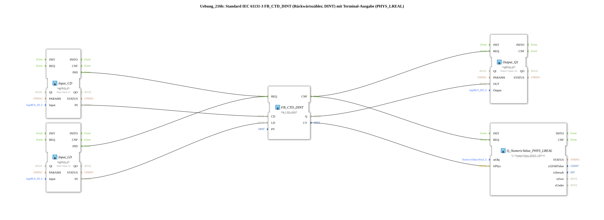

# Exercise_216b: Standard IEC 61131-3 FB_CTD_DINT (Down Counter, DINT) with Terminal Output (PHYS_LREAL)



* * * * * * * * * *
## Introduction

This exercise implements a **down counter (CTD)** according to IEC 61131-3 with the data type `DINT` and a terminal output of the current count value as a physical quantity (`PHYS_LREAL`). The counter is controlled via two digital inputs (**CD** = Count Down, **LD** = Load) and outputs the counter signal (`Q`) to a digital output. Simultaneously, the current counter value is visualized on a terminal via a numeric output block.


## Function Blocks (FBs) Used

- **FB_CTD_DINT** – Type: `iec61131::counters::FB_CTD_DINT`

- Parameter: `PV` = `DINT#10` (default value 10)

- Counts down from `PV` on each rising edge of `CD`; resets to `PV` when `LD` is activated.

- **Input_CD** – Type: `logiBUS::io::DI::logiBUS_IX`

- Parameters: `QI` = `TRUE`, `Input` = `Input_I1` (Hardware input I1)

- Provides the countdown input.

- **Input_LD** – Type: `logiBUS::io::DI::logiBUS_IX`

- Parameters: `QI` = `TRUE`, `Input` = `Input_I2` (Hardware input I2)

- Provides the load input.

- **Output_Q1** – Type: `logiBUS::io::DQ::logiBUS_QX`

- Parameters: `QI` = `TRUE`, `Output` = `Output_Q1` (Hardware output Q1)

- Outputs the logical state of the counter output `Q`.


``` - **Q_NumericValue_PHYS_LREAL** – Type: `isobus::UT::Q::Q_NumericValue_PHYS_LREAL`

- Parameters: `stObj` = `OutputNumber_N3` (Terminal object for display)

- Converts the current counter value (`CV`) into a physical quantity (`LREAL`) and displays it on the terminal.

## Program Flow and Connections

Control is purely event-driven via the **IND** events of the inputs:

1. **Count Input (CD):**

A rising edge at `Input_I1` is detected by the function block `Input_CD` and triggers the event `IND`. This is connected to the `REQ` event of the counter `FB_CTD_DINT`. Simultaneously, the physical input value (`IN`) is transmitted to the counter input via the data connection `Input_CD.IN → FB_CTD_DINT.CD`.

2. **Charge Input (LD):**

Similarly, a rising edge at `Input_I2` is detected via `Input_LD` and also connected to the `REQ` of the counter. The input value (`IN`) is forwarded to the charge input `FB_CTD_DINT.LD`.


Similarly, a rising edge at `Input_I2` is detected via `Input_LD` and also connected to the `REQ` of the counter. *Note*: Both events (CD and LD) use the same `REQ` event of the counter. The counter internally evaluates the respective data lines to distinguish between the operation (counting or loading).

3. **Output Q1 and Terminal Display:**

After the counter processing is complete, the `CNF` event is triggered. This is sent in parallel to the `REQ` inputs of `Output_Q1` and `Q_NumericValue_PHYS_LREAL`.

- The output value `FB_CTD_DINT.Q` (logical if the counter reading is ≤ 0) is sent via the data connection to `Output_Q1.OUT` and thus displayed at hardware output Q1.


``` - The current counter reading `FB_CTD_DINT.CV` (type `DINT`) is passed to `Q_NumericValue_PHYS_LREAL.lrPhys` and displayed as the physical value `LREAL` on the terminal.

**Summary of Connections:**

| Sender | Receiver | Type |

|--------|-----------|-----|

| `Input_CD.IND` | `FB_CTD_DINT.REQ` | Event |

| `Input_LD.IND` | `FB_CTD_DINT.REQ` | Event |

| `FB_CTD_DINT.CNF` | `Output_Q1.REQ` | Event |

| `FB_CTD_DINT.CNF` | `Q_NumericValue_PHYS_LREAL.REQ` | Event |

| `Input_CD.IN` | `FB_CTD_DINT.CD` | Data |

| `Input_LD.IN` | `FB_CTD_DINT.LD` | Data |

| `FB_CTD_DINT.Q` | `Output_Q1.OUT` | Data |

| `FB_CTD_DINT.CV` | `Q_NumericValue_PHYS_LREAL.lrPhys` | Data |

## Summary

Exercise 216b demonstrates the application of an IEC 61131-3 reverse counter (`FB_CTD_DINT`) in the 4diac IDE. The counter is controlled via two digital inputs and outputs both a binary signal (counter reaches zero) and a numerical display of the current counter value on a terminal. Event control ensures that the output values are only updated after a complete counter operation. This example demonstrates fundamental concepts of event-driven application development using standard function blocks and hardware interfaces.

---

### 🌐 Related topic subpages on ms-muc-docs.de

* [🌐 Eclipse 4diac IDE & color reference on ms-muc-docs.de](https://www.ms-muc-docs.de/iec-61499/eclipse-4diac/)

]