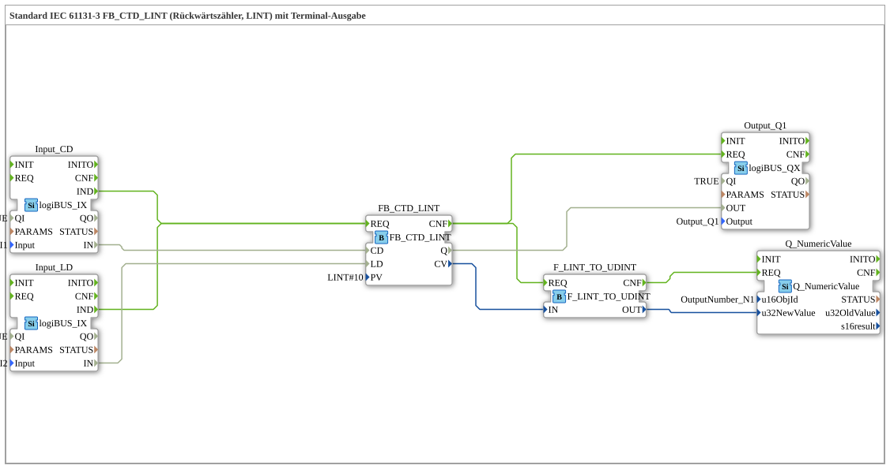

# Exercise_217: Standard IEC 61131-3 FB_CTD_LINT (Countdown Counter, LINT) with Terminal Output

* * * * * * * * * *
## Introduction

This exercise implements a countdown counter (CTD) according to IEC 61131-3 with the LINT data type (64-bit integer). The counter is controlled by two digital inputs: a countdown pulse (CD) and a load pulse (LD). The current counter value (CV) is converted to the UDINT (unsigned 32-bit) type and sent to a numeric terminal output. The Q output signals when the counter value is ≤ 0.
A comment on the network points out that the conversion ``F_LINT_TO_UDINT`` is unsuitable for negative counter readings, as UDINT cannot represent negative numbers.

## Function Blocks (FBs) Used

**FB_CTD_LINT** (LINT Down Counter)

- **Type**: `iec61131::counters::FB_CTD_LINT`
- **Parameters**: `PV = LINT#10` (Preset value, initial value for the counter)
- **Event Inputs**: `REQ` (triggered by both `Input_CD` and `Input_LD`)
- **Event Outputs**: `CNF` (Acknowledgement after processing)
- **Data Inputs**: `CD` (Count-down signal), `LD` (Load signal)
- **Data Outputs**: `CV` (current counter reading, LINT), `Q` (output when CV ≤ 0)

**Input_CD** (digital input for countdown)

- **Type**: `logiBUS::io::DI::logiBUS_IX`
- **Parameters**: `QI = TRUE`, `Input = Input_I1` (hardware address)
- **Event outputs**: `IND` (event on signal change)
- **Data outputs**: `IN` (current input value, BOOL)

**Input_LD** (digital input for load)

- **Type**: `logiBUS::io::DI::logiBUS_IX`
- **Parameters**: `QI = TRUE`, `Input = Input_I2`
- **Event Outputs**: `IND`
- **Data Outputs**: `IN`

**Output_Q1** (Digital Output)

- **Type**: `logiBUS::io::DQ::logiBUS_QX`
- **Parameters**: `QI = TRUE`, `Output = Output_Q1`
- **Event Inputs**: `REQ`
- **Data Inputs**: `OUT` (sets the output)

**F_LINT_TO_UDINT** (LINT → UDINT Conversion)

- **Type**: `iec61131::conversion::F_LINT_TO_UDINT`
- **Event Inputs**: `REQ`
- **Event Outputs**: `CNF`
- **Data Inputs**: `IN` (LINT)
- **Data Outputs**: `OUT` (UDINT) – Note: Negative input values are not displayed correctly.

**Q_NumericValue** (Terminal output numeric value)

- **Type**: `isobus::UT::Q::Q_NumericValue`
- **Parameter**: `u16ObjId = OutputNumber_N1` (Object identifier in the terminal)
- **Event Inputs**: `REQ`
- **Data Inputs**: `u32NewValue` (UDINT, new value to be displayed)

## Program Flow and Connections

1. **Event Chaining**:
- An input event of `Input_CD.IND` or `Input_LD.IND` triggers `REQ` of the counter `FB_CTD_LINT`.
- After processing the counter (output `CNF`), the output `Output_Q1` (via `REQ`) and the conversion `F_LINT_TO_UDINT` (via `REQ`) are called simultaneously.
- After the conversion (`CNF`) is complete, the terminal output `Q_NumericValue` (via `REQ`) is updated.
2. **Data Connections**:
- `Input_CD.IN` → `FB_CTD_LINT.CD`: The value of digital input I1 controls whether the counter counts down.
- `Input_LD.IN` → `FB_CTD_LINT.LD`: The value of digital input I2 loads the preset value (PV) into the counter.
- `FB_CTD_LINT.Q` → `Output_Q1.OUT`: The counter's output signal is directly connected to digital output Q1.
- `FB_CTD_LINT.CV` → `F_LINT_TO_UDINT.IN`: The current counter reading (LINT) is forwarded for conversion.
- `F_LINT_TO_UDINT.OUT` → `Q_NumericValue.u32NewValue`: The converted value (UDINT) is sent to the terminal for display.
3. **Note on Conversion**:

Using `F_LINT_TO_UDINT` is not suitable for negative counter values, as the UDINT value range only includes non-negative numbers. With a negative counter value, an unexpected result will be displayed, or the conversion may fail. In practice, a different representation (e.g., signed) should be used.

## Summary

This exercise involves controlling an IEC 61131-3 reverse counter (`FB_CTD_LINT`) with two digital inputs. The counter value is displayed on a terminal, with the conversion from LINT to UDINT intentionally limiting the output to negative values. This exercise illustrates event-driven processing in 4diac, the coupling of hardware inputs, and the limitations of data type conversions.

---

### 🌐 Related topic subpages on ms-muc-docs.de

* [🌐 Eclipse 4diac IDE & Color Reference on ms-muc-docs.de](https://www.ms-muc-docs.de/iec-61499/eclipse-4diac/)

]
