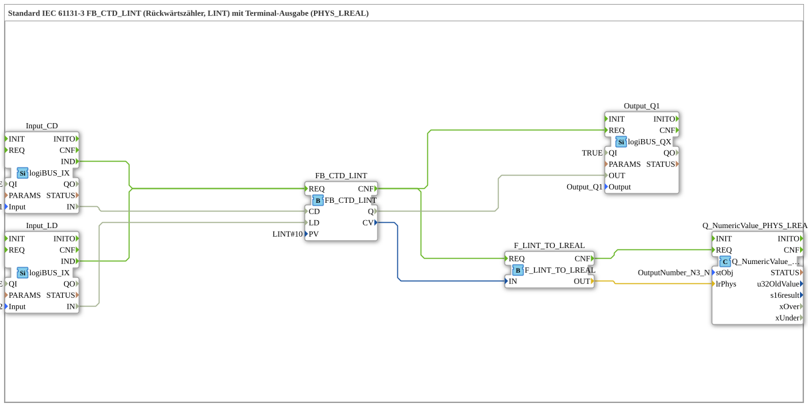

# Exercise_217b: Standard IEC 61131-3 FB_CTD_LINT (Down Counter, LINT) with Terminal Output (PHYS_LREAL)

* * * * * * * * * *
## Introduction

This exercise implements a down counter according to IEC 61131-3 (type `FB_CTD_LINT`) that uses a LINT data type. The current counter value is displayed on a terminal via a physical LREAL output. The exercise demonstrates the use of a standard IEC counter, its connection to real inputs/outputs (logiBUS), and the data type conversion from LINT to LREAL for terminal output.

## Function Blocks Used (FBs)

The following function blocks are used in the SubApp network:

- **FB_CTD_LINT** (Type: `iec61131::counters::FB_CTD_LINT`)
- Parameters: `PV` = `LINT#10` (Preset value = 10)
- Inputs: Event `REQ`, Data `CD` (Count pulse), `LD` (Load preset value)
- Outputs: Event `CNF`, Data `Q` (Counter reading > 0), `CV` (Current counter reading)
- **Input_CD** (Type: `logiBUS::io::DI::logiBUS_IX`)
- Parameters: `QI` = `TRUE`, `Input` = `Input_I1` (Physical Digital Input 1)
- Output: Data `IN` (Bool)
- **Input_LD** (Type: `logiBUS::io::DI::logiBUS_IX`)
- Parameters: `QI` = `TRUE`, `Input` = `Input_I2` (Physical Digital Input 2)
- Output: Data `IN` (Bool)
- **Output_Q1** (Type: `logiBUS::io::DQ::logiBUS_QX`)
- Parameters: `QI` = `TRUE`, `Output` = `Output_Q1` (Physical Digital Output 1)
- Input: Data `OUT` (Bool)
- **F_LINT_TO_LREAL** (Type: `iec61131::conversion::F_LINT_TO_LREAL`)
- Input: Data `IN` (LINT)
- Output: Data `OUT` (LREAL)
- **Q_NumericValue_PHYS_LREAL** (Type: `isobus::UT::Q::Q_NumericValue_PHYS_LREAL`)
- Parameter: `stObj` = `OutputNumber_N3` (Terminal output object)
- Input: Data `lrPhys` (LREAL)

## Program Flow and Connections

The exercise is event-driven:

1. **Event Path**:
- A rising pulse at the digital input `Input_I1` (connected to `Input_CD`) generates an event `IND`.
- Similarly, a pulse at `Input_I2` (connected to `Input_LD`) generates a `IND` event.
- Both events are routed to the event input `REQ` of the counter `FB_CTD_LINT`.
- After processing the counter (output `CNF`), the output `Output_Q1` (via `REQ`) and the conversion `F_LINT_TO_LREAL` (via `REQ`) are triggered.
- After the conversion, the event is forwarded to the terminal output `Q_NumericValue_PHYS_LREAL`.
2. **Data Path**:
- The digital value of `Input_CD.IN` (Boolean) is assigned to the data input `CD` of the counter.
- The digital value of `Input_LD.IN` is assigned to the data input `LD` of the counter.
- The counter output `Q` (Bool) is assigned to the data input `OUT` of the output block `Output_Q1`.
- The current counter reading `CV` (LINT) is transferred to the converter `F_LINT_TO_LREAL.IN`.
- The converted value (LREAL) is sent to the terminal block `Q_NumericValue_PHYS_LREAL.lrPhys`.

**Counter Functionality**:

- As long as no load signal (`LD` = FALSE) is present, the function block counts down from 10 with each increasing pulse at `CD` (preset value = `PV` = 10).
- A load signal resets the current counter value to the value of `PV`.
- The output `Q` is `TRUE` as long as the counter value is greater than 0; upon reaching 0, `Q` becomes `FALSE` (overflow is undefined and remains at 0).
- The current counter value is output to the terminal as a physical LREAL value.

## Summary

Exercise **Exercise_217b** implements a standards-compliant reverse counter (`FB_CTD_LINT`) with terminal output. It combines digital inputs (logiBUS) as counting and charging pulses, a digital output as a signal output, and a LINT-to-LREAL conversion for displaying the current counter reading on a terminal. The process is fully event-driven and demonstrates the integration of IEC 61131-3 blocks with logiBUS I/O and terminal outputs in the 4diac IDE.

---

### 🌐 Related topic subpages on ms-muc-docs.de

- [🌐 Eclipse 4diac IDE & color reference on ms-muc-docs.de](https://www.ms-muc-docs.de/iec-61499/eclipse-4diac/)
