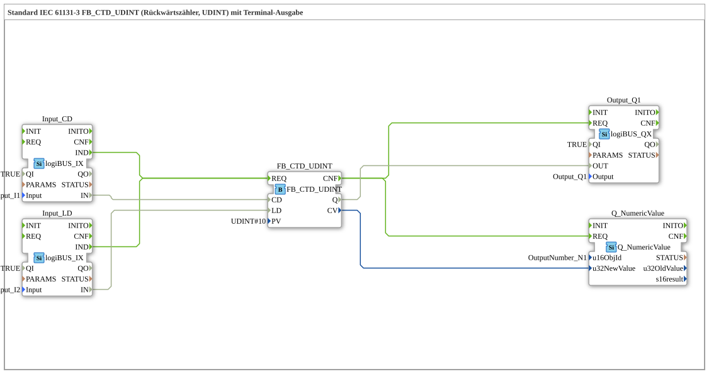

# Exercise_218: Standard IEC 61131-3 FB_CTD_UDINT (Countdown Counter, UDINT) with Terminal Output

* * * * * * * * * *
## Introduction

This exercise implements a downcounter according to IEC 61131-3 (type `FB_CTD_UDINT`). The function block counts down on each falling edge at the input `CD` (Count Down), starting from the preset value `PV` (Preset Value). The counter can be reset to the starting value via a load input (`LD`). The current counter reading (`CV`) is output to a terminal, and the output `Q` is set as soon as the counter reading reaches zero.
The hardware connection is established via two digital inputs (I1, I2) and one digital output (Q1), as well as a terminal output for numerical values. The entire configuration is implemented as a subapplication in the 4diac IDE.

## Function Blocks (FBs) Used

| FB Name | Type | Description |
|---------|-----|---------------|
| `FB_CTD_UDINT` | `iec61131::counters::FB_CTD_UDINT` | IEC 61131-3 reverse counter with inputs `CD`, `LD`, `PV` and outputs `Q` and `CV`. Parameter: `PV = UDINT#10` (start value 10). |
| `Input_CD` | `logiBUS::io::DI::logiBUS_IX` | Digital input for the counting signal (pushbutton I1). Parameters: `QI=TRUE`, `Input=Input_I1`. |
| `Input_LD` | `logiBUS::io::DI::logiBUS_IX` | Digital input for charging the counter (button I2). Parameters: `QI=TRUE`, `Input=Input_I2`. |
| `Output_Q1` | `logiBUS::io::DQ::logiBUS_QX` | Digital output for displaying "counter reading = 0" (lamp Q1). Parameters: `QI=TRUE`, `Output=Output_Q1`. |
| `Q_NumericValue` | `isobus::UT::Q::Q_NumericValue` | Terminal output for the current counter reading (`CV`). Parameter: `u16ObjId=OutputNumber_N1`. |

**Note:** There is a comment in the network indicating that explicit type conversion (`F_UDINT_TO_UDINT`) is not necessary, as the data flow is direct.

## Program Flow and Connections

### Event Control

1. **Event Source:**
- `Input_CD.IND` (signal from button I1) is connected to `FB_CTD_UDINT.REQ`.
- `Input_LD.IND` (signal from button I2) is also connected to `FB_CTD_UDINT.REQ`.
2. **Event Sink:**
- `FB_CTD_UDINT.CNF` (counter confirmation) triggers two actions:
- `Output_Q1.REQ` (digital output Q1 is updated).
- `Q_NumericValue.REQ` (Terminal display update).

### Data Flows

| Source | Destination | Meaning |
|--------|------|-----------|
| `Input_CD.IN` | `FB_CTD_UDINT.CD` | Button I1 as a counting pulse (count down). |
| `Input_LD.IN` | `FB_CTD_UDINT.LD` | Button I2 as a charging signal (set to PV). |
| `FB_CTD_UDINT.Q` | `Output_Q1.OUT` | Output Q1 becomes active as soon as the counter reading is 0. |
| `FB_CTD_UDINT.CV` | `Q_NumericValue.u32NewValue` | Current counter reading (as a 32-bit value) to the terminal. |

### Functionality

- After startup, the counter is set to the preset value `PV = 10` by the loading signal (`LD`).
- Each negative signal at the `CD` input (button I1) decrements the counter by 1.
- As soon as the counter reading reaches zero, the output `Q` is set to `TRUE`, and the digital output Q1 (lamp) illuminates.
- The current counter reading (`CV`) is continuously displayed on the terminal (object `OutputNumber_N1`).

### Learning Objectives & Prerequisites

- **Difficulty Level:** Easy
- **Prerequisites:** Basic knowledge of IEC 61131-3 and familiarity with the 4diac IDE.
- **Learning Objectives:**
- Use of the standard down counter `FB_CTD_UDINT`.
- Connecting digital inputs/outputs and a terminal output.
- Understanding event and data connections in 4diac.

## Summary

Exercise 218 implements a complete down counter using the IEC 61131-3 standard module. The counter's behavior is clearly demonstrated by combining two pushbuttons (count and load), a terminal output, and a lamp. Integration into 4diac is achieved through simple event and data connections, enabling robust and expandable control.

---

### 🌐 Related topic subpages on ms-muc-docs.de

* [🌐 Eclipse 4diac IDE & Color Reference on ms-muc-docs.de](https://www.ms-muc-docs.de/iec-61499/eclipse-4diac/)

]
