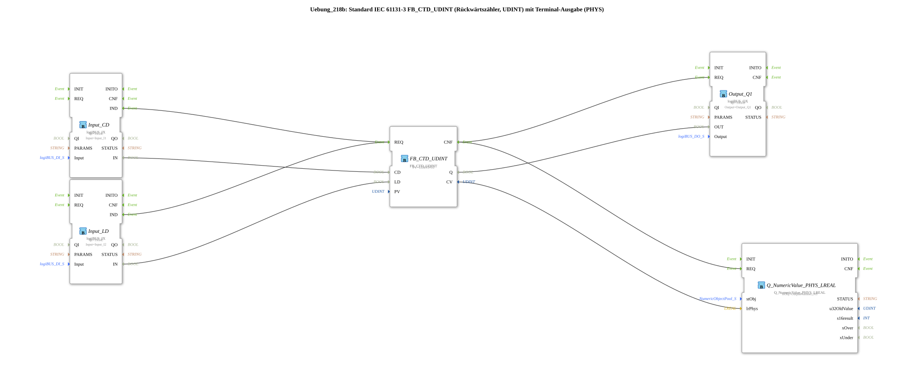

# Exercise_218b: Standard IEC 61131-3 FB_CTD_UDINT (Down Counter, UDINT) with Terminal Output (PHYS)



* * * * * * * * * *

## Introduction

This exercise implements a down counter according to IEC 61131-3 of type **FB_CTD_UDINT** (count value as UDINT).

The counter is controlled via two digital inputs: A pulse at **input I1** (CD) decrements the current value by 1, and a pulse at **input I2** (LD) loads the preset value (PV) into the counter.

The current counter reading is output both as a **physical value (LREAL)** via a terminal (FB `Q_NumericValue_PHYS_LREAL`) and as a **digital signal (Q1)** – Q1 is TRUE as soon as the counter reading reaches zero.

This exercise demonstrates the direct connection from UDINT to LREAL without manual conversion and shows the combination of counter logic with physical output.

## Function Blocks (FBs) Used

This exercise consists of a subapplication (SubAppType) containing five function blocks.

All FBs used are described below.


### Sub-Blocks:

1. **FB_CTD_UDINT** (IEC 61131-3 Down Counter)

- **Type**: `iec61131::counters::FB_CTD_UDINT`

- **Parameters**:

- `PV` = `UDINT#10` (default value)

- **Event Inputs**:

- `REQ` – triggered by a rising pulse from inputs CD or LD

- **Event Outputs**:

- `CNF` – acknowledges execution after a REQ

- **Data Inputs**:

- `CD` – count pulse (count down)

- `LD` – Charging pulse (sets counter to PV)

- **Data outputs**:

- `Q` (BOOL) – TRUE when counter reading = 0

- `CV` (UDINT) – current counter reading

- **Functionality**:

This function block implements an edge-triggered down counter. A positive pulse on CD decrements CV by 1; a low pulse sets CV to the value in PV. Output Q becomes TRUE as soon as CV reaches 0.


`Q` (BOOL) – TRUE when counter reading = 0


`CV` (UDINT) – current counter reading
... 2. **Input_CD** (Digital Input I1)

- **Type**: `logiBUS::io::DI::logiBUS_IX`

- **Parameters**:

- `QI` = `TRUE` (Activation)

- `Input` = `Input_I1` (Physical Connection)

- **Event Output**:

- `IND` – sent on a rising edge at the input

- **Data Output**:

- `IN` (BOOL) – current state of the input

- **Functionality**:

Provides the physical digital input I1 (e.g., push button or sensor) in the system. The IND event is triggered when the state changes.


``` 3. **Input_LD** (Digital Input I2)

- **Type**: `logiBUS::io::DI::logiBUS_IX`

- **Parameters**:

- `QI` = `TRUE`

- `Input` = `Input_I2`

- **Event Output**:

- `IND`

- **Data Output**:

- `IN` (BOOL)

- **Function**:

Identical to Input_CD, but connected to physical input I2 – serves as a load pulse for the counter.


``` 4. **Output_Q1** (Digital Output Q1)

- **Type**: `logiBUS::io::DQ::logiBUS_QX`

- **Parameters**:

- `QI` = `TRUE` (Activation)

- `Output` = `Output_Q1` (Physical Output)

- **Event Input**:

- `REQ` – triggers the output of the current value

- **Data Input**:

- `OUT` (BOOL) – value to be output

- **Functionality**:

Sets the physical digital output Q1 to the value present at the data input OUT. Q1 becomes active as soon as the counter Q = TRUE.

5. **Q_NumericValue_PHYS_LREAL** (Terminal Output)

- **Type**: `isobus::UT::Q::Q_NumericValue_PHYS_LREAL`

- **Parameters**:

- `stObj` = `OutputNumber_N3` (Reference to the terminal output object)

- **Event Input**:

- `REQ` – triggers the output of the current physical value

- **Data Input**:

- `lrPhys` (LREAL) – the physical value to be output

- **Functionality**:

This function block takes an LREAL value and outputs it via a terminal (e.g., on a control panel or console). The counter value CV of type UDINT is connected directly to this input without conversion.

## Program Flow and Connections

The flow is controlled by the event and data connections in the SubAppNetwork:

- **Event Chaining**:

- A rising edge at `Input_CD` or `Input_LD` (each `IND`) triggers the event input `REQ` of the counter `FB_CTD_UDINT`.

- After processing, the counter acknowledges with `CNF`. This event is forwarded to two locations:

- Firstly, to `Output_Q1.REQ` – so that the current Boolean state (Q) is output at the physical output.

- Secondly, to `Q_NumericValue_PHYS_LREAL.REQ` – so that the current counter reading appears on the terminal.


... - **Data Chaining**:

- The data output `Input_CD.IN` is connected to the counter input `FB_CTD_UDINT.CD` – the signal from button I1 is used as the counting pulse.

- `Input_LD.IN` is connected to `FB_CTD_UDINT.LD` – button I2 loads the preset value.

- The counter output `Q` (BOOL) is connected to the data input `OUT` of `Output_Q1`.

- The counter output `CV` (UDINT) is connected to the data input `lrPhys` of `Q_NumericValue_PHYS_LREAL`.


`
`` ``Input_CD.IN`` is connected to the data input `lrPhys` of `Q_NumericValue_PHYS_LREAL`.

`` ``Input_LD.IN`` is connected to the data input qzmsdocs000058 ... The two comments in the network indicate that the normal output (Q) could also be used as an alternative, and that UDINT can be interpreted as LREAL without explicit conversion (an implicit type conversion occurs internally).

## Summary

- **Learning Objectives**: To learn and apply the IEC 61131-3 down counter (CTD) with UDINT counter values, as well as the integration of digital inputs/outputs and a physical terminal output.

- **Difficulty Level**: Easy to medium – suitable for getting started with counter logic and the use of physical output blocks.

- **Prerequisites**: Basic knowledge of the 4diac IDE and simple IEC 61131-3 components.

- **Operation**:

1. Connect the physical inputs I1 (down count button) and I2 (load button).

2. Output Q1 switches on as soon as the counter reading reaches zero.

3. The terminal (OutputNumber_N3) displays the current counter reading as a real-time value.

4. Start the exercise by triggering a rising edge at one of the inputs.

This exercise demonstrates a complete, practical counter application with both digital and visual feedback.

---

### 🌐 Related topic subpages on ms-muc-docs.de

* [🌐 Eclipse 4diac IDE & color reference on ms-muc-docs.de](https://www.ms-muc-docs.de/iec-61499/eclipse-4diac/)

]